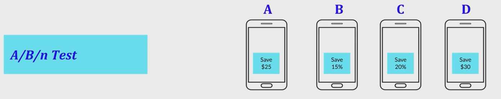
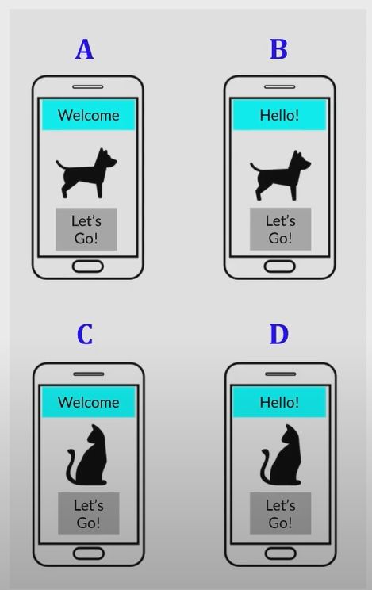
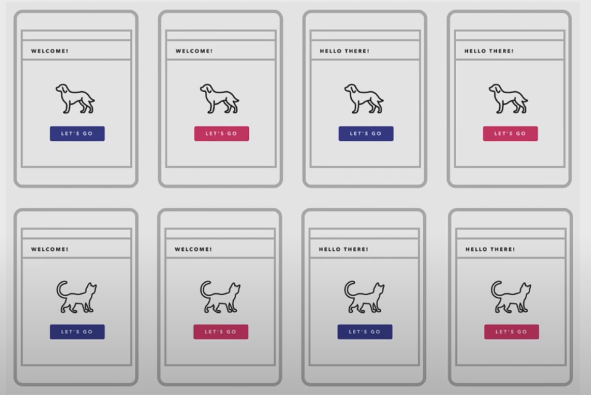
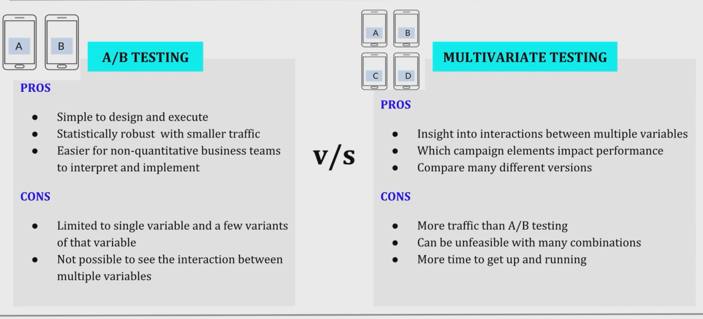

## 1. Types of Experiments
    a. A/B Testing
    b. Multivariate Testing
    c. Multi-Armed Bandit Testing

## 2. A/B Testing

a. An experiment where two or more variants of a page are shown to users at random

b. Statistical analysis is used to determine which variation performs better for a given conversion goal and whether the improvement is statistically significant.

c. Conversion goals can be around `clicks, subscriptions, purchases etc.`

d. The original page or the business as usual scenario is also referred to as the `Control`

## 3. When to use A/B Testing?

a. Test the dffering impacts of `alternate campaign/web designs or approaches`

    Example1 : Send in-app messages that are different in design to groups users, to see which design sparks better response

    Example2 : A Test in which a test group will receive your push notifications, but a control group of users will get no push messages at all

b. Test just `one element` on the page

    Example : Differ your CTA message from original (A) to variant (B)

## 4. Multivariate Testing

    a. Compares a higher number of variables
    b. Reveals more information on how variable interact with one another
    c. Measures effectiveness of each design combination on the ultimate goal
    d. Also reveals which elements have greatest positive or negative impact on a visitor's interaction

## 5. When to use Multivariate Testing?

a. Test combinations of variables within a single campaign or message:

    Example : Test the title or header of your landing page, plus the image that accompanies your text, plus the color of the CTA button

    Full Factorial Testing!

## 6. Pros and Cons

