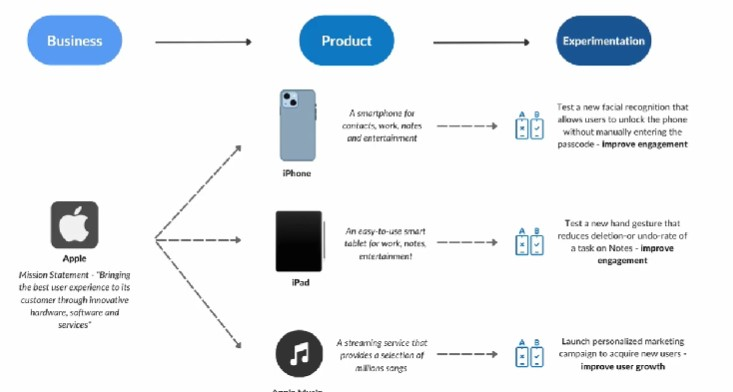
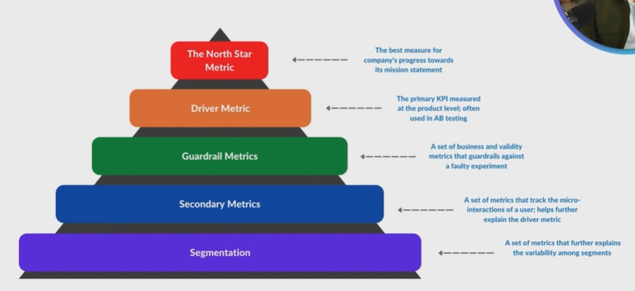
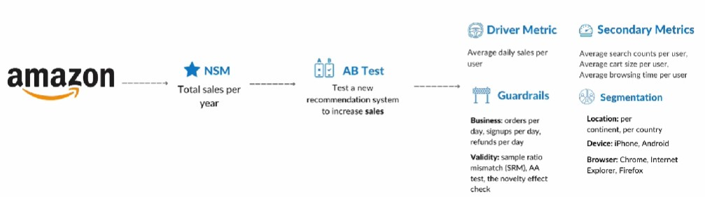

## 1. Experiment Goals in Three Levels

An experiment is designed to improve the quality of a product, thereby, contributing to the growth of a business.

1. Business
    - A business captures its primary goal to users in the form of a "mission statement"

2. Product
    - Based on the business goal, the product goal is to provide tangible value to users.

3. Experimentation
    - Based on the product goal, an experimentation goal is to improve a particular feature of a product.

## 2. Product Breakdown

To know what to test in a product, start by understanding the core product aspects.

1. Problem
    - What is the problem that the product solves?

2. Users
    - Who are the users using the product?

3. Onboarding
    - What is the onboarding process of the product?

4. Journey
    - What is the user experience from the beginning to the end of a task?

5. Reward 
    - How does the product reward users?

6. Retention
    - How does the product retain current users?

7. Growth
    - How does the product grow users?

## 3. Metric Recipe

1. Action
    - What is the main action you are measuring?

    - Click, View, Post

2. Unit of Analysis
    - At what level do you want to measure the action?

    - User, Session, Month

3. Statistical Function
    - How do you want to quantify the action?

    - Total, Average, Count

## 4. Metric Framework

1. AARRR

2. HEART
    - Happiness 
        - How satisfied and happy are your customers?

    - Engagement
        - How are customers engaged on your product?
 
    - Acquisition
        - How many new visitors are you getting per month?
    
    - Retention
        - What are the daily and monthly active users?
    
    - Task Success
        - How long does it take for a user to complete a task?

## 5. Metric Hierarchy

## 6. Amazon Case Study

#### Exercise

Suppose that Amazon's search team runs an experiment to test a new recommendation algorithm on the product search result. What are the North Star, driver, guardrail, secondary and segmentation metrics?

