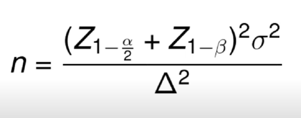
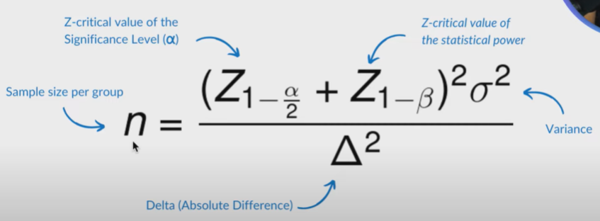
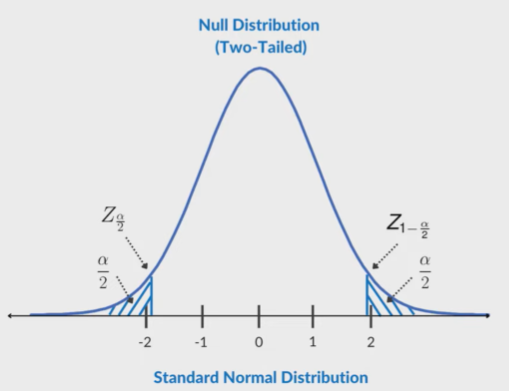
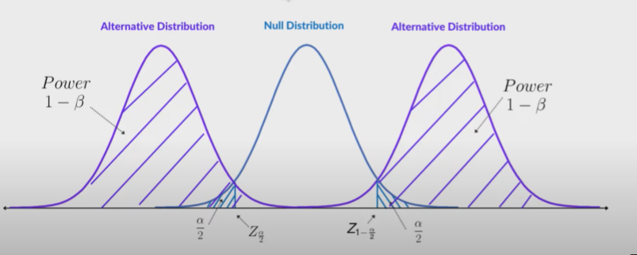
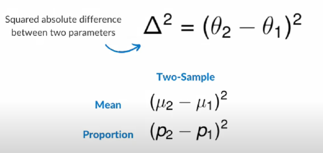
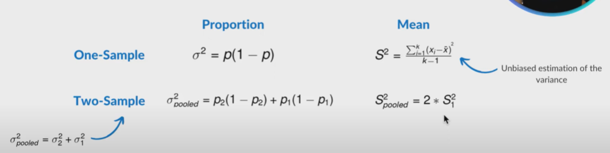
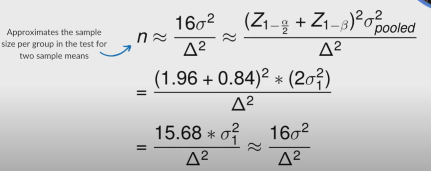
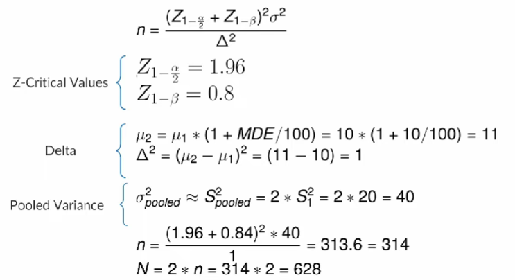

## Sample Size Calculation

Calculate sample size based on the underlying statistical model, significance level, statistical power and minimum detectable effect.

1. Formula

    

    

    Keep in mind that this Delta squared. It is not the same thing as lift.

2. Significance Level(Alpha)

    A threshold for which a p-value of an observed effect is considered as statistically significant.

    

    If you observe an effect, you ran an experiment on ABTest and you see that there's an improvement of your KPI of interest. 

    Let's just say SIGN UP Rate.

    And it is better for the treatment than what you saw in the control. 

    But the question is that the effect that you observe the difference between the two didn't happen because of some random chance or because of the underlying difference between the treatment effect versus the control effect.

    So you need to evaluate this statistical significance of that effect on the way you gauge. 
    
    That is comparing the p-value the probability of observing theh effect or more extreme under the assumption that the null hypothesis is true.

    And If this p-value is less than the significance level, then you would deem that effect to be statistically significant.

    Now this null hypothesis has following distribution of null distribution and you're trying to calculate the probability of observing the effect or more extreme under this null distribution.

    Because remember you're assuming that the null hypothesis is True.

    Now this node distribution when you're evaluating using a statistical test is normalized in standard normal distribution.

    And what is normal distribution is you're essentially scaling your data. 
    
    In such a way that the mean becomes zero and the standard deviation becomes one.

    Now in most statistical tests oftentimes, it is a two-tailed test.

    What that means is that the effect may be in the negative direction meaning the control might be worse than the treatment or it might be in the positive direction meaning that the treatment is better than control.

    Because this is a two-tailed test, you have to split the alpha in this case.

    So you allocate half of it by diving Alpha by 2. 

    One of the region on the left side is going to have Alpha divided by 2 and on the right side is going to be Alpha divided by 2 as well.

    The threshold applied on this scale that creates this rejection region is going to be the Z critical value or the Z-Score.

3. Statistical Power (1 - Beta)

    

    The probability of detecting an effect given that the effect exists.

    What is underlying difference between the significance level and Statistical power?

    So the underlying difference between those is that the statistical significance gives you the statistical evidence you need in order to reject the null hypothesis or not.

    But the null hypothesis often claiming that the two distributions are the same.

    However this doesn't give us a sense about what is a probability of detecting an effect if that were true.

    So how do we get the power in this case?

    Statistical power is the region covering the intersection of this critical value on the null distribution.

    So whatever is to the righht of this critical value is going to be your statistical power.

4. Calculating Delta

    

    It is important that you're trying to calculate the sample size, you don't plug in the MDE expressed in the lift form into this Delta squared.

    Because they're not the same thing.

5. Example

    Let's suppose that the MDE (relative lift) is 20%, and the baseline CTR is 15%, What is the delta squared?

    MDE = 20%
    CTR_1 = 0.15

    CTR_2 = CTR_1 * (1 + MDE / 100)

    CTR_2 = 0.15 * (1 + 20 / 100) = 0.18

    Delta Squared = (CTR_2 - CTR_1) ^ 2

6. Estimating the Variance.

    

    You might be wondering why can't you calculate the sample vairance of group 2 in this case.

    The reason why you can't do that is becasue you don't know sample variance is of group 2 which is often the treatment until you've actually run the experiment.

7. Sample Size Calculation.

    
    
8. Question 1

    Suppose that, in an AB Test, the desired MDE in a two-tailed test is 10%, the significance level of 0.05 and statistical power of 0.80.

    Given that the baseline mean is 10 and variance is 20. What is the total sample size required for the experiment? Assume that there are two groups.

    