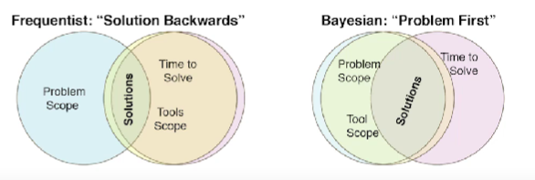

## 1. Motivation : Meet Nadia

Nadia is a product manager. 
Nadia is smart. 
She wants to know if a new feature will be effective.
She talks to you about impact, tracking & KPIs before planning the feature.

BE LIKE NADIA

## 2 So... Is it working?

Life is noisy and complicated, so we ran a test:
- Nadia asks: "Can we say the ad campaign worked?"
- You say: "We saw X% increase daily visits, with p < 0.05"
- Nadia hears: "99.5% its working?"

## 3. The answers you want

```
P("it works" | data) <- The answer Nadia wants

= P("it works") P(data | "it works") / P(data)

p-value = P(data|"it's not working")

cf.
- P("it works") <- prior
- P(data|"it works") <- Likelihood(model)
- P(data) <- Might be hard to compute

```

P-value quantifies surprise in a universe when there is no effect when there is no change.

## 4. Why Bayes?

- Because you want the right answer: Is it working?
- Because by using p-values you are miss-communicating with your stakeholders (with p < 0.001)
- Because it's a good way to think about problems.
- Because Bayesian tools support a better processes ( and cover more cases)

## 5. It is working!

1. Frequentist gives:
Point estimate + CI + p-value(& power) + confusion

2. Bayes gives : Posterior distribution, that can answer:

- Where does the difference "live" (HDI/EDI)
- Are doing damage? (Type S)
- Are we off by a magnitude? (Type M)
- Are below an arbitary minimal threshold?
- How crazy do you have to be to think there was no difference? (Bayes factors)

## 6. Some Toolkits

1. Low level frameworks: Stan/pyMC3/BUGS/JUGS
    - Fully flexible & powerful
    - New syntax
    - Cross platform

2. Mid level frameworks: BSTS
    - Topical (solve a specific problem)
    - Flexibility <-> Structure trade off

3. Wrappers 
    - Stan/R ecosystem: Prophet, BRMS, stanARM, ...
    - BSTS: CausalImpact
    - R packages: BEST / BayestestR

## 7. AB Testing is the answer to everything, except...

1. When you are out of the "Goldilocks Zone"
    - Too fast / slow (time matters)
    - Too broad / specific (pooling)

2. When you just can't test:
    - Public campaigns
    - Tracking gaps
    - Legal issues

## 8. Thinking & Framing



- Frequentist tools : phrase the problem to fit the tools

- Bayesian tools : find a model that fits the problem (but in a finite time)