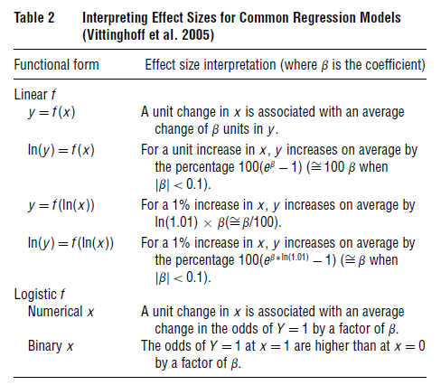

## 1. 요약
- 큰 표본에서 p-value는 빠르게 0으로 이동함
- p-value에만 의존하면 실질적으로 유의미하지 않은 결과에 대한 주장을 할 수 있음
- 대규모 표본 연구 조사에서 상당수의 논문이 낮은 p-value와 회귀계수에 의존하여 가설을 뒷받침한다는 것을 발견
- 대형 샘플에서 p-value문제를 완화하기 위해 취할 수 있는 조치 권고
- 권고사항은 이베이에서 30만 대 이상의 카메라 판매 사례를 통해 설명

## 2. 서론
- 큰 표본에 작은 표본의 통계 추론을 적용할 때 핵심 이슈는 극소량의 효과도 통계적으로 유의미할 수 있다는 점임.

- `통계적 유의미(significance)`가 아니라 `결과의 실질적 유의미(significance)`를 살펴봐야함.

## 3-1. 큰 샘플의 p-value 문제

- 주어진 맥락에서, 우리가 통계적으로 중요한 결과를 산출할 수 있을 만큼 충분히 큰 표본을 항상 가지고 있다는 보장은 없음

- 귀무 가설에 대한 앞서 언급한 관찰은 `통계적 유의성`에만 의존하는 것에서 `실질적인 유의성과 효과의 크기`를 고려하는 것으로 촛점을 이동시켜야 함.

- 즉, 귀무 가설이 기각된다고 주장하는 유의성 및 부호만을 근거로 한 결론은 효과 크기의 실제 크기에 비추어 해석되지 않는 한 의미가 없음.

## 3-2. 다른 분야에서 p-value 문제

- p-value는 귀무 가설이 실제 효과가 있을 때 기각될 수 있는 확률만 설명하는 반면, 신뢰 구간(CI)은 관심 있는 모수의 실제 크기에 대한 범위를 제공합
- 표본 크기가 커질수록 일반적인 CI는 더 좁아짐
- p-value가 전달하는 정보는 큰 표본으로 확장되지 않지만 신뢰 구간에 포함된 정보는 범위 추정치가 더 정확해짐에 따라 확장됨.
- 이 속성은 연구자가 표본이 p-value를 사용하기에는 너무 큰지 확실하지 않더라도 CI를 확인하는 것이 항상 안전하다는 것을 의미

## 3-3. 대용량 샘플은 어떻게 해야하는지

- 효과 크기를 표현하기(Presenting Effect Size)
    - 전통적인 통계 검정 외에도, 연구자는 가능한 한 객관적이고 명확하며, 연구 컨텍스트 내에서 계수 추정치의 의미, 즉 효과 크기를 이해할 수 있도록 도와야 함
    - 즉, 다음과 같이 보고해야 함.

        
    
    - 비선형 모델의 경우, 한계 분석(Marginal Analysis)은 p-값이나 계수의 크기를 보는 것보다 효과 크기를 해석하는 더 강력한 방법(때로는 유일한 방법)

    - 예를 들어 하루에 사과 한 개를 먹으면 병에 걸릴 확률이 3%에서 2%로 줄어든다고 가정
    - "하루에 사과를 추가로 섭취할 때마다 병원에 갈 확률이 평균 33% 감소한다"고 말할 수 있고, "하루 사과를 식단에 포함하면 병에 걸릴 위험을 3%에서 2%로 줄일 수 있다"고 말할 수 있음.
    -  이 해석은
        - (1) 비교 시점(X = 0, 사과 없음), 
        - (2) 효과 크기에 대한 전통적인 감각((3% - 2% / 3% = 33%), 
        - (3) 효과 크기의 상대적 크기(3%에서 2%로 증가)를 보여주기 때문에 훨씬 더 유익

- 신뢰구간을 명시하기 (Reporting Confidence Intervals)
    - 신뢰 구간을 사용하여 효과 크기(effect size)를 보고할 것을 권고
    - 신뢰 구간의 가장 보수적인 경계를 사용

    

- 차트 사용하기(Using Charts)
    - 신뢰구간 차트(confidence interval chart)
    - 계수/p-value/샘플사이즈 차트(The coefficient/p-value/sample-size) - CPS Chart
    - 1% 유의성 임계값 차트(1% significance threshold chart)
        - 계수가 1% 수준에서 유의하게 되는 표본 크기를 보여줌
        - 강건함(Robustness)을 확인하기 위한 하위 표본 크기를 결정하는 데 사용할 수 있음.
    - 몬테카를로 CPS 차트(The Monte-Carlo CPS chart)

## 4. 결론

- 가설증명을 위해 단순히 회귀계수와 낮은 p-value에 의존해서는 안됨
- 대신 `효과 크기(effect sizes)`와 `신뢰구간(confidence intervals)`을 명시
- 예를 들어,  신뢰구간의 최소점을 보수적으로 잡고, 몬테카를로 시뮬레이션과 함께 데이터를 해석하기 위한 다양한 그림을 사용

## [PDF Link](https://www.researchgate.net/publication/270504262_Too_Big_to_Fail_Large_Samples_and_the_p-Value_Problem)
