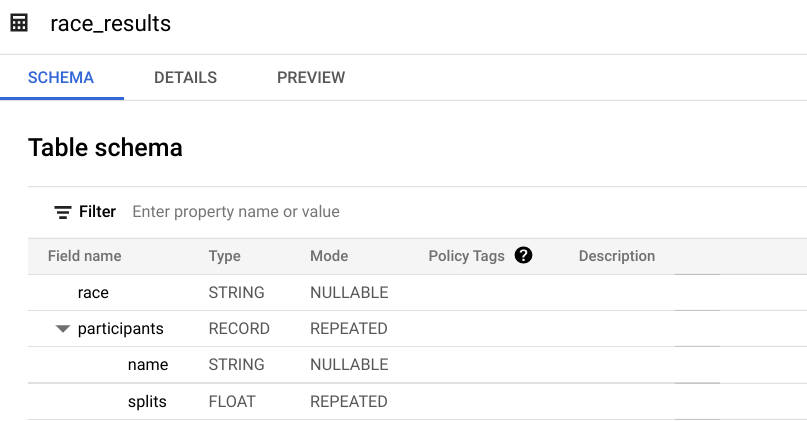
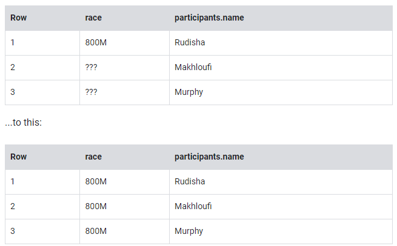
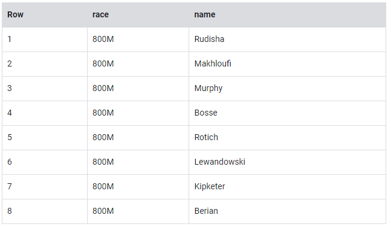

## 1. Practice working with Arrays in SQL

- An array is simply a list of items in brackets [ ]
- BigQuery (in Standard SQL mode) displays arrays as flattened. It simply lists the value in the array vertically (note that all of those values still belong to a single row)

Try it yourself. Enter the following in the BigQuery Query Editor:

```SQL
#standardSQL
SELECT
['raspberry', 'blackberry', 'strawberry', 'cherry'] AS fruit_array
```

You should get an error that looks like the following:

`Error: Array elements of types {INT64, STRING} do not have a common supertype at [3:1]`

Arrays can only share one data type (all strings, all numbers). You might ask at this point, can you have an array of arrays? Yes, they can! This will be covered later.

Here's the final table to query against:

```SQL
#standardSQL
SELECT person, fruit_array, total_cost FROM `data-to-insights.advanced.fruit_store`;
```

## 2. Uploading JSON files

What if you had a JSON file that you needed to ingest into BigQuery? You'll try this now.

Create a new table in the `fruit_store` dataset. To create a table, click on the View actions icon next to the fruit_store dataset and select Open. Then click Create table from the right panel.

Note: You may have to widen your browser window to see the Create table option.
Add the following details for the table:

Source: Choose Google Cloud Storage in the Create table from dropdown.
Select file from GCS bucket: data-insights-course/labs/optimizing-for-performance/shopping_cart.json
File format: JSONL (Newline delimited JSON)
Call the new Table name fruit_details. Under Schema, click on the checkbox of Auto detect

Click Create table.

Click on the table `fruit_details`.

In the schema, note that fruit_array is marked as REPEATED which means it is an array.

## 3. Storing data about one entity that has different data types

As you saw earlier, arrays can only have one data type. There is, however, a data type which supports having both multiple field names and types: the [STRUCT](https://cloud.google.com/bigquery/docs/reference/standard-sql/data-types#struct_type) data type.

The next dataset will be lap times of runners around the track. Each lap will be called a "split".

With this query, try out the STRUCT syntax and note the different field types within the struct container:

```SQL
#standardSQL
SELECT STRUCT("Rudisha" as name, 23.4 as split) as runner
```

What do you notice about the field aliases? Since there are fields nested within the struct (name and split are a subset of runner) you end up with a dot notation.

What if the runner has multiple splits in one record? How could you have multiple split times within a single record? Hint: the splits all have the same numeric datatype.

Answer: With an array of course! Run the below query to confirm:

```SQL
#standardSQL
SELECT STRUCT("Rudisha" as name, [23.4, 26.3, 26.4, 26.1] as splits) AS runner
```

To recap:

- Structs are containers that can have multiple field names and data types nested inside.

- Arrays can be one of the field types inside of a Struct (as shown above with the splits field).

## 4. Load in race results from other racers into a new table

Create a new dataset titled `racing`.

Create a new table titled `race_results`.

Ingest this Google Cloud Storage JSON file:

data-insights-course/labs/optimizing-for-performance/race_results.json

- Source: select `Google Cloud Storage` under Create table from dropdown.

- Select file from GCS bucket: data-insights-course/labs/optimizing-for-performance/race_results.json

- File format: JSONL (Newline delimited JSON) and set Table name as race_results.

- Move the Edit as text slider and add the following:

```JSON
[
    {
        "name": "race",
        "type": "STRING",
        "mode": "NULLABLE"
    },
    {
        "name": "participants",
        "type": "RECORD",
        "mode": "REPEATED",
        "fields": [
            {
                "name": "name",
                "type": "STRING",
                "mode": "NULLABLE"
            },
            {
                "name": "splits",
                "type": "FLOAT",
                "mode": "REPEATED"
            }
        ]
    }
]
```

Click Create table.

After the load job is successful, preview the schema for the newly created table:



Which field is the STRUCT? How do you know?

The participants field is the STRUCT because it is of type RECORD

Which field is the ARRAY?

The participants.splits field is an array of floats inside the parent participants struct. It has a REPEATED Mode which indicates an array. Values of that array are called nested values since they are multiple values inside of a single field.

## 4. Practice querying nested and repeated fields

What if you wanted to list the name of each runner and the type of race?

Run the below schema and see what happens:

```SQL
#standardSQL
SELECT race, participants.name
FROM racing.race_results
```

`Error: Cannot access field name on a value with type ARRAY<STRUCT<name STRING, splits ARRAY<FLOAT64>>>> at [2:27]`

Much like forgetting to GROUP BY when you use aggregation functions, here there are two different levels of granularity. One row for the race and three rows for the participants names. So how do you change this...



In traditional relational SQL, if you had a races table and a participants table what would you do to get information from both tables? You would JOIN them together. Here the participant STRUCT (which is conceptually very similar to a table) is already part of your races table but is not yet correlated correctly with your non-STRUCT field "race".

Can you think of what two word SQL command you would use to correlate the 800M race with each of the racers in the first table?

Answer: CROSS JOIN

Great! Now try running this:

```SQL
#standardSQL
SELECT race, participants.name
FROM racing.race_results
CROSS JOIN
participants  # this is the STRUCT (it's like a table within a table)
```

`Error: Table name "participants" missing dataset while no default dataset is set in the request.`

Even though the participants STRUCT is like a table, it is still technically a field in the `racing.race_results` table.

Add the dataset name to the query:

```SQL
#standardSQL
SELECT race, participants.name
FROM racing.race_results
CROSS JOIN
race_results.participants # full STRUCT name
```

And Run.

Wow! You've successfully listed all of the racers for each race!



You can simplify the last query by:

- Adding an alias for the original table
- Replacing the words "CROSS JOIN" with a comma (a comma implicitly cross joins)

This will give you the same query result:

```SQL
#standardSQL
SELECT race, participants.name
FROM racing.race_results AS r, r.participants
```

If you have more than one race type (800M, 100M, 200M), wouldn't a CROSS JOIN just associate every racer name with every possible race like a cartesian product?

`Answer`: No. This is a correlated cross join which only unpacks the elements associated with a single row. For a greater discussion, see [working with ARRAYs and STRUCTs](https://cloud.google.com/bigquery/docs/reference/standard-sql/arrays#flattening-arrays)

Recap of STRUCTs:

- A SQL STRUCT is simply a container of other data fields which can be of different data types. The word struct means data structure. Recall the example from earlier:

- STRUCT("Rudisha" as name, [23.4, 26.3, 26.4, 26.1] as splits) AS runner

- STRUCTs are given an alias (like runner above) and can conceptually be thought of as a table inside of your main table.

- STRUCTs (and ARRAYs) must be unpacked before you can operate over their elements. Wrap an UNNEST() around the name of the struct itself or the struct field that is an array in order to unpack and flatten it.

## 5. Lab Question: STRUCT()

Answer the below questions using the racing.race_results table you created previously.

`Task`: Write a query to COUNT how many racers were there in total.

To start, use the below partially written query:

```SQL
#standardSQL
SELECT COUNT(participants.name) AS racer_count
FROM racing.race_results
```

`Hint`: Remember you will need to cross join in your struct name as an additional data source after the FROM.

Possible Solution:

```SQL
#standardSQL
SELECT COUNT(p.name) AS racer_count
FROM racing.race_results AS r, UNNEST(r.participants) AS p
```
## 6. Unpacking ARRAYs with UNNEST( )

Now that you are familiar working with STRUCTs, it's time to apply that same knowledge of unpacking ARRAYs to some traditional arrays.

Recall that the [UNNEST](https://cloud.google.com/bigquery/docs/reference/standard-sql/query-syntax#unnest) operator takes an ARRAY and returns a table, with one row for each element in the ARRAY. This will allow you to perform normal SQL operations like:

- Aggregating values within an ARRAY
- Filtering arrays for particular values
- Ordering and sorting arrays

As a reminder, an Array is an ordered list of elements that share a data type. Here is a string array of the 8 racer names.

`['Rudisha','Makhloufi','Murphy','Bosse','Rotich','Lewandowski','Kipketer','Berian']`

You can create arrays in BigQuery by adding brackets [ ] and comma separating values.

Try the below query and be sure to note how many rows are outputted. Will it be 8 rows?

```SQL
#standardSQL
SELECT
['Rudisha','Makhloufi','Murphy','Bosse','Rotich','Lewandowski','Kipketer','Berian'] AS normal_array
```

Tip: If you already have a field that isn't in an array format you can aggregate those values into an array by using [ARRAY_AGG()](https://cloud.google.com/bigquery/docs/reference/standard-sql/functions-and-operators#array_agg)

In order to find the racers whose names begin with the letter M, you need to unpack the above array into individual rows so you can use a WHERE clause.

Unpacking the array is done by wrapping the array (or the name of the array) with UNNEST() as shown below. Run the below query and note how many rows are returned.

```SQL
#standardSQL
SELECT * FROM
UNNEST(['Rudisha','Makhloufi','Murphy','Bosse','Rotich','Lewandowski','Kipketer','Berian']) AS unnested_array_of_names
```

You have successfully unnested the array. This is also called [flattening](https://cloud.google.com/bigquery/docs/reference/standard-sql/arrays#flattening-arrays) the array.

Now add a normal WHERE clause to filter these rows, and run the query:

```SQL
#standardSQL
SELECT * FROM
UNNEST(['Rudisha','Makhloufi','Murphy','Bosse','Rotich','Lewandowski','Kipketer','Berian']) AS unnested_array_of_names
WHERE unnested_array_of_names LIKE 'M%'
```

## 7. Lab Question: Unpacking ARRAYs with UNNEST( )

Write a query that will list the total race time for racers whose names begin with R. Order the results with the fastest total time first. Use the UNNEST() operator and start with the partially written query below.

Complete the query:

```SQL
#standardSQL
SELECT
  p.name,
  SUM(split_times) as total_race_time
FROM racing.race_results AS r
, r.participants AS p
, p.splits AS split_times
WHERE
GROUP BY
ORDER BY
;
```

`Hint`:

- You will need to unpack both the struct and the array within the struct as data sources after your FROM clause
- Be sure to use aliases where appropriate

Possible Solution:

```SQL
#standardSQL
SELECT
  p.name,
  SUM(split_times) as total_race_time
FROM racing.race_results AS r
, UNNEST(r.participants) AS p
, UNNEST(p.splits) AS split_times
WHERE p.name LIKE 'R%'
GROUP BY p.name
ORDER BY total_race_time ASC;
```

## 8. Filtering within ARRAY values]

You happened to see that the fastest lap time recorded for the 800 M race was 23.2 seconds, but you did not see which runner ran that particular lap. Create a query that returns that result.

Complete the partially written query:

```SQL
#standardSQL
SELECT
  p.name,
  split_time
FROM racing.race_results AS r
, r.participants AS p
, p.splits AS split_time
WHERE split_time = ;
```

Possible Solution:

```SQL
#standardSQL
SELECT
  p.name,
  split_time
FROM racing.race_results AS r
, UNNEST(r.participants) AS p
, UNNEST(p.splits) AS split_time
WHERE split_time = 23.2;
```