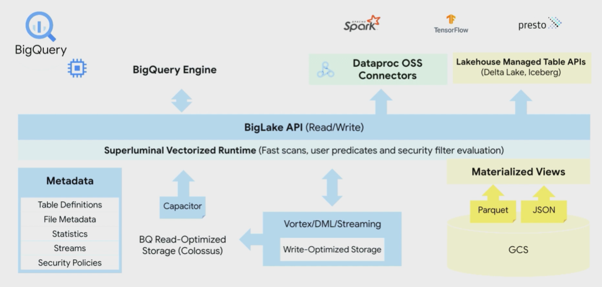
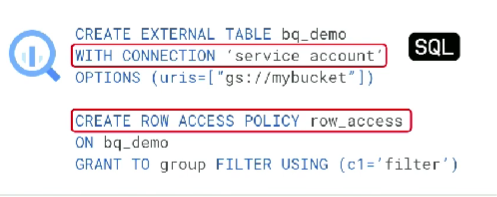
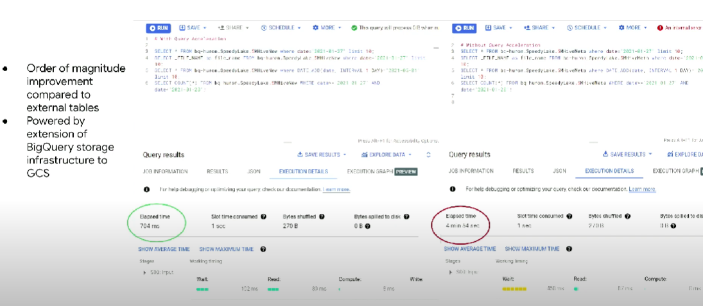
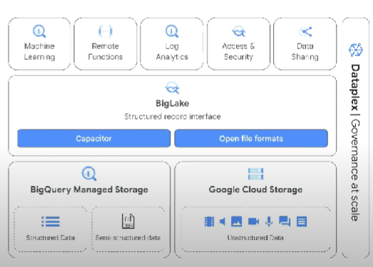
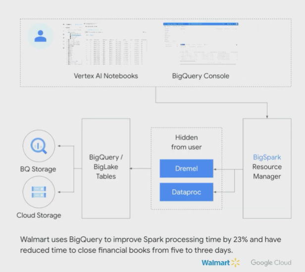

## 1. BigLake 출시

1. 새로운 Data Format 지원
    - ICEBERG 지원
    - 향후 hudi, DELTA LAKE 지원 예정

2. 가격은 저렴하면서도 DW 수준으로 성능낼 수 있음

3. Data Lakes에서 BigQuery의 보안과 Governance 기능 가능

4. 퍼포먼스 가속 기능이 있어서 GCS를 사용하고도 성능 개선이 가능

5. Object Table - 비정형 데이터 지원

## 2. BigQuery Omni

1. 현재 US Region에서만 지원, 하지만 NON-US Region중에서는 한국이 최초로 하반기에 확장이 됨

## 3. Google Data Cloud Architecture

## 4. Spark & BigQuery

1. BigQuery Stored Procedures에 Spark를 연동

2. BigSpark

3. Change Data Capture 및 Datastream 통합

4. Analytics on Log Data

- 서버, 센서, 기타 디바이스에서 자동 생성된 로그를 BigQuery에서 비즈니스 데이터와 함께 저장, 탐색, 분석

5. Query Inspector

6. BQML과 Vertex AI Model Registry 통합

7. BigQuery Migration Service

8. Connected Sheets