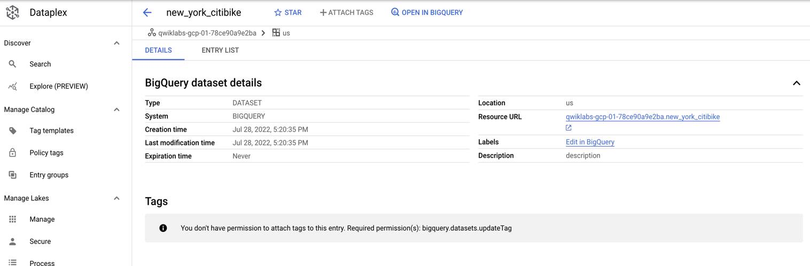
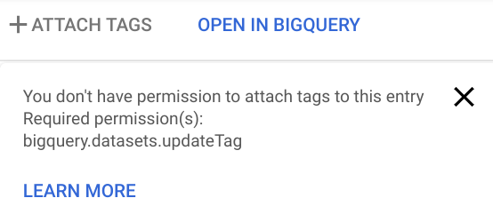

# Scenario: CEO of NYC transportation company


You are the head of a transportation business operating in New York City. You have teams of data analysts that query datasets you have collected about NYC travel (by bike and car).

`Challenges:`

- Some of your datasets contain sensitive information that you want to access control.

- Your team complains that finding the right dataset is difficult among the many other datasets they have access to.

- To comply with recent regulatory requirements, you need a very clear way to flag which datasets have PII (Personally Identifiable Information) in them.

### Datasets for your organization

- NYC Bike Share Trips
- NYC Motor Vehicle Collisions

Each data engineering team maintains their dataset in their own separate Google Cloud Project so they can better manage access and billing. While this is good for them, it makes these datasets less discoverable for your team of analysts.

### Not all analyst roles are equal

To make matters more complex, you have different levels of data analysts on your BI team working for you:

- Data Analysts - least privileges

- Owner - full admin

# Part 1: Explore the existing data environment with the owner role

Recall that your data engineering team provided you with three projects each containing a different New York City dataset. Confirm the Owner role can see and query all datasets.

1. Log in using the Owner (full admin) auto-generated email and password provided as part of this lab.

2. Accept the Terms and Conditions to use Google Cloud (if prompted).


## Task 1. Confirm the owner role can view and query the new_york_mv_collisions Dataset

Let's now confirm that the owner role can view the `new_york_mv_collisions` dataset.

1. In BigQuery, under Explorer click your project name to toggle open the available datasets you have access to see.

2. Confirm you can see the `new_york_mv_collisions` dataset.

3. Click the `new_york_mv_collisions` dataset to toggle open the tables inside.

4. Click the `nypd_mv_collisions` table and explore the available fields in the schema.


### Confirm that the owner role can query the collisions dataset

Since you're logged in as a global owner, confirm you can see and access both projects and datasets. Confirm you can run the below query.

- Copy and paste the below query into the BigQuery Query Editor and click Run:

What were the 10 most common factors in NYC car crashes?

```SQL
SELECT
  contributing_factor_vehicle_1 AS collision_factor,
  COUNT(*) AS num_collisions
FROM
  `new_york_mv_collisions.nypd_mv_collisions`
WHERE
  contributing_factor_vehicle_1 != "Unspecified"
  AND contributing_factor_vehicle_1 != ""
GROUP BY
  collision_factor
ORDER BY
  num_collisions DESC
LIMIT 10;
```

## Task 2. Confirm the owner role can view and query the Bike Share dataset


### What are the most popular Bike Share routes by gender?

The NYC Citi Bike Public Dataset tracks each individual bike share trip (starting location, ending location) as well as other fields for each user.

- Add the below query to the Query editor and Run it to see the most popular routes by gender. Note that the only three values provided in the dataset are unknown, male, and female which may not be representative of all the gender values for bike share riders:

```SQL

WITH unknown AS (
  SELECT
    gender,
    CONCAT(start_station_name, " to ", end_station_name) AS route,
    COUNT(*) AS num_trips
  FROM
    `new_york_citibike.citibike_trips`
  WHERE gender = 'unknown'
  GROUP BY
    gender,
    start_station_name,
    end_station_name
  ORDER BY
    num_trips DESC
  LIMIT 5
)
, female AS (
  SELECT
    gender,
    CONCAT(start_station_name, " to ", end_station_name) AS route,
    COUNT(*) AS num_trips
  FROM
    `new_york_citibike.citibike_trips`
  WHERE gender = 'female'
  GROUP BY
    gender,
    start_station_name,
    end_station_name
  ORDER BY
    num_trips DESC
  LIMIT 5
)
, male AS (
  SELECT
    gender,
    CONCAT(start_station_name, " to ", end_station_name) AS route,
    COUNT(*) AS num_trips
  FROM
    `bigquery-public-data.new_york_citibike.citibike_trips`
  WHERE gender = 'male'
  GROUP BY
    gender,
    start_station_name,
    end_station_name
  ORDER BY
    num_trips DESC
  LIMIT 5
)
SELECT * FROM unknown
UNION ALL
SELECT * FROM female
UNION ALL
SELECT * FROM male;
```

# Part 2: Explore the existing data environment with restricted user access

So far in the lab you have been logged in as the Owner account which your data engineering team has provided with the highest level permissions.

You have asked your engineering teams to limit access to your Data Analyst users as follows

Data Analysts should see:

- NYC Bike Share

Data Analysts should NOT see:

- NYC Motor Vehicle Collisions

Sign out of the Owner account

1. Click the profile icon.

2. Sign out.

## Task 3. Log in with the Data Analyst user and confirm restricted project access


## Task 4. Attempt to directly query a private dataset

In BigQuery, even if a project is not pinned or visible in your Explorer section you can still query it if you have access. Try to query the NYC Collisions dataset directly as a Data Analyst user by using the project-id.

- Add the below query from before and replace the project id prefix the project id for the `NYC Motor Vehicle Collisions Project`:


```SQL
SELECT
  contributing_factor_vehicle_1 AS collision_factor,
  COUNT(*) AS num_collisions
FROM
  `qwiklabs-gcp-REPLACE-HERE.new_york_mv_collisions.nypd_mv_collisions`
WHERE
  contributing_factor_vehicle_1 != "Unspecified"
  AND contributing_factor_vehicle_1 != ""
GROUP BY
  collision_factor
ORDER BY
  num_collisions DESC
LIMIT 10;
```

Receiving an access denied error message verifies your Data Analyst access level.

You have now explored the different privileges and accesses granted to owner roles (broadest set of privileges) and Data Analysts (most restrictive) when it comes to accessing projects, datasets, and queries.

Next you will try and find a hidden dataset using the Data Catalog search functionality. Do you think it will show up for Data Analysts if BigQuery blocks you?

# Part 3: Using Data Catalog to tag datasets across projects

Now that you are familiar with the datasets and access levels granted to different roles, you will address the challenges posed earlier in the sample scenario:

Challenges:

- Some of your datasets contain sensitive information that you want to access control.
- Your team complains that finding the right dataset is difficult among the many other datasets they have access to.

To comply with recent regulatory requirements, you need a very clear way to flag which datasets have PII (Personally Identifiable Information) in them. You will address these challenges and complete this task with the Data Catalog service.

### How Data Catalog surfaces metadata

Before searching, discovering, or displaying Google Cloud resources, [Data Catalog checks that the user has been granted an IAM role](https://cloud.google.com/data-catalog/docs/concepts/iam#searching_resources) with the metadata read permissions required by BigQuery, Pub/Sub, or other source system to access the resource.

Example: Data Catalog checks that the user has been granted a role with bigquery.tables.get permission before displaying BigQuery table metadata.

## Task 5. Create a Data Catalog tag template from a BigQuery dataset

1. Click on the `new_york_citibike` table name entry. This is a subtask of the ride share dataset you are allowed to view.

    

    For BigQuery tables, Data Catalog allows you to tag:

    - The Dataset itself

    - The table

    - Individual columns


2. Attempt to click on the Attach tag button.

3. Confirm you get a similar error:

    


4. In that dialog, hover over Learn more to see why it is not available.

### Who can create a tag template?

In order to create tag templates, the user needs to have, at minimum, edit access to the resource in question (BigQuery for this lab) AND datacatalog.tagTemplateUser (assuming a template has already been created). To learn more, refer to the [Data Catalog IAM Guide](https://cloud.google.com/data-catalog/docs/concepts/iam#attaching_tags_to_resources).


What if you need to create a new tag template? Then you would need to be at minimum a datacatalog.tagTemplateCreator or roles/datacatalog.tagTemplateOwner. Owner allows you to delete existing templates and additional admin privileges.

Most common Data Catalog predefined Cloud IAM roles:

- roles/datacatalog.tagTemplateViewer

- roles/datacatalog.tagTemplateUser

- roles/datacatalog.tagTemplateCreator

- roles/datacatalog.tagTemplateOwner

- For a complete list of roles, refer to [Data Catalog roles](https://cloud.google.com/iam/docs/understanding-roles#datacatalog)

## Task 6. Create a new Data Catalog template

[Search and view data assets with Data Catalog.](https://cloud.google.com/data-catalog/docs/how-to/search)

[Data Discovery in Google Cloud (Cloud Next '19)](https://www.youtube.com/watch?v=Qq76r-z_50c)