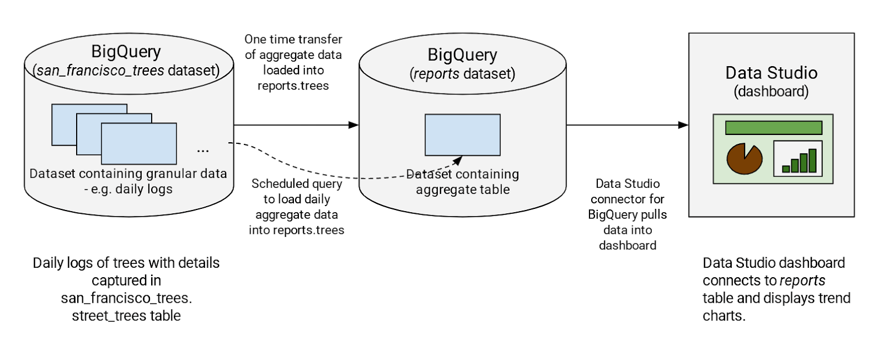
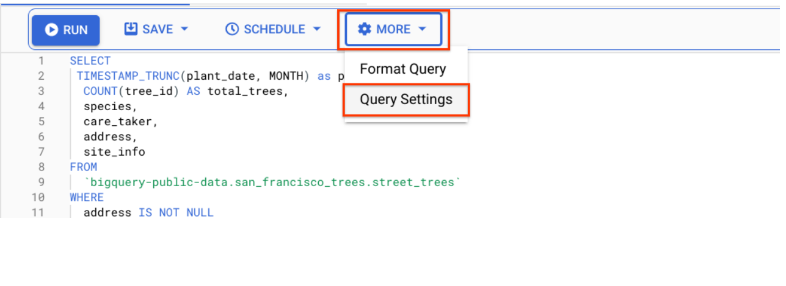
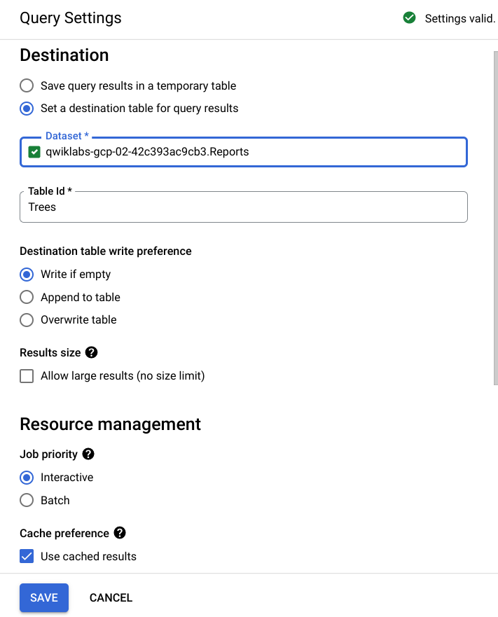
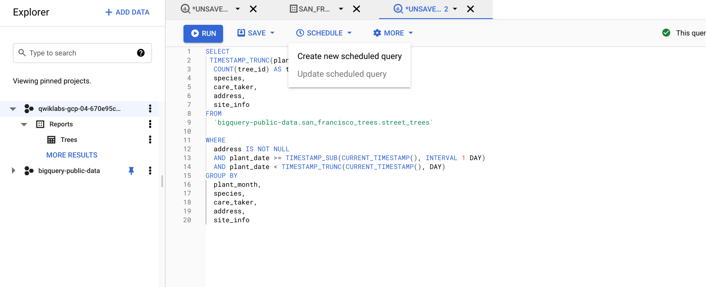
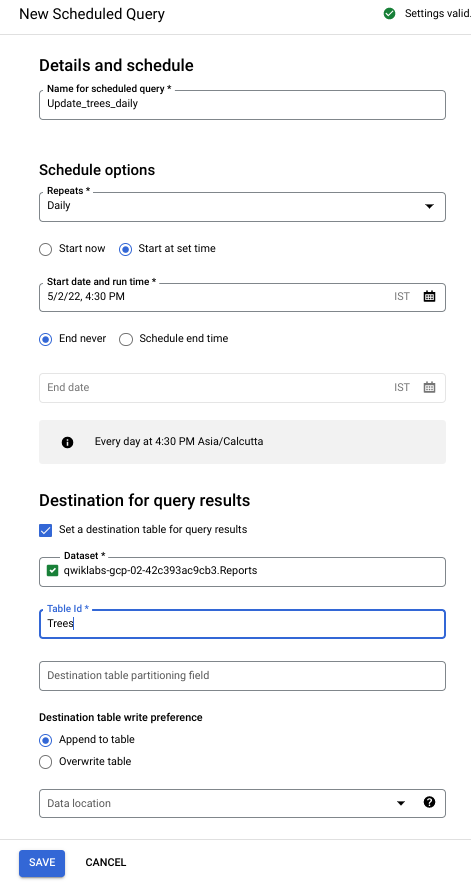

## 1. Overview

Typically, a dashboard shows an aggregated view of usage — it doesn't need details all the way to the level of an order ID, for instance. So, to reduce query costs, you'll first aggregate your needed logs into another dataset called "Reports" then create a table of aggregated data. You'll query the table from the Data Studio dashboard. This way, when your dashboard is refreshed, the reporting dataset queries process less data. Since usage logs from the past never change, you'll only refresh new usage data into the Reports dataset.



## 2. Create a reports dataset in BigQuery

Next you'll create a new dataset called Reports in your project. A separate dataset has a couple of benefits: it reduces the amount of data queried by the dashboard, and it removes unnecessary access to your source datasets by users who are only interested in aggregated data.

- Click on the project name that starts with "qwiklabs", then click on View Actions.

- Click on Create dataset and call it "Reports".

- Click Check my progress to verify the objective.

## 3. Query the dashboard data

Next you run a one-time query to pull the data for the last year, summarizing:

- The number of trees planted each month

- Which species of trees were planted

- Who the caretaker of the trees is

- Address of the planted trees

- Tree site information


`1. Add the following to the query editor:`

```SQL
SELECT
 TIMESTAMP_TRUNC(plant_date, MONTH) as plant_month,
  COUNT(tree_id) AS total_trees,
  species,
  care_taker,
  address,
  site_info
FROM
  `bigquery-public-data.san_francisco_trees.street_trees`
WHERE
  address IS NOT NULL
  AND plant_date >= TIMESTAMP_SUB(CURRENT_TIMESTAMP(), INTERVAL 365 DAY)
  AND plant_date < TIMESTAMP_TRUNC(CURRENT_TIMESTAMP(), DAY)
GROUP BY
  plant_month,
  species,
  care_taker,
  address,
  site_info
```

`2. Click the More button, and select Query settings from the dropdown menu.`







- Select Set a destination table for query results.
- For Dataset name, type Reports.
- Create a name for the table, like "Trees".
- For Destination table write preference, select Write if empty.

Because you specified a Table name and selected the Write if empty preference, the query creates a table if the table does not already exist.

`3. Accept the other default settings and click Save.`

`4. Click Run to run the query.`

When the query completes, you are on the Results tab, where you can see the data.

## 4. Scheduling queries in BigQuery

To keep your dashboard up-to-date, you can schedule queries to run on a recurring basis. Scheduled queries must be written in standard SQL, which can include Data Definition Language (DDL) and Data Manipulation Language (DML) statements. The query string and destination table can be parameterized, allowing you to organize query results by date and time.

Now you add a query that checks each day for new data. When new trees are planted, you'll get the additional stats updated directly into the `reports.trees` table.


`1. Click Compose New Query and run the following query to pull incremental data into the reports.trees table on a daily basis using the scheduled query feature:`


```SQL
SELECT
 TIMESTAMP_TRUNC(plant_date, MONTH) as plant_month,
  COUNT(tree_id) AS total_trees,
  species,
  care_taker,
  address,
  site_info
FROM
  `bigquery-public-data.san_francisco_trees.street_trees`
WHERE
  address IS NOT NULL
  AND plant_date >= TIMESTAMP_SUB(CURRENT_TIMESTAMP(), INTERVAL 1 DAY)
  AND plant_date < TIMESTAMP_TRUNC(CURRENT_TIMESTAMP(), DAY)
GROUP BY
  plant_month,
  species,
  care_taker,
  address,
  site_info
```

`2. Click on the Schedule button, then Create new scheduled query.`



`3. On the new Scheduled query page, set the following:`

- Name: Update_trees_daily

- Schedule options:

    - Repeats: daily, choose date and time in the future

`4. In the Destination for query results sections, check the box for Set a destination table for query results and specify dataset name as <b>Reports</b>`



`5. Click Save.`

`6. You may have a popup blocker enabled, click Allow and then give your lab credentials permission, then agree to replace your query.`

## Reference [Visualize Data Studio](https://cloud.google.com/bigquery/docs/visualize-data-studio)