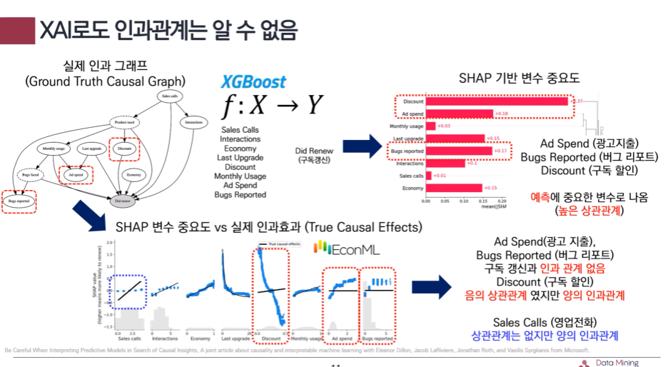
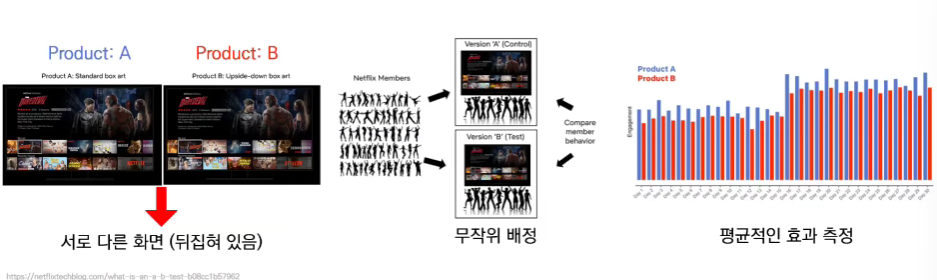
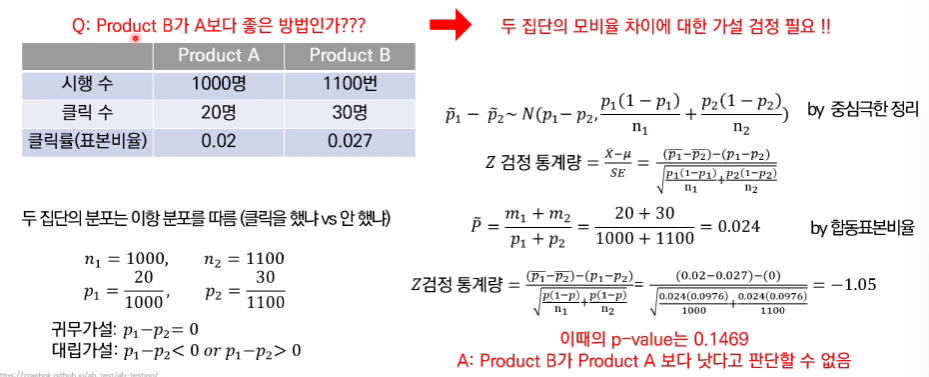

## 1. XAI도 상관관계일 뿐.

## 2. 인과관계 분석 방법

1. 인과관계 분석 방법은 크게 3가지로 나뉨

    - Randomization (랜덤화 추출)

        - Randomized Clinical Trial (A/B Test)

        - Reinforcement Learning Based - Multi Armed Bandit (MAB)

    - Causal Graphic Models (인과 그래프 모형)

        - Directed Acyclic Graph (DAG)
            
            - Greedy 알고리즘
            
            - Epsilon Greedy 알고리즘

            - Upper Confidence Bound (UCB) 알고리즘

    - Potential Outcome (잠재적 결과)

        - Machine Learning Based

            - Meta Learners (T, S, X)

        - Neural Net Based

            - TARNet

            - CFRNet

## 3. 인과관계 분석 방법 1

- Randomization (랜덤화 추출) : Randomization Clinical Test

    - Randomized Clinical Test (무작위 임상 시험) -> 현실에서는 AB Test라고 불림

    - 측정하고자 하는 변수 이외에는 모든 것들을 최대한 고정하고 확인하고 싶은 변수만 변경하면서 실험하는 방법 -> 실험 기반

    - 무작위 배정으로 평균적인 효과를 측정할 수 있음 

    

    