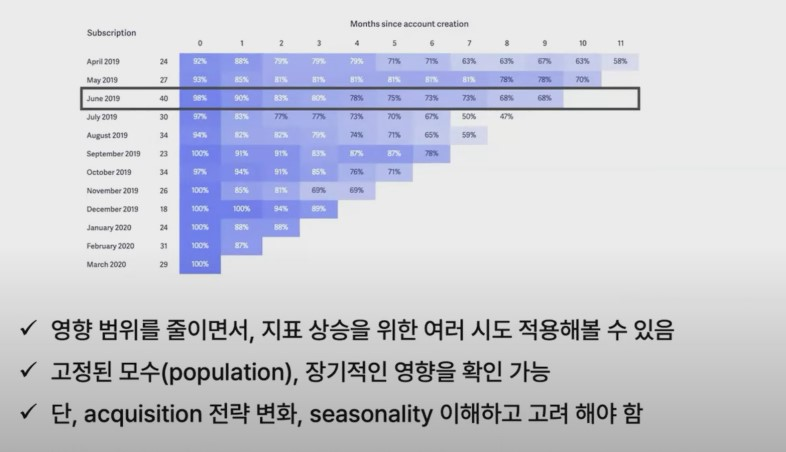

## 1. 우리는 왜 실험을 할까요?

1. Reduce Risks

    - 제품에 대한 가설은 주로 틀린다.

        - [Snapchat redesign](https://medium.com/free-code-camp/why-most-redesigns-fail-6ecaaf1b584e) : DAU down, Revenue Down 

        - [Google, Bing과 같은 성숙도가 높은 서비스의 실험 성공률](https://www.amazon.com/Uncontrolled-Surprising-Trial-Error-Business/dp/046502324X) : 10 ~ 20%

        - [Microsoft에서 진행한 실험의 1/3만이 지표 상 긍정적 결과](https://exp-platform.com/Documents/ExP_DMCaseStudies.pdf)

2. Validate Assumptions

    - 여러가지 요인이 상호작용 

        - 제품 : 홈 화면의 카테고리 구성 변경

        - 마케팅 : 때마침 블랙 프라이데이 프로모션

            - 서비스의 매출을 견인한 요인은 무엇일까?

            - 각 Action의 효과는 얼마일까?

## 2. 실험 = 유익함, 필요함 But 잘 해내기 어려움

1. 환경
    
    - 실험에 필요한 기술적 환경이 갖추어지지 않음 : 정보 관리, 실험군 배정

    - 실험에 필요한 문화적 환경이 갖추어지지 않음 : 가설 / 지표 / 의사결정자의 투자

    - Industry 특성에 따른 차이 : 구매 주기가 긴 상품(ex: 자동차), B2B SaaS

2. 기술

    - 사용자 Pool이 작아 실험에 필요한 Sample size 확보 어려움

    - 영향 범위가 큰 / 통제할 수 없는 action (ex. 시즈널 프로모션)

## 3. 가설 속의 가정(Assumption) 생각하기

1. 가설과 가정

    - 가설 : 데이터를 통해 검증할 수 있는 구체적인 명제

    - 가정 : 우리가 고객의 사고 방식에 대해서 가지고 있는 추측이나 믿음

        - 가설 : 상품 페이지 더 좋게 바꾸자! 구매전환율 5%p 더 오를듯?

            - Why? 
                
                - 가정1 : 상세 사이즈 정보 + 

                - 가정2 : 판매 수량 정보 + 

2. 가정을 통해 얻을 수 있는 것 1 : 세부적인 분석 결과 

    - Without Assumption

        - 상품 페이지 전 vs 후 (또는 실험군 vs 대조군) 구매 전환율 비교

    - With Assumption

        - 사이즈 추가 정보 조회 O 23%

        - 사이즈 추가 정보 조회 X 17%

3. 가정을 통해 얻을 수 있는 것 2 : 장기적인 성공 확률 개선

    - 상품 페이지 더 좋게 바꾸자! 구매전환율 5%p 오를 듯?

        - 사이즈 정보를 추가해서 선택에 도움을 주면 더 사고 싶겠지?

        - 인기가 많은 상품을 강조해서 보여주면 더 사고 싶겠지?

        - 상품 디테일 컷을 추가하면 더 사고 싶겠지?

        - 고객의 긍정적 구매 후기를 강조해서 노출하면 더 사고 싶겠지?

    
## 4. 실험의 비용 효율 생각하기

1. 실험으로 발생하는 비용의 종류

    - 프로젝트 복잡도

    - 코드 관리 복잡도 

    - 의사결정까지 소요되는 시간 

    - 고객 경험 차이

    - 다른 실험과 충돌

2. 실험에 필요한 Sample Size

    

    

3. 실험 O - Take the Risk

    - One sided Test

    - Confidence Level down to 90%

        - 이렇게 하면 예시의 사례의 모수에서 2,206명 * 2 (If 주간 방문자 2k -> 2주)

    - 실험이 진행되는 기간 동안 실험군과 대조군의 차이가 유지되는지 모니터링

4. 실험 X - Reduce the Variance

    

## 5. 신규 사용자 Cohort 공략하기

1. [신규 사용자의 온보딩 단계 공략하기](https://baremetrics.com/blog/cohort-analysis)

    