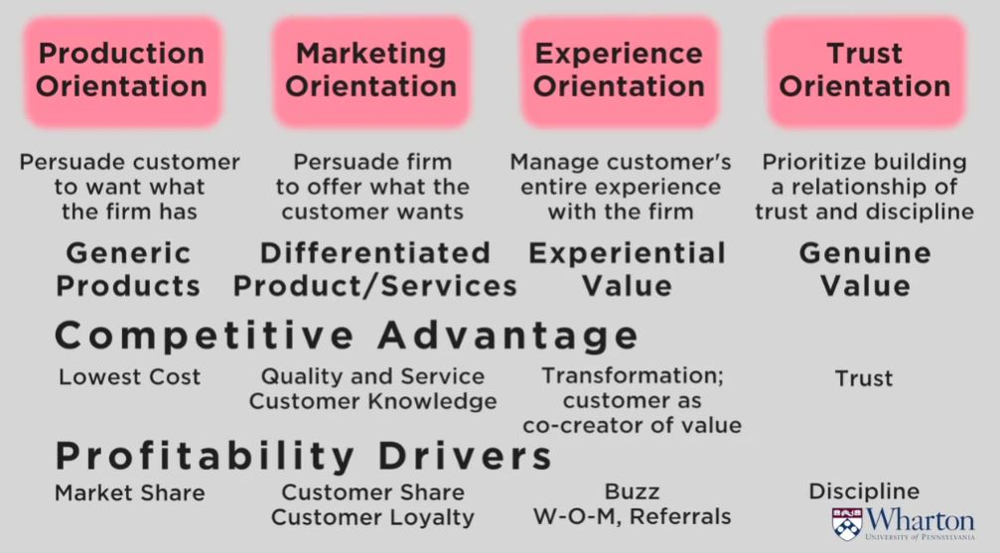

## 1. What is Marketing?

- Seller's Market
    - Production:
        - Focus on Company

- Buyer's Market
    - Marketing
        - Focus on Customer and Competition

## 2. Connected Community

- Experience
    - Focus deeper on customer experiential value

## 3. Economic Uncertainty

- Trust
    - Focus on genuine customer value - RESET, discipline, Flexibility

