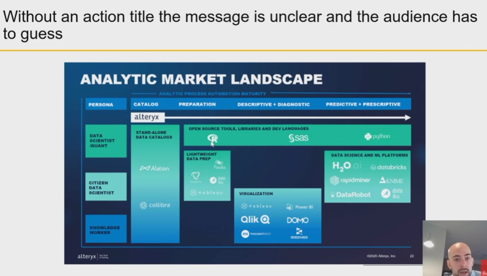
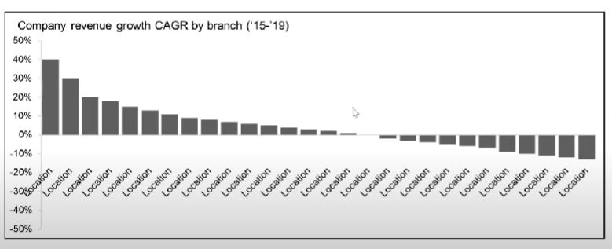

## 1. Put clear message in slide Header

It's more important to have a clear concise message.

The way you convey your message on a slide is by putting it in slide header.

## 2. Effective Action Title 

## 3. Exercise : What would be good title?

1. Global Widget Market Share
2. Company A is the market leader
3. Company A leads with 40% Market Share in NA
4. Company A leads in the US but lacks in other geographics

## 4. Exercise : What would be good title?

1. Company revenue 
2. Company revenue growth CAGR
3. 60% of locations have increased their revenues
4. Location 1 has experienced significant growth of 40%, yearly over the last 4 years.