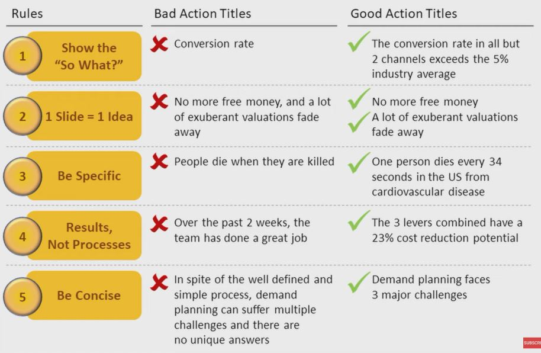

### 1. 3 Rules

1. Presentation is Story

    - Narrative
    - Pyramid

2. Slide is a Statement + Supporting Ideas

    - Top down communication
    - Action titles primer

3. Supporting Ideas Must Be Structured

    - Templates

### 2. Situation-Complication-Resolution Framework in Action:

1. Situation : A manufacturing company has a 1% defect rate in its products vs 0.1% industry average.

2. Complication : This leads to $5M in returns and to $20M + in lost customer trust

3. Resolution : The company should invest $10M in 3 major quality control measures.

### 3. A More Exciting Story: Tesla Energy Keynote 2015

1. Situation : Today's fossil fuels suck

2. Complication : If we do nothing, we are screwed

3. Resolution : Fixing the problem takes little - Look at the map.

4. Demo : Here's the solution in action. Here and now. Batteries power the whole night.

5. Features : See all the cool benefits the solution has.

6. Vision : The system is infinitely scalable.

7. Inspiration : This is something we must do, can do, and will do.

### 4. Pyramid 

### 5. Top-Down Communication

### 6. Action TItles : 5 Rules

### 7. Action Title Quiz

- Retail revenue of 3 major fashion brands? (X)
    - Show the "So What?"

- Chinese fashion startups beating Western competitors (X)
    - Be Specific

- Shein has no stores, a huge ad budget, and a vast ever growing assortment (X)
    - Results, Not Processes 

- A smartphone-only fast fashion brand overtakes H&M with ~$30bn in revenue (O)