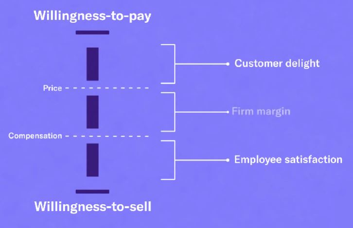

## 1. What is strategy?

- Strategy is simple. It's a plan to create value

## 2. Strategy doesn't begin with a focus on profit

- We want to start with a sense of how much value do we create in first place.
    - Value for customers
    - Value for employees
    - Value for suppliers

- Value is the difference between willingness to pay and willingness to sell.

- Willingness to pay
    - The most a customer would pay for a product or service

    - "Customer delight" is the difference between WTP and price

- Willingness to sell
    - The least amount of compensation an employee would accept

## 3. How do I raise willingness-to-pay?

- Product quality
- Product complements
- Network effects

