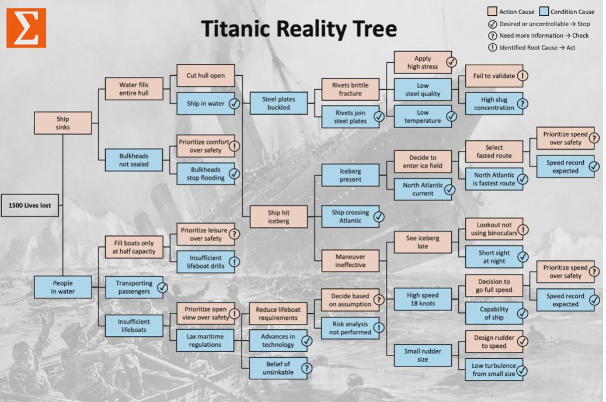

## 1. Root Cause Analysis with Logic Trees

- Disasters and repeat failures usually originate from a series of small problems that were identified but never resolved due to incorrect analysis, incomplete understanding, or ineffective actions.

## 2. Are you Effective?

- Ineffective Problem Solving
    - Quick Fix
    - Fire Fighting, going from crisis to crisis
    - Stagnant or declining performance
    - No time for deep analysis: "We are so busy..."
    - Looking for the guilty party : "Who did that?"
    - Jumping from problems into actions
    - Long lists of action to firefight symptoms
    - Focus on defects, cost, sales, profits

- Effective Problem Solving
    - Continuous Improvement
    - Systematic root cause elimination
    - Better performance after each problem solved
    - Time allocated to analyze, dialogue, conclude
    - Seek deep understanding : "How did that happen?"
    - Acting after understanding cause-effect relationships
    - Addressing all controllable causes per logic tree
    - Focus on process capability that drives performance

## 3. Analyzing Root Causes

1. Event-Based Problems
    - Disaster
    - Accident
    - Breakdown

2. Rule-Based Problem
    - Risks
    - Delays
    - Defects

3. Human Failures
    - Errors
    - Mistakes
    - Violations

## 4. Titanic Reality Tree

## 5. 0.74% Patients Receive Incorrect Insulin Dose

