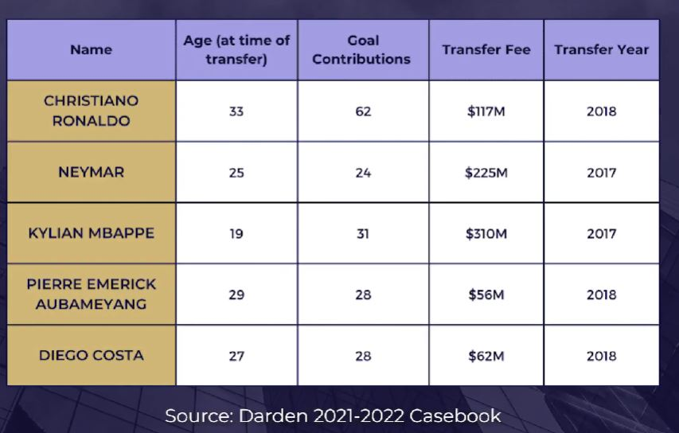

## 1. Four Parts of Consulting Case Interview

1. Opening

2. Structure

3. Analysis

4. Recommendation

### A. Opening

- Prompt
    
    Your client is the manager of a major European soccer team. He's called you while brimming with excitement after receiving news that Lionel Messi is looking for a new team. Players of Messi's quality rarely become available and would surely improve any team. However, with global conditions restricting budgets, money is tight and the team needs to generate a retrun. He'd like you to figure out what the right amount of money to offer is.

### B. Structure

- Should we hire Messi onto the team? If so, for how much?
- Will the acquisition be profitable? Under this topic I'd consider:
    - Revenues: What are the incremental ticket sales? Jersey sales? TV/ad revenues?
    - Costs: What are the acquisition fees and salary costs?
- Will competitors respond?
    - How will the competitors respond? Will this start a talent arms race?
- Are there significant risks to this acquisition? Under this topic I'd consider:
    - Will his goal contribution (the core success metric for a soccer forward) stay high?
    - Age / Career Arc? - How many more years will he be able to play?
    - Will he want to come to this team?
    - Language barriers?
    - Injury risk (could increase with age)
    - Could he ask to leave our club in a few years?
    - Style of play - Will he work well with the rest of the team?

### C. Analysis

- Incremental Revenue in AN M&A Case Example
    - The team plays 25 home matches per year, with an average ticket price of $50. The stadium has 60,000 seats and is 83.33% full.
    - Each fan typically spends $10 on food and beverages.
    - TV rights are assigned based on popularity - the team currently receives $150 million per year in revenue.
    - Sponsers currently pay $50 million a year.
    - In the past, the team has sold 1 million jerseys for $100 each, but only receives a 25% margin.

- Current Revenue Sample Computation
    - Ticket revenues: 60,000 seats * 83.33% (5/6) fill rate * $50 tickets * 25 games = $62.5 million.
    - Food & beverage revenues: 60,000 seats * 83.33% * $10 food and beverage * 25 games = $12.5 million.
    - TV, streaming broadcast, and sponsorship revenues: Broadcast($150 million) + Sponsorship ($50 million) = $200 million
    - Jersey and merchandise revenues: 1 million jerseys * $100 jersey * 25% margin = $25 million
    - Total Revenues = $300 million.

- Additional Information
    - Given Messi's significant commercial draw, the team would expect to sell out every home game, and charge $15 more per ticket.
    - Broadcast revenue would increase by 10% and sponsorship would double.
    - Last year, Messi had the highest-selling jersey in the world, selling 2 million units. The team expects to sell that many each year of his contract, but it would cannibalize 50% of their current jersey sales. Pricing and margins would remain the same.
    - Messi is the second highest-paid player in the world, with a salary of $100 million per year. His agents take a 10% fee annually.

- Future Revenue For the Team:
    - 60,000 seats * 100% fill rate * $65 ticket * 25 games = $97.5 million.
    - 60,000 seats * 100% * $10 food and beverage * 25 games = $15 million.
    - Broadcast ($150 million * 110% = $165 million) + Sponsorship ($100 million) = $265 million
    - 2 million new jerseys + 1 million old jerseys * (50% cannibalization rate) = 2.5 million total jerseys * $100 * 25% margin = $62.5 million.
    - Total revenues = $440 million

- Incremental Revenue of $140 million per year
    - Messi will have a very high salary which is expected to be $110 million per year. Incremental Annual Profits = $30 million
    - With an upfront cost of $140 million and incremental annual profits of $30 million, the payback period for acquiring Messi is just under 5 years.

### D. Recommendation

- We recommend recruiting Messi for a trasfer fee of approximately $140 million.
- We recommend this for 3 reasons:
    - First, the breakeven period is a little less than 5 years.
    - We would be able to sell more tickets and attract more fans to our games.
    - Acquiring a player of the quality of Messi will boost the morale of the club and improve the quality of play, which should build the long-term value of the brand to attract future talent and win more games.
- The majjor risk here is
    - Messi's ability to play at the highest level for more than 5 years and remain injury free given his current age.

- Given more time, my team and I would like to evaluate how we optimize Messi's performance over the 5 years to maximize his contributions to the club while minimizing risks of injury and decrease performance.
