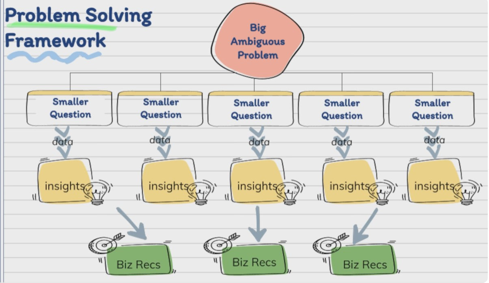
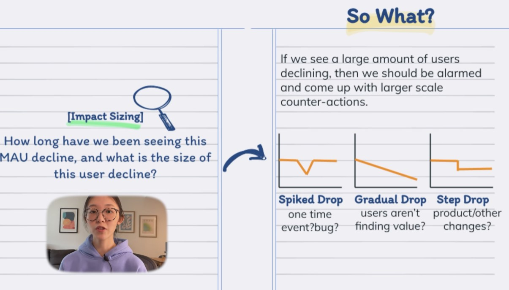
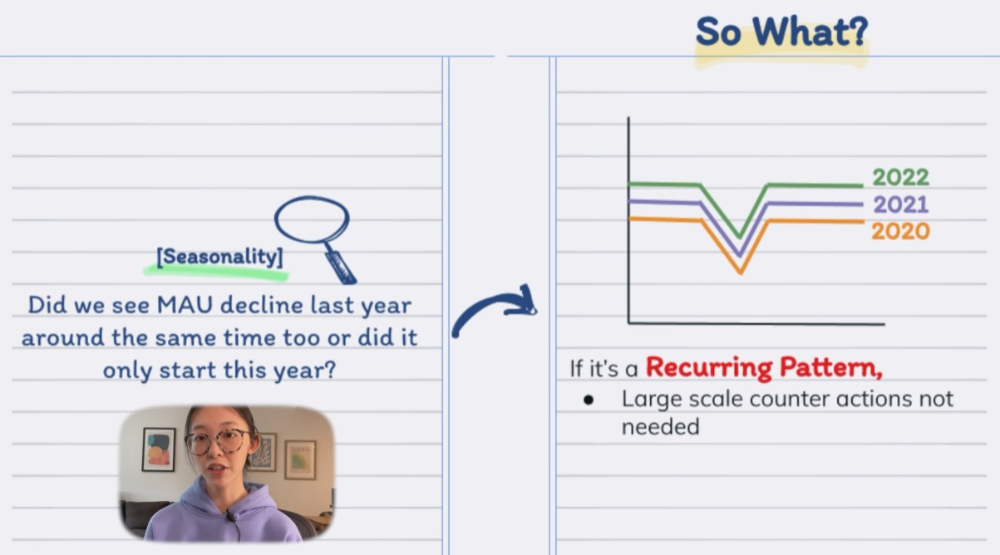
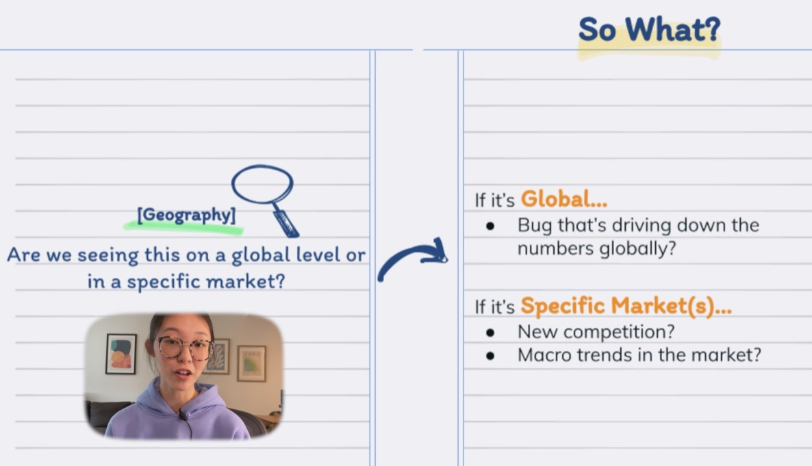
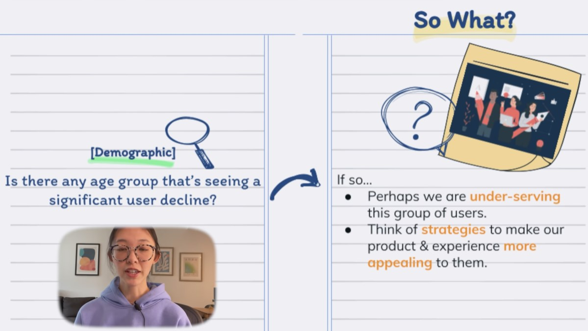
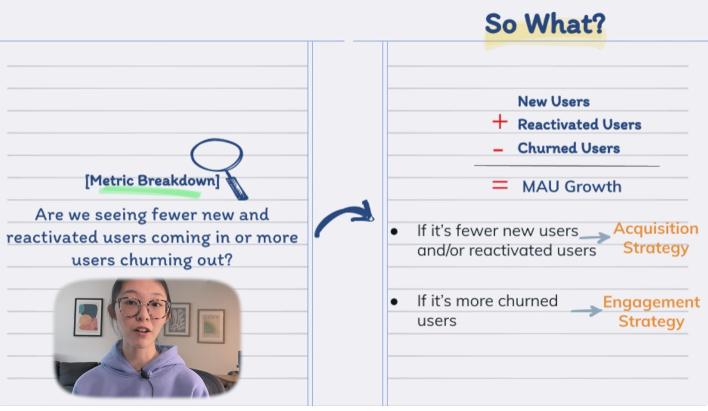
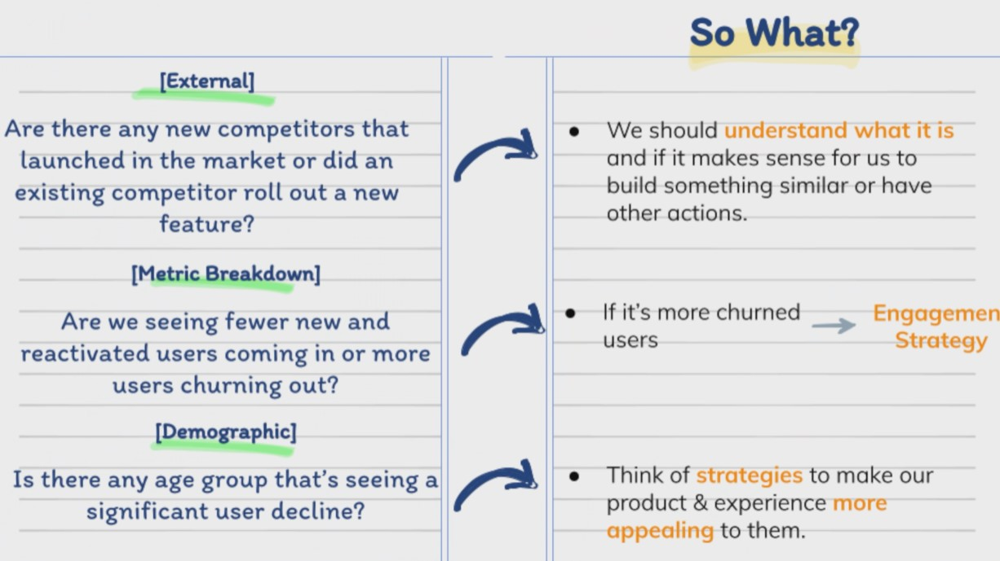

## 1. Problem Solving Skills

- Break down ambiguous questions into smaller pieces in a structured way rather than sharing an unconnected set of ideas/analyses

## 2. Root Cause Analysis

- Imagine you work at Netflix. We are seeing Monthly Active Users declining on the Netflix app.

    - Can you root cause the issue?

    - What recommendations do you have?

    

## 3. Break Down Problems into Smaller Questions

- Impact Sizing

    - How long have we been seeing this MAU decline, and what is the size of this user decline?

- Geography

    - Are we seeing this on a global level or in a specific market?

- Seasonality 

    - Did we see MAU decline last year around the same time too or did it only start this year? maybe it's a recurring pattern and related to seasonality?

- External

    - Are there any new competitors that launched in the market or did an existing competitor roll out a new feature or offering?

- Internal

    - Is there a bug that happened in our data systems? Or did we run any experiments that could be cannibalizing our MAU?

- Demographic
    
    - Is there any age group that's seeing a significant user decline?

- Platform 
    
    - Is there a device type (like iOS and android) that's seeing a significant user decline?

- Metric Breakdown 

    - There are three levers that'd affect MAU growth: new users, reactivated users, and churned users. Are we seeing fewer new and reactivated users coming in or are we seeing more users churning out?

## 4. Top Down Communication

- Key Insights ("Executive Summary")

    - As of Feb, Netflix's MAU(100M) has been declining since Jan. (-1M M/M), likely correlated with competition and higher churn rates.

        - A competitor launched a new feature in the U.S in the Jan. which has increased their total downloads by +1.5M M/M from Jan.-Feb.

        - Netflix saw higher churn rates (+5% M/M from Jan.-Feb.) in the U.S. especially among 25-34 y/o thus driving the MAU curve downward.

## 5. So What exercise

