## 1. 1월 - 사상 최악의 심리에서 시작한 2023년

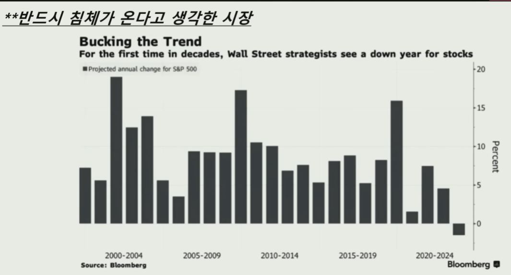

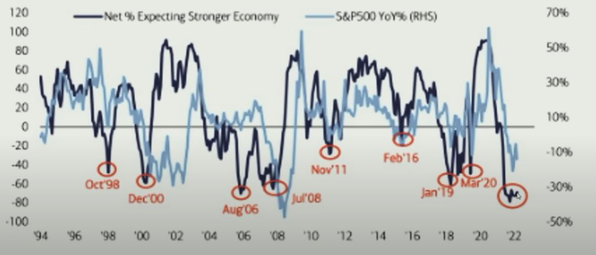

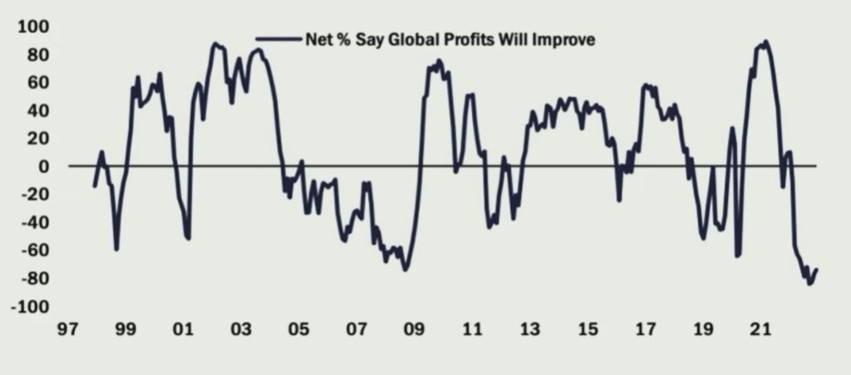

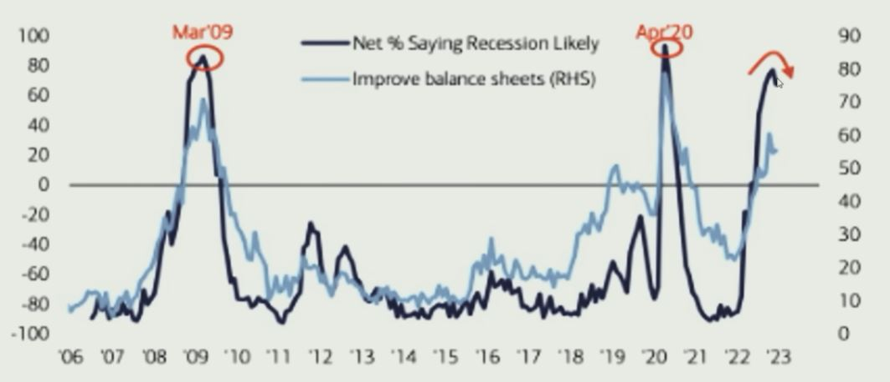

- 심리가 너무 최악일 때는 더 이상 빠지지 않는다

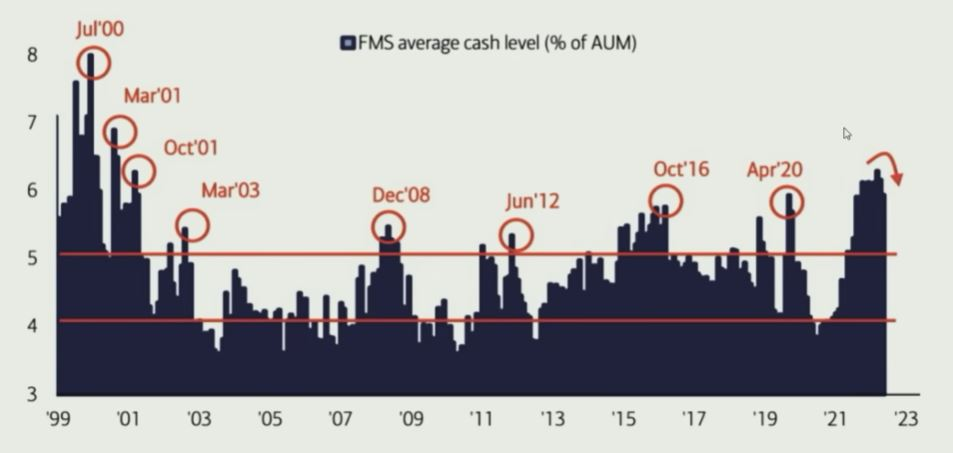

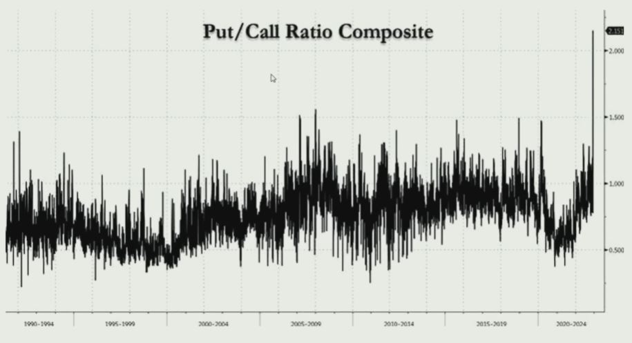

- 고용 및 물가, 인플레이션 강도 내려가
    - 임금 상승률 하락 + CPI 7%대에서 6%대로 하락
    - 미시간대 기대인플레이션도 급락 (예상 4.3% -> 실제 3.9%)
    - 그러자 급격하게 연준 금리 인상폭 25bp론 대두 => 2월 실제로 25bp로 감속

    - 생각보다 별 탈없이 빠르게 진행된 중국의 코로나 리오프닝

    - 모건스탠리의 테크 보고서, '봄이 오고 있다, Spring Is Coming'
        - 외국인 투자자의 강렬한 한국 시장 매수 행렬

## 2. 2월 - 고용 호조 및 미국 CPI 조절이 만들어낸 참극

- 고용 슈퍼 서프라이즈 (2월 3일)
    - 월간 고용 순증, 발표 51.7만 (예상 18.5만, 직전 2개월 + 7.1만 수정)
    - 실업률, 발표 3.4% (예상 3.6%, 전월 3.5%)
    - 평균 시간당 임금상승률, 발표 4.4% (예상 4.3%, 전월 + 0.2%p 수정)

    - 의문 - 이후 47.2만으로 수정. 그리고 22년 11월 ~ 23년 6월 평균 순증은 24.7만에 불과 (1월 제외)

- CPI 가중치, 계정조정치 조절
    - 당초 2년마다. 그런데 이번부터 갑자기 매년 하기로
    - 과거 10년, 수정하고 첫 달에는 물가가 시장 예상치보다 높게 나오는 경향

    - 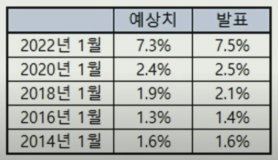

    - 하지만 이후에는 물가 상승이 예상보다 덜 나오게 만드는 효과

        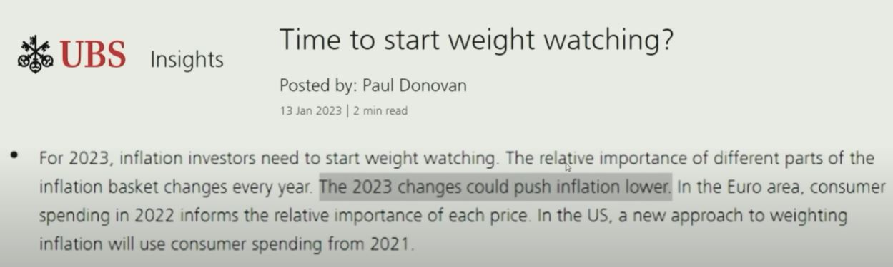

    - 22년 업데이트 이후에도 나타났던 극적 효과

        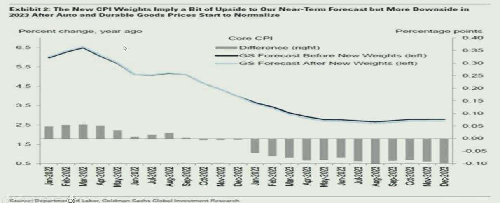

    - 집 관련 비중 상승, 차량 관련 비중 하락

        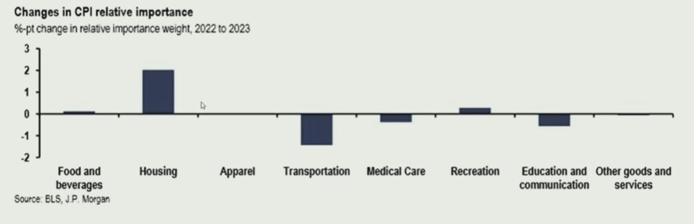

    - 그리고 실제로 더 높게 나온 CPI
    - 그러자 금리가 마구 치솟기 시작 (Fed Watch, 최종 금리 5.50~5.75% 반영)
    - 이렇게 치솟은 금리가 만들어낸 은행 파산 (seasonally adjusted bankcruptcy)
    - 실제 이후론 예상치 대비 낮게 나와

        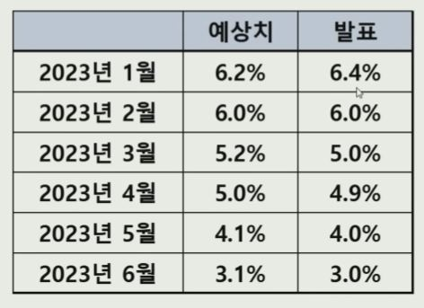

## 3. 3월 - SVB 사태 발생

- 미국 은행 파산 사태
    - SVB, 시그니처 파산
    - UBS, CS 인수

    - 이후 시장의 우려 -> 첫째 - 예금 인출, 대출 감소, 둘째 - 급전 사용 증가

        - 예금, 886억 달러 감소 (1~3월, 월평균 감소액 1,478억 달러 / 바닥대비 + 1,569억 달러)
        
        - 대출, 743억 달러 증가 

        (3월 말 대비 7월 5일 기준)

- 연준 급전 창구 이용 추이

    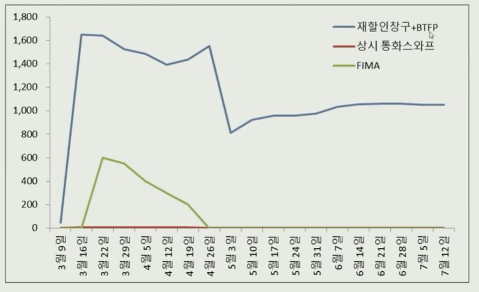

## 4. 4월 - 의심의 벽을 타고 오르는 증시

- SVB 이슈를 꾸역꾸역 소화해 나간 자산 시장

- SG증권발 무더기 하한가 사태 발생

    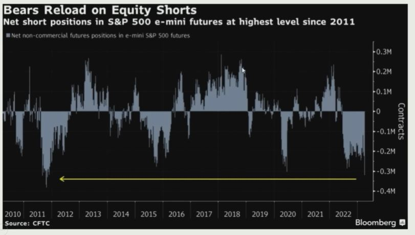

## 5. 5월 - 부채한도 협상

- 2017년~2019년 초, 역레포 금리 - 미국채 1개월 금리 - 역레포 잔고 추이

    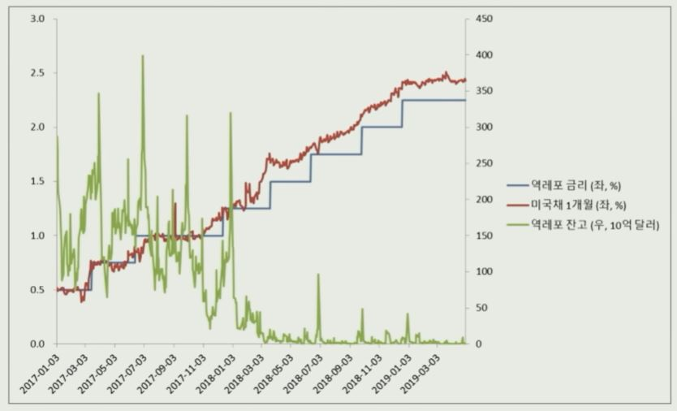

- 이번에도 반복된 역레포의 완충지대 역할
    
    - 역레포 금리 - 5.05%

    - 미국채 1개월물 금리 - 5.2 ~ 5.3%

    - (5월 31일 대비 7월 12일)

        - 역레포 잔고, 4,678억 달러 감소 (잔고 2.15조 달러)
        - 재무부 일반계정 잔고, 4,689억 달러 증가 (잔고 5,174억 달러)

- 5월 FOMC 회의, 2006년을 떠올리게 하며 6월 회의 동결 가능성 부각

- 22년 1분기 이후 가장 훌륭한 실적 시즌 기록

## 6. 6월 - 드디어 금리 동결

- 드디어 6월 회의에서 첫 동결을 결정한 연준
    - 그러나 점도표 2회 인상으로 향후 금리 전망은 오히려 더 올라가

- 중국 데이터 부진
    
    - 리오프닝 효과가 줄어들어가
    - 부양책 사용에 대한 기대도 줄어들어가

- 미-중 대화 재개
    - 옐런, 블링컨 방중
    - 하지만 구체적인 성과는 없어
    - 다만 미국 국무부 여행 공지 사항에 대만 관련, 국가 표현 삭제

## 7. 하반기 - 실적 장세

- 산뜻하게 시작한 2분기 실적 시즌
    
    - EPS 예상치 상회%, 80% (과거 5년 77%, 과거 10년 73%)
    - EPS 예상치 상회폭%, 8.8% (과거 5년 8.4%, 과거 10년 6.4%)

        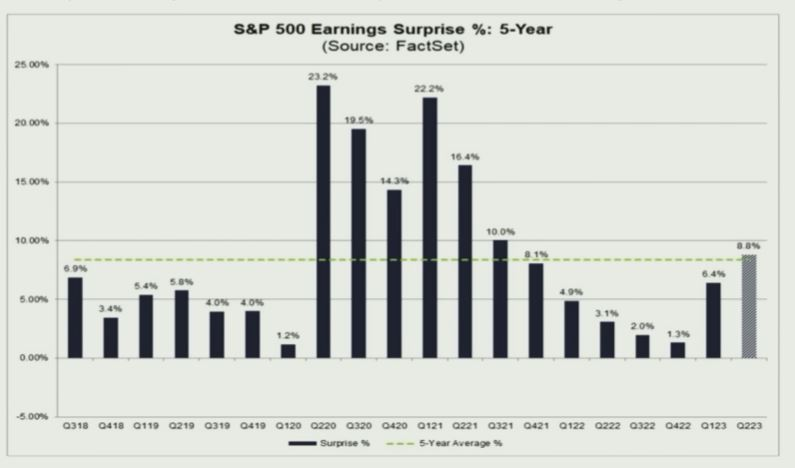

- 3분기부터는 전년동기대비 증익 예상
    
    - 22년 4분기부터 이어진 감익
    
    - 3분기부터는 예상치 자체가 증익

        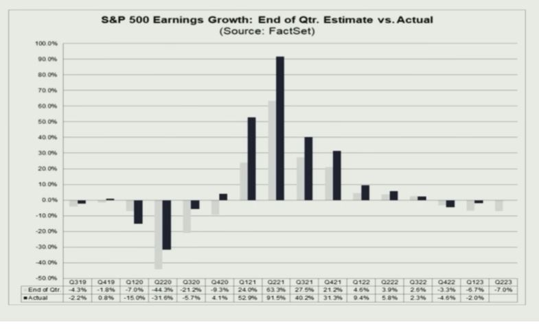

- 인플레 수준, 침체 가능성을 낮춘 경제학자들 (WSJ 조사)

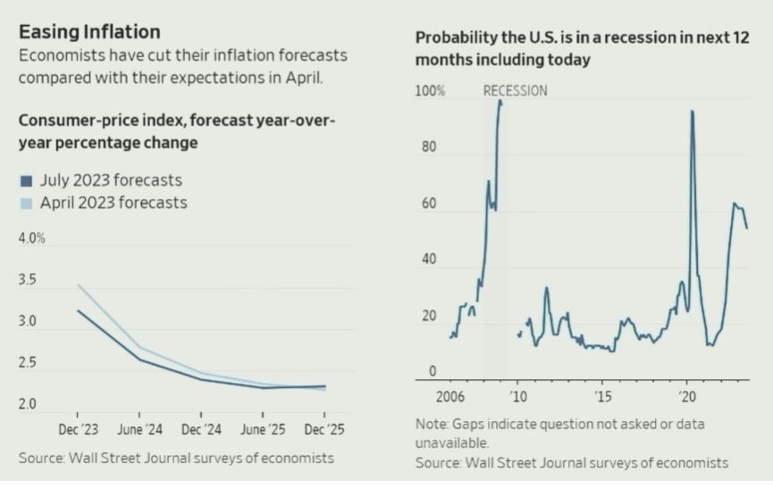
