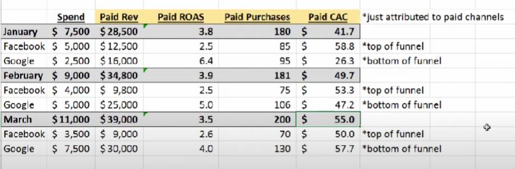

## Important

1. 매체간 ROAS 효율이 단순히 다르다고 하니까 거기에 돈을 더 쏟는건 전반적인 CAC를 높일수 있음
2. 왜냐하면 각 매체는 퍼널의 상위 단계 혹은 하위단계로써 각각 다르게 활용되고 있을 수 있기 때문
3. 영상 속 예시
    
    - 구글에서 더 ROAS 잘나온다고 예산을 더 부었더니 오히려 전반적인 ROAS는 깎아먹고 CAC는 높이는 결과를 낳음.