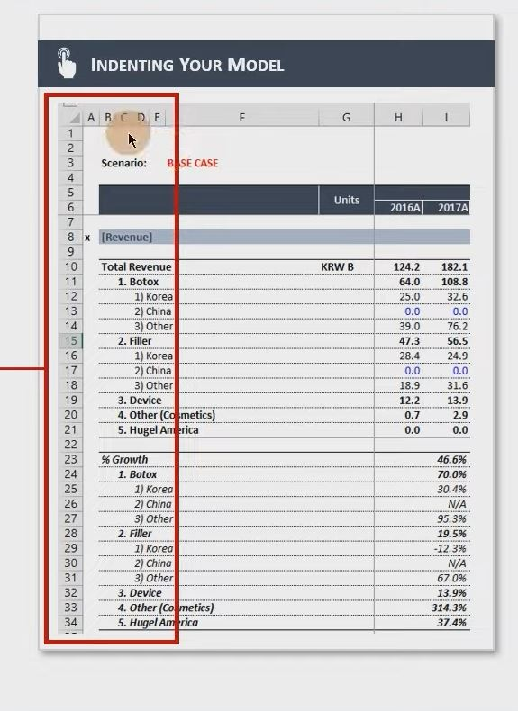
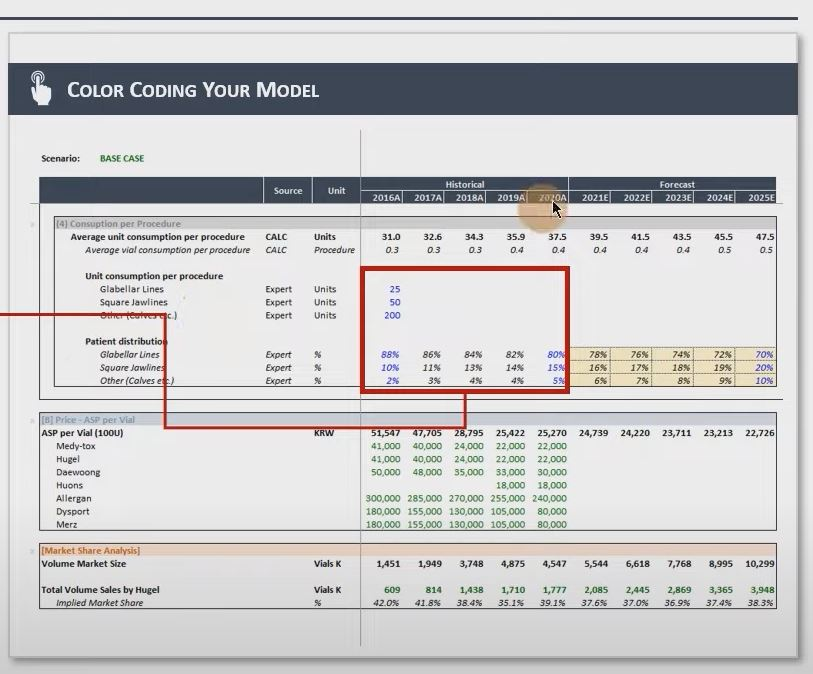
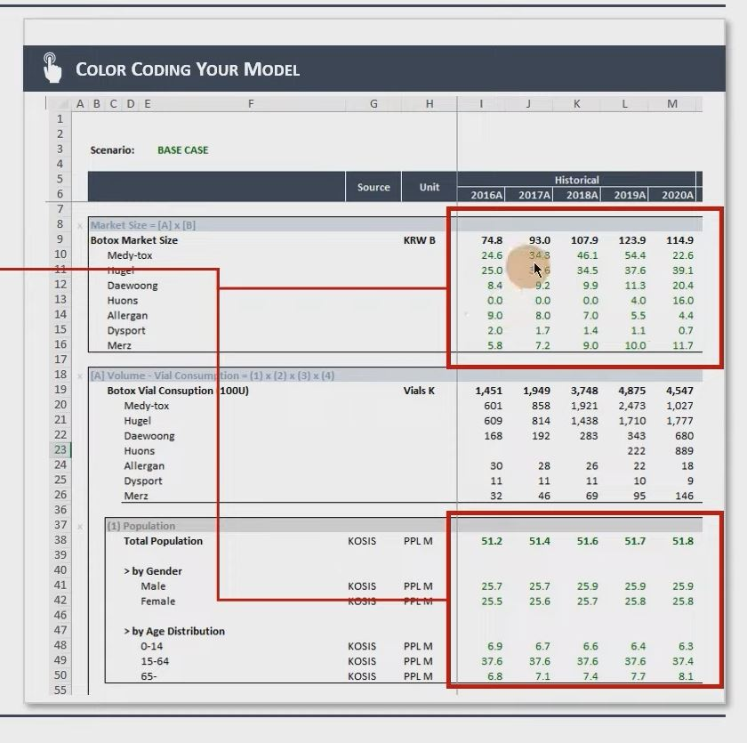
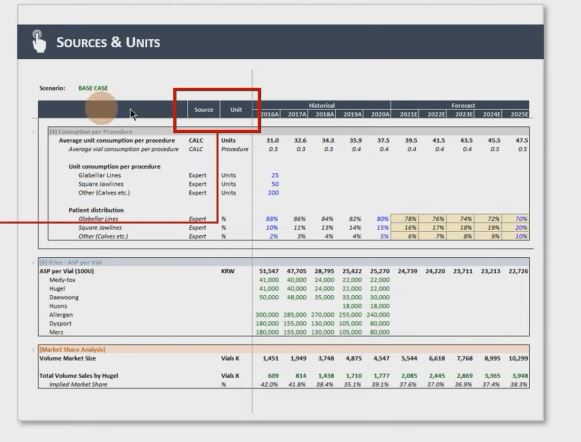

## 1. Formatting Your Financial Model

1. Organizing Raw data 

- Raw Data의 경우 일반적으로 뒤쪽에 배치

- 실제 Model Tab들과의 구분을 위해서 일반적으로 Raw Data 관련 Tab들은 회색으로 Color Format

- 추가로, Raw Data Tab들과 실제 Model Tab 사이에서의 충돌을 막기 위해, Raw Data Tab들 앞에 소문자 'r'을 붙이기도 함

2. Indenting Your Model

- 들여쓰기의 경우, 엑셀의 들여쓰기 기능 (ALT + H + 6) 이용해서도 할 수 있음
- 하지만 모델의 맨 앞 5~8열 정도에는 짧은 열들을 추가하는 Formatting을 더욱 권장함

- 이 방법을 활용하면 추후에 모델을 Formatting하거나 Model Structure에 대한 수정 시, 훨씬 수월하게 진행할 수 있을 것임

3. Color Formatting

- Modelling 시, 셀의 Input에 대해 색깔별로 Formatting하는 것이 매우 중요
- 모델링을 하는 당사자뿐 아니라 모델을 읽고 검토하고 분석하는 모든 주체들에게 Data의 Source를 표시해주는 역할 수행
    - Blue: Hard-Coding 숫자
    - Green: 다른 Sheet로부터 Calculations / Links
    - Black: 같은 Sheet로부터 Calculations / Links
    - RED: 강조가 필요한 수식 (주요가정, 에러, 불필요한 Data 등)

- 모델링의 주요 가정이 들어간 셀들의 경우, 반드시 셀 자체의 색깔을 Foramtting (일반적으로 Yellow or GRAY)

3. Sources / Units / Comments

- 일부 모델들은 (특히 단위가 많이 바뀌는 경우), UNIT을 표시해주는 칸이 별도로 존재
- 또한, 일부 모델들은 Data의 출처를 표시하기 위한 칸이 존재하기도 함
- Comment를 남길 수 있는 칸은 되도록 만드는 것을 권장

4. Navigator

- A열의 경우 Navigator를 만들기 위한 공간을 만들어 두는 것을 권장
- Navigator는 위아래로 화면을 빠르게 움직이게 하기 위해서 설치
- "x"표시를 하는 것이 일반적이며, 완성본에서는 흰색으로 설정해서 숨기는 경우도 있음

5. 무엇보다 중요한 점은 나중에 모델을 보게 될 사람 입장에서 생각하고, 누가 보더라도 이해하기 쉽게 만드는 것
