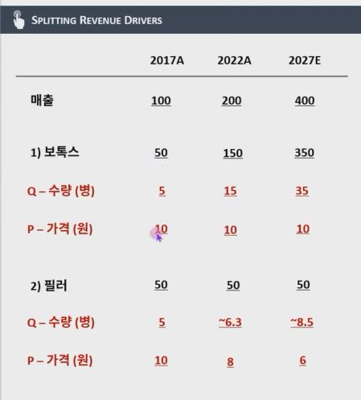
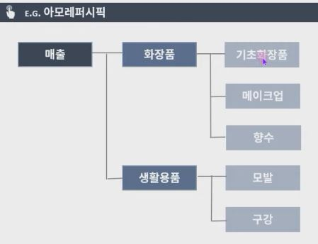
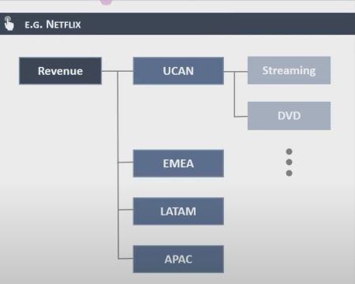
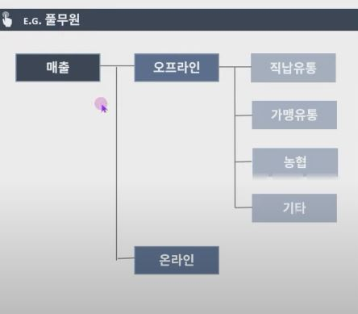
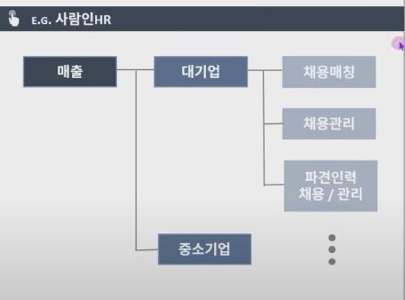
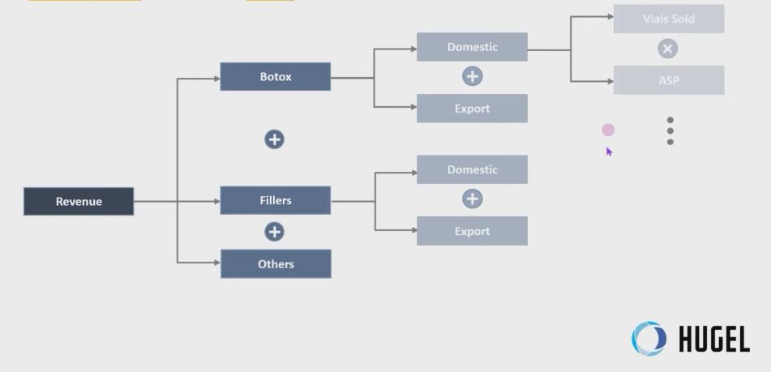

## 1. 쪼개면 쪼갤수록 정교해지는 추정

- 재무모델링의 가장 중요한 원칙 중 하나는, DRIVER를 쪼개면 쪼갤수록 추정이 정교해지고 설득력이 생긴다는 점
- 예를 들어, 삼성전자 매출액을 통쨰로 추정하는 것과, DRIVER 별로 쪼갠 뒤 특정 반도체 제품의 가격상승률을 하나하나 추정하는 것 중 어느 것이 더 추정치가 정확할까?
- 후자가 추정해야 되는 양은 많아지겠지만, 훨씬 더 설득력 있는 추정을 만들 수 있을 것
- 이는 매출액 뿐만 아니라, 시장규모 추정, 인건비, CAPEX, 감가상각비 등 중요 추정에는 모두 적용 가능한(해야하는) 절차이지만, 중요하지 않은 추정일 경우, 굳이 하지 않아도 되는 절차임
- 그렇다면 매출액은 어떤 방법들로 쪼갤 수 있을까?

## 2. Revenue Forecast

1. 제품
    - 기업이 생산하는 제품 or 제품군별로 매출을 쪼개는 방법

        

2. 지역
    - 지역별로 매출 규모/성장률 차이가 유의미하게 존재하거나, 고객군 특성이 달라 LOCALIZATION이 필요한 경우
    
    - 
    
3. 채널
    - 채널별 매출 규모/성장률이 유의미하게 차이나는 경우
    - 소비자가 제품을 접하는 채널이 여러 곳인 경우

    - 
    

4. 고객
    - 고객별 판매하는 제품군이 다른 경우
    - 고객별 영업방식이 유의미하게 다른 경우
    - 
    

## 3. 모델 구성하기
- 이번 모델에서는 매출구성을 총 3단계 Layer로 Breakdown
- 제품별, 지역별 그리고 마지막으로 P*Q로 나눠서 분석

    - 
    
