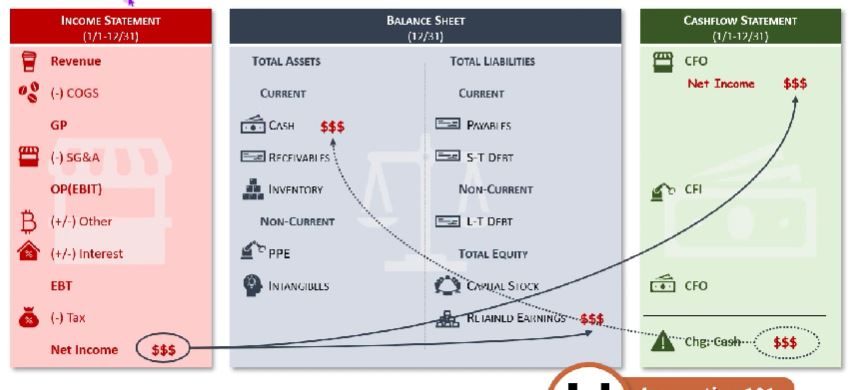
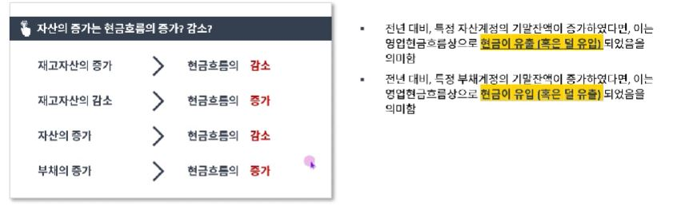

## 1. 손익계산서와 재무상태표 그리고 현금흐름표

- 3 STATEMENT 연결 시에는, 서로 영향을 한번씩 주는 접점을 반드시 연결하는 것이 포인트
- 시작은 I/S에서, B/S에 생성되는 계정 파악, 이후 CFS입장에서 고민해보고, 최종적으로 B?S의 A = L + E가 맞는지 검증

## 2. Balance Sheet Item들의 증감과 현금흐름의 관계

