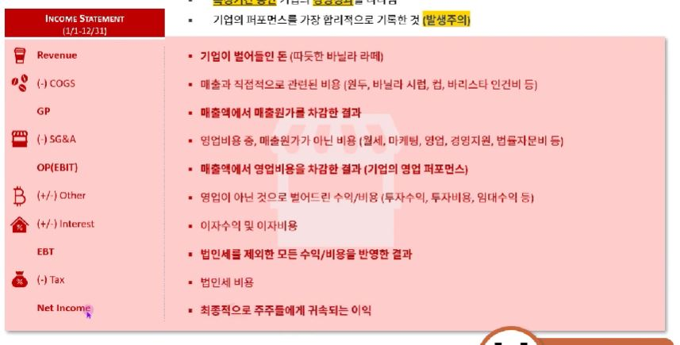
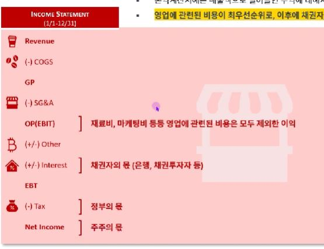

## 1. 손익계산서란 무엇인가?

- 특정기간 동안 기업의 경영성과를 나타냄
- 기업의 퍼포먼스를 가장 합리적으로 기록한 것 (발생주의)

## 2. 손익계산서에 담긴 이익에 대한 우선순위
- 손익계산서에는 매출액으로 벌어들인 수익에 대해서 각 이해관계자의 우선순위가 표현되어 있음
- 영업에 관련된 비용이 최우선순위로, 이후에 채권자, 정부, 주주 순으로 이익을 가져가게 되어 있음

