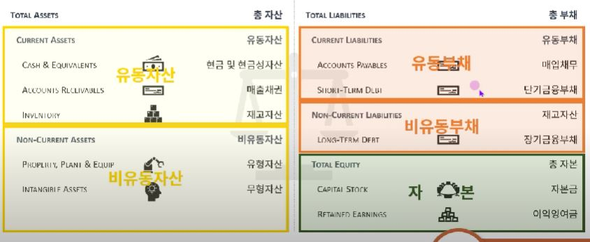
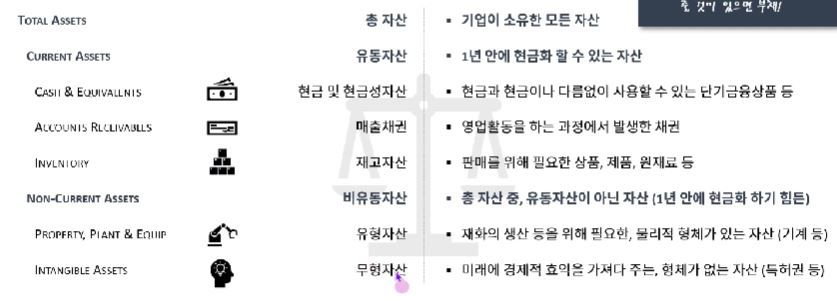
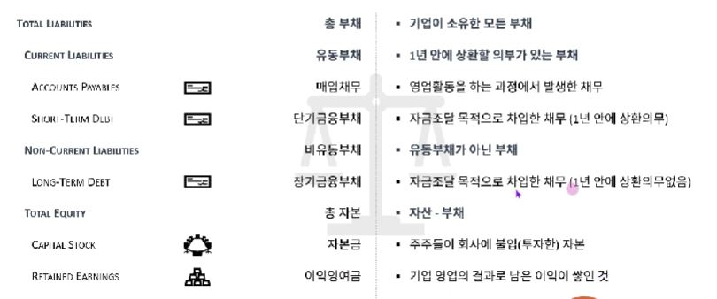

## 1. 재무상태표란 무엇인가

- 특정 시점에서 기업의 상태를 표현하며, 지금까지의 모든 기업활동에 대한 결과가 누적되어 있음
- 일반적으로 우측은 기업이 어떻게 자금조달을 했는지를 보여주며, 왼쪽은 그 재원으로 기업이 소유하고 있는 자산들을 나타냄
- TOTAL ASSET = TOTAL LIABILITY + TOTAL EQUITY

## 2. 재무상태표의 또 다른 분류법
- 회계기준에 입각해 분류하는 방법도 좋지만, 분석 목적으로 부채는 영업부채와 금융부채로, 자본은 납입자본과 이익잉여금으로 나누는 방법을 추천
- 영업부채란, 일반적인 영업활동을 영위하면서 생기는 부채인 반면, 금융부채는 자금조달을 목적으로 끌어온 부채
- 납입자본이란, 증자를 통해 (회사의 지분 취득을 통해) 조달한 반면, 이익잉여금은 기업의 영업활동으로 인한 이익이 쌓임

## 2. A Typical Balance Sheet Evolution

## 3. 재무상태표 - 자산(Assets)

- 미래에 경제적 효익을 가져오는 것들 중, 회사가 소유하거나 지배하는 것을 자산이라 함
- 1년 안에 현금화할 수 있는 자산을 유동자산, 그 밖의 모든 자산을 비유동자산이라고 함
- TOTAL ASSET = TOTAL LIABILITY + TOTAL EQUITY

## 4. 재무상태표 - 부채(LIABILITIES) + 자본(SHAREHOLDER'S EQUITY)

- 반대로, 회사 입장에서 자산이나 용역을 제공해야 하는 의무를 부채라고 함
- 자본은 주주/소유주들의 몫이며, 자산에서 부채를 뺀 잔여분을 의미함
- 1년 안에 상환할 의무가 있는 부채를 유동무채, 그 밖의 모든 자산을 비유동부채라고 함

