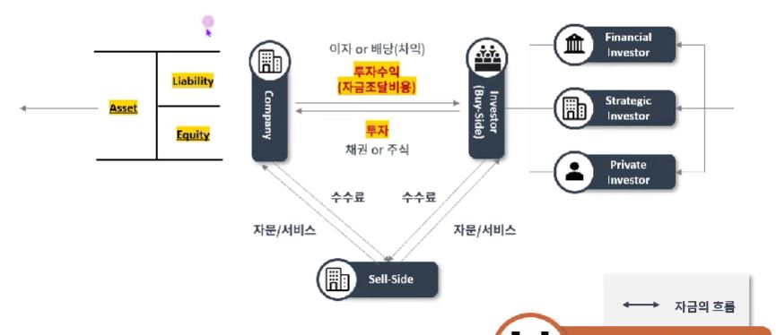
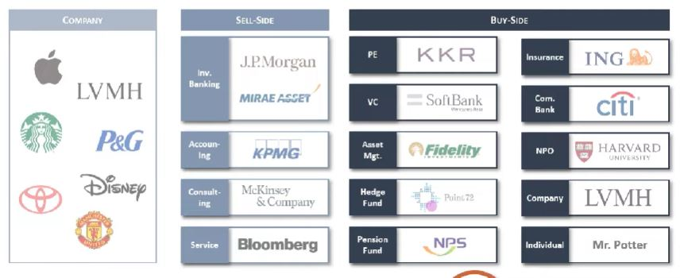

## 1. 금융이란 무엇인가?

- 금융업은, 기본적으로 개인 또는 기업이 필요한 자금을 조달하는 것을 일컬음
- 금융업은 투자자(BUY-SIDE) 기업(CORPORATE), 그리고 그 중간에서 서비스들을 제공해주는 증권사 및 자문사(SELL-SIDE)로 이루어져 있음

## 2. 금융업 개요

- BUY-SIDE는 직접적으로 투자에 참여해서 투자수익을 내며, SELL-SIDE는 (정의가 다양하지만) CORPORATE와 BUY-SIDE에 다양한 서비스를 제공해서 수수료수익을 내는 구조
- 이 외에도 한국은행, 금융감독원, 한국거래소 등 정부 규제기관들도 존재

