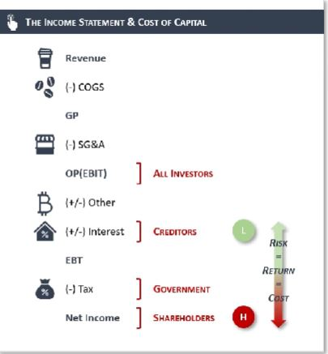
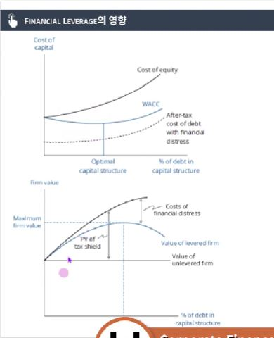

## 1. 타인자본비용 vs 자기자본비용

- 정의
    - 타인자본비용: COST OF DEBT로, 사채, 차입금 등의 부채를 이용하여 자금 조달 시 비용
    - 자기자본비용: COST OF EQUITY로 유상증자, IPO 등 자본을 통해 자금 조달 시 비용 (주식발행을 통한 자본조달)

- (기업입장에서의) 자본비용 = (투자자 입장에서의) 요구수익률

- 일반적으로 자기자본비용 > 타인자본비용 (주식의 요구수익률 > 부채의 요구수익률)
    - 이유1 : 채권자들은 주주들 대비, 이익에 대하여 우선권이 있음 (이자는 배당대비 이익에 대한 우선권이 있으며, 파산 시 회사의 자산에 대해서도 우선권이 있음)
    - 이유2 : 타인자본비용의 경우 이자가 발생하게 되기 때문에, 해당 이자로 인하여 절세 효과가 존재 (TAX SHIELD)

## 2. Financial Leverage(재무 레버리지)란 무엇인가?

- 일반적으로 기업이 타인자본을 이용해서 자본을 조달한 비중이 높을 때 기업가치가 높아지는 현상
- 타인자본비용이 자기자본비용보다 낮고, 절세효과 또한 존재하기 때문에, 기업의 평균 자본조달비용이 낮아지며, 결과적으로 기업가치가 높아지는 현상
- 이는 어디까지나 타인자본으로 자본을 조달했을 때 비용 대비 기업의 이익이 더 많이 늘어날 경우 달성 가능
- 이는 ROE의 DUPOINT ANALYSIS에서도 확인 가능

