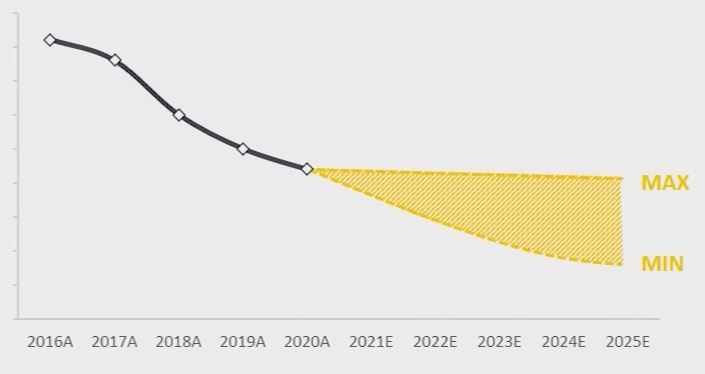
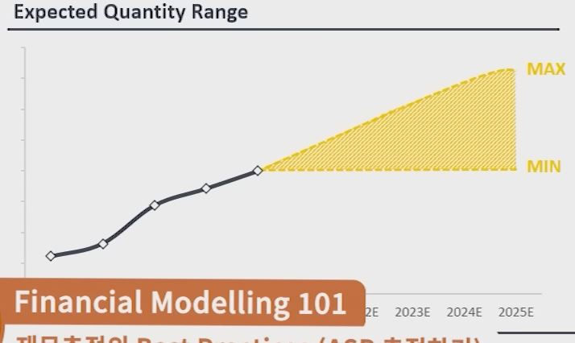

## 1. Forecasting Price & Quantity

1. Expected Price Range

    

2. Expected Quantity Range

    

3. Best Practices
    - 실제로 Bottom-Up Approach에서 미래에 대한 추정기법을 일반화하기는 매우 어려움
    - 산업마다, 기업마다 상황이 모두 다르고, 사람마다 분석 스타일과 가용할 수 있는 물적/시간적 자원이 다르기 때문
    - 하지만 그나마 흔하게 사용하는 추정 시의 Best Practices들을 열거하면 다음과 같음
        - Setting the Upper / Lower Limit
        - Company Inquiry (Exper Interview / Survey)
        - Research (Institutes / Equity Research etc.)
        - Benchmarking
        - Historical Growth (Average, CAGR etc)