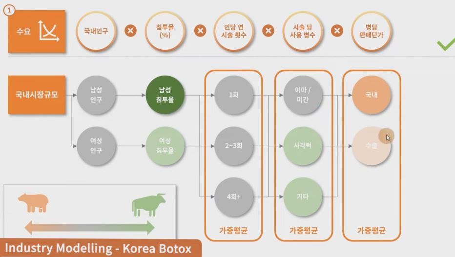

## 1. Industry Model - Korean Botulinum Toxin Market

1. 시장 쪼개기
    - 수요
        - 국내인구 * 침투율(%) * 인당 연 시술 횟수 * 시술 당 사용 병수 * 병당 판매단가
    - 공급
        - 국내 병원 수 * 피부과 / 성형외과 비율(%) * 병원 당 하루 시술 수 * 병원 평균 영업일 수 * 시술 당 사용 병수 * 병당 판매단가
        - 국내 의사 수 * 피부과/성형외과 비율(%) * 의사 당 하루 시술 수 * 의사 평균 영업일 수 * 시술 당 사용 병수 * 병당 판매 단가
    - 생산
        - 국내 보톡스 생산 Capa * 가동률(%) - 수출물량 + 수입물량 * 병당 판매 단가

    - 매출
        - 보톡스 업체 국내 매출의 합 = Player1 + Player2 + Player3 ...

2. 모델 Structure 짜기

    - 수요 
        - 국내인구 * 침투율(%) * 인당 연 시술 횟수 * 시술 당 사용 병수 

    