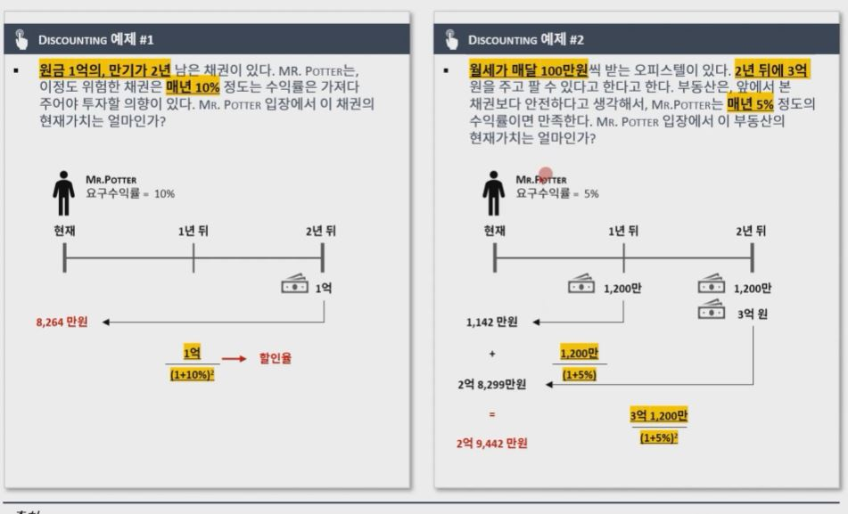

## 1. 화폐의 시간가치

## 2. 할인율이란 무엇인가

- 기업의 의사결정은 미래 현금흐름을 기반으로 현재 시점에서 이루어지므로, 의사결정 시 화폐의 시간 가치를 고려해야 함

- 우리가 투자자입장에서 지금 얼마를 투자하면 미래에 얼마를 받을까라고 생각하는 것과 달리, 반대로 미래에 얼마를 받을 수 있다면, 현재 얼마를 투자할까?의 개념

- 할인이란? 주어진 이자율(=할인율)로 미래가치를 현재가치로 환산하는 행위

- 1년 뒤 1억을 받을 수 있는 권리가 있다면, 요구수익률이 10%인 사람은, 1억을 10%(1+10%)로 할인한 9,090만원을 기준으로, 이보다 싸게 살 수 있다면 살 것이고, 그것보다 비싸다면 사지 않는 의사결정을 할 것

- 쉽게 생각해서, 수익률과 할인율은 같은 개념이지만, 관점에 따라 이름이 다름

