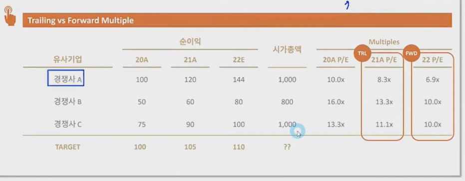

## 1. Trading Comps Valuation

1. Trailing vs Forward Multiple
    - Trading Comps Valuation의 마지막 고민은, 과거실적에 기반한 Trailing Multiple을 써야하는지 아니면 미래 추정치에 기반한 Forward Multiple을 써야 하는 가임

        

2. Trailing Multiple과 Forward Multiple의 특징
    - LTM이란
        - 지난 12개월 동안의 실적의 합

    - Trailing Multiple (LTM P/E)
        - 과거 실적 기반
        - 과거 실적은 일반적으로 전년도 혹은 지난 12개월 (LTM)을 활용
        - 회사의 미래 성장성을 반영해주지 못하는 한계
        - 애널리스트의 Target에 대한 주관을 반영해줄 수 없는 한계

    - Forward Multiple (FTM P/E)
        - 미래 추정치 기반
        - 미래 추정치는 일반적으로 Consensus를 활용
        - 회사의 미래 성장성을 반영해주기는 하나, 애널리스트의 주관이 반영될 수 있음
        - 일반적으로 미래 추정치가 더 높기 때문에, Multiple 숫자가 Trailing Multiple 대비 낮음
        