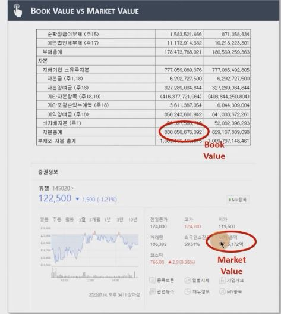
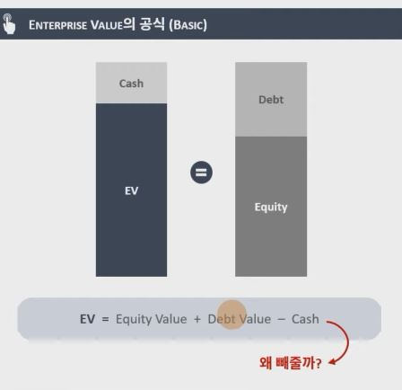
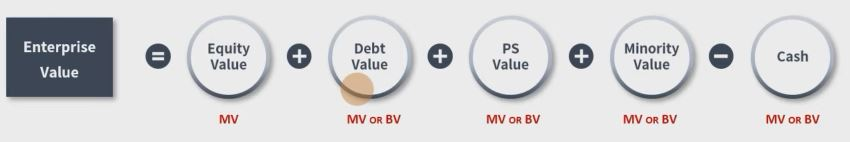
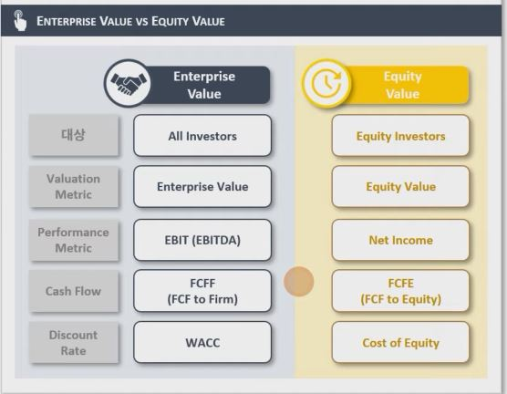

## 1. Book Value vs Market Value

1. Book Value / Market Value 의미

    - Book Value (장부가)
        - Book Value는 말 그대로 회사의 장부에 적힌 금액을 뜻함
        - 예를 들어, Equity Value의 Book Value는 공식으로 표현하면, 장부에 적혀있는 Total Assets - Total Liabilities (즉 Total Equity)로 도출

    - Market Value (시장가)
        - 시장에서 회사의 가치가 (혹은 개별 자산들이) 평가받는 금액을 뜻함
        - 예를 들어, Equity Value의 Market Value는 주식시장에서 사람들이 이 주식을 평가하고 있는 가치임 (시가총액)

        - 

    - 일반적으로는 회사의 Market Value가 Book Value보다 가치가 크며, 이는 투자자들이 현재 보유하고 있는 자산 대비, 미래에 더 많은 수익을 낼 수 있을 것으로 기대하고 있다는 걸 나타냄 

## 2. Enterprise Value vs Equity Value

1. Enterprise Value 및 Equity Value의 정확한 의미
    - Enterprise Value란
        - 모든 투자자들에게 (채권자, 우선주주, 보통주주 등)
        - 영업가치(비영업가치는 제외)를 의미함
    
    - Equity Value란
        - 보통주주들의
        - 기업이 가진 모든 가치(비영업가치도 포함)를 의미함
        
    

2. Enterprise Value 도출 (Extended Formula)
        
    

    - 공식에서 Cash를 빼주는 이유는 두 가지로 설명할 수 있는데
        - 첫째, 상식적으로 Cash를 사용해서 차입금을 갚을 수 있기 때문
        - 둘째, Equity Value가 Market Value이기 때문에, 그 안에는 이미 Cash의 증감이 반영되어있기 때문에 이를 상계시켜주면서 영업가치만 남기는 것임
    
    - 마지막으로 Enterprise Value는 원칙적으로는 영업가치만을 포함해야 하지만, 통상적으로 업계에서 사용하는 공식은 위처럼 비영업자산도 일부 포함되어 있는 경우가 많음
    
    - 그러므로 항상 Enterprise Value가 어떤 공식을 통해서 도출되었는지 검증작업 필요

3. Enterprise Value와 Equity Value의 조합

    

    - Enterprise Value는 EBIT, FCFF 및 WACC (모든 투자자들의 요구수익률의 가중평균)과 좋은 궁합을 보이며,

    - Equity Value는 Net Income(EPS), FCFE 및 Cost of Equity (보통주 주주들의 요구수익률)과 좋은 궁합을 보임
    