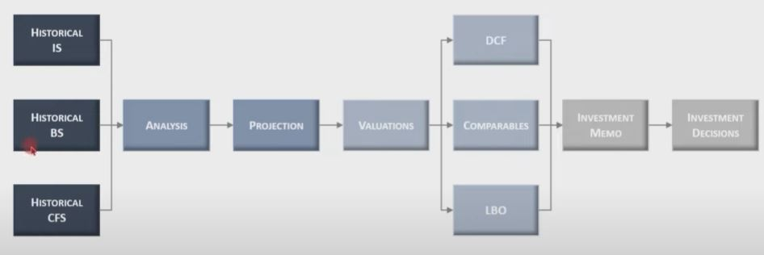
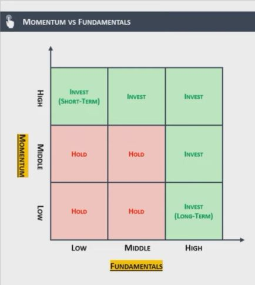

## 1. 투자의사결정 프로세스

1. 재무추정의 영역
2. 가치평가의 영역

## 2. VALUATION을 통해서 무엇을 할 수 있는가?

- 가치평가란 회사 또는 특정 자산의 가치를 논리적인 방법으로 추정하는 것을 말함
- 가치평가의 대상은 기업(주식)뿐만 아니라 부동산, 채권, 신사업, 개발프로젝트 등 다양한 자산들이 될 수 있음
- 단, 가치평가가 완벽하게 이루어졌다고 해서 반드시 투자가 성공하는 것은 아님
- 가치평가를 통해 기업의 FUNDAMENTAL을 평가할 수는 있지만, 주가(실제 시장가치)란 FUNDAMENTAL을 따라가지 않는 경우도 많기 때문 (특히 단기에는)
- 그러므로 가치평가는, 특히 장기투자(M&A 등)에 더욱 많은 영향을 미치는 편이며, 의사결정에 많이 사용됨
- 마지막으로, VALUATION은 SCIENCE가 아닌 ART의 영역이라고 불림. 방법론이 워낙 다양하고, 가정이 많이 들어가기 때문에 모든 사람들의 공감을 얻을 수 있는 완벽한 기업가치평가란 없음 (주관의 영역이 큼)

