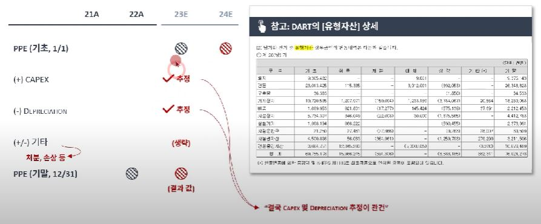
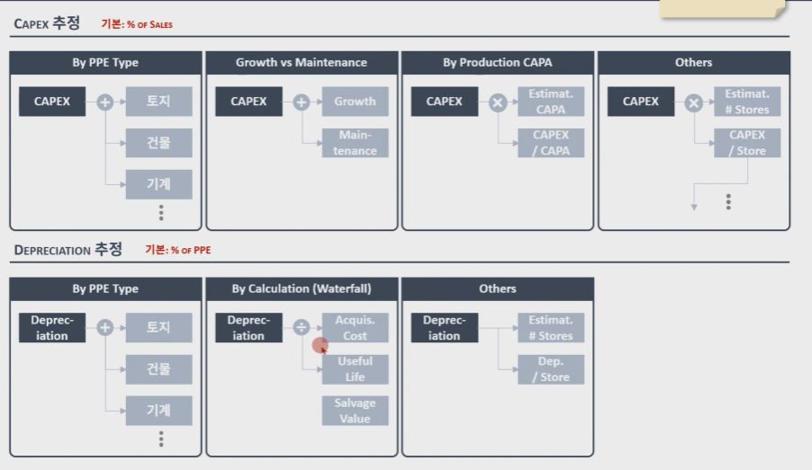
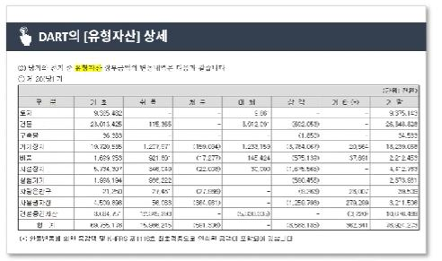
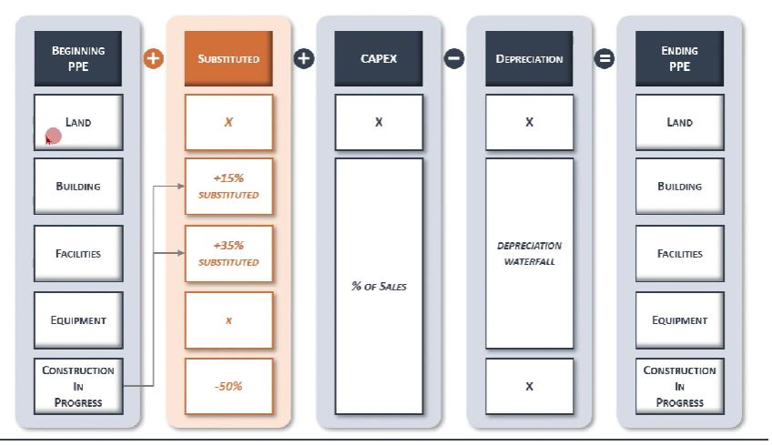

## 1. Advanced PPE Schedule

1. Financial Model에서 구현하기

    - Balance Sheet 상의 ITEM들은 INCOME STATEMENT 및 CASHFLOW STATEMENT 증감의 결괏값으로 결정되는 경우가 많음
    - 가령, 유형자산의 경우 CAPEX 및 DEPRECIATION의 증감에 따라 도출됨 (자산의 매각, 손상차손 등도 가능)
    - 결론적으로, 유형자산 자체를 추정하는 것이 아닌, CAPEX와 DEPRECIATION 추정 후, 간접적으로 도출

    

    

2. Advanced PPE Schedule

    - (대부분의 제조업의 경우) DART에 있는 유형자산 상세 DATA를 이용해서 PPE Schedule을 조금 더 정교하게 만들 수 있음

    - 단, Data 정리도 복잡하고, Logic을 조금 단순화 해야 하는 부분도 있음

    - 본 수업에서는 유형자산을 비슷한 성격을 가진 자산별로 묶을 것 (토지/건물/기계장치/건설중인 자산/ 기타)

    

    

