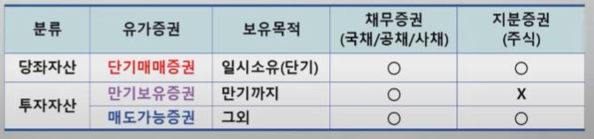

1. 회계정보 질적특성

    - 목적적합성 (예, 피, 적) - 현재
        - 예측가치
        - 피드백가치
        - 적시성

    - 신뢰성 (표, 검, 중) - 결과 (역사적원가)
        - 표현의 충실성
        - 검증가능성
        - 중립성

2. 강제매입국공채 = 액면과 공정가치의 차액만큼 취득원가에 포함

3. 증권 관련

    

4. 자본잉여금

    - 주식발행초과금

    - 기타자본잉여금
        - 감자차익
        - 자기주식처분이익

5. 수익측정
    - 로열티수익은 관련된 계약의 경제적 실질을 반영하여 발생기준에 따라 인식

    - 이자수익은 원칙적으로 유효이자율을 적용하여 발생기준에 따라 인식

    - 배당금수익은 배당금을 받을 권리와 금액이 확정되는 시점에 인식

    - 수익은 금액을 신뢰성 있게 측정할 수 있고 경제적 효익의 유입가능성이 높을 때 인식
     
6. 부가가치세법상 과세 대상

    - 재화의 공급
    - 용역의 공급
    - 재화의 수입
    