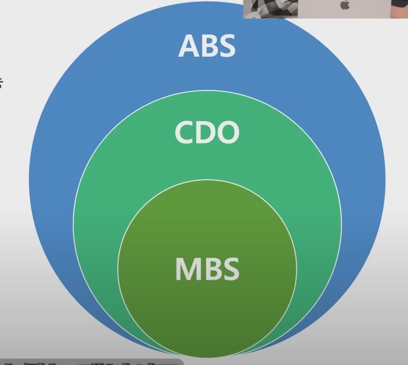
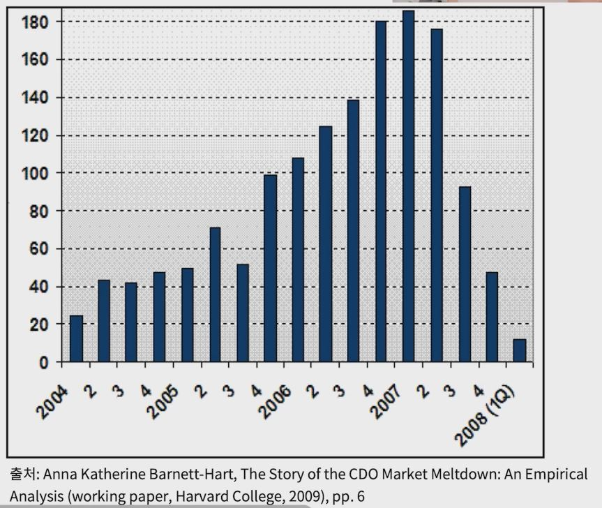
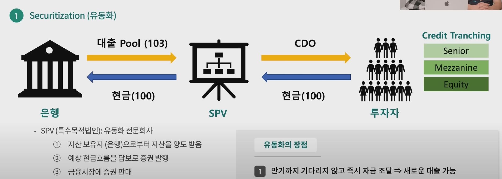
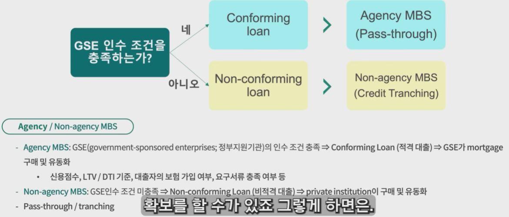
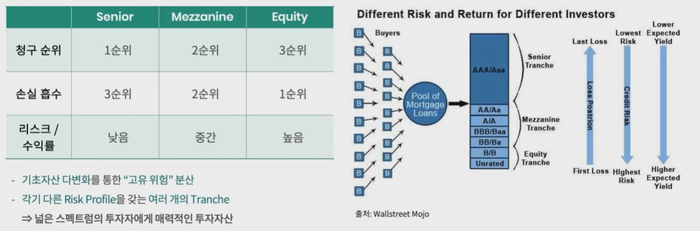

## 1. 자산유동화증권, 부채담보부증권, 주택저당증권

- 자산유동화 증권(ABS, Asset-Backed Securities)이란?
    - 유동성이 떨어지지만 가치가 있는 자산을 담보로 발행된 증권

    - 매출채권, 재고자산, 부동산, 대출 등 다양한 기초자산에 활용 가능

    - 일반적으로 현금흐름을 창출하는 자산에 기초

- 부채담보부증권(CDO, Collateralized Debt Obligations)이란?
    - ABS 중 다양한 채무(Debt)를 기초자산으로 하는 증권
    
- 주택저당증권(MBS, Mortgage-Backed Securities)이란?
    - ABS / CDO 중 부동산담보대출을 기초자산으로 하는 증권

## 2. 서브프라임이란?

- FICO라는 미국 신용점수에서(850 만점) 620점 미만을 SubPrime이라고 부름

## 3. 부채담보부증권 101

- 08년 금융위기의 주범 - 부채담보부증권(CDO)

    

    - 2003년 이후 발행량 폭발적으로 증가

    - 기초자산 pool이 대부분 subprime mortgage로 구성

    - 복잡한 구조로 인해 내재된 리스크를 이해하기 어려웠음

- 부채담보부증권(CDO)의 핵심 개념
    
    - Securitization (유동화)

    - Tranche / Class (계층)

## 4. 부채담보부증권 101 - 유동화

- Securitization (유동화)

    

    - SPV (특수목적법인): 유동화 전문회사
        - 자산 보유자 (은행)으로부터 자산을 양도 받음
        - 예상 현금흐름을 담보로 증권 발행
        - 금융시장에 증권 판매

    - 왜 SPV를 쓰는가?  
        - 기초자산을 자산 보유자(은행)의 다른 자산으로부터 분리
        - 투자자들이 기초자산에서 창출되는 현금을 직접 받을 수 있음

    - 유동화의 장점
        - 만기까지 기다리지 않고 즉시 자금 조달 => 새로운 대출 가능

        - 회사채 발행에 비해 저렴한 조달비용 (신용절연 / 신용보강)

        - 투자자의 리스크 선호도 / 듀레이션 needs에 따라 맞춤 투자 가능

    

    

- Tranche / Class (계층)

    
