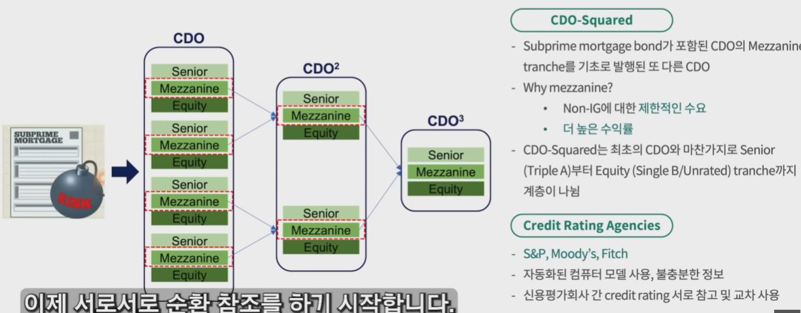
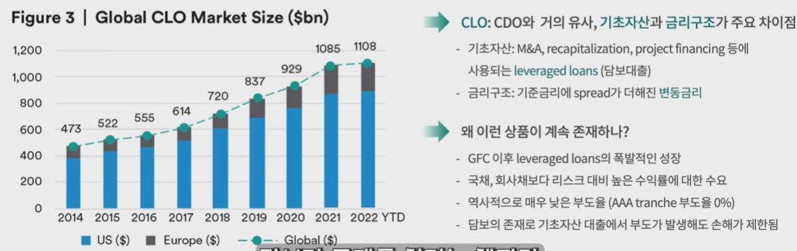

## 1. 부채담보부증권 101 - 트랜치 / 계층

- Tranche / Class (계층)- CDO Squared / Credit Ratings

    

## 2. 대출채권담보부증권(CLO) 101

- CLO(Collaterlized Loan Obligations), CDO의 배다른 형제
    - GFC 이후 CDO는 시장에서 거의 사라짐

        

