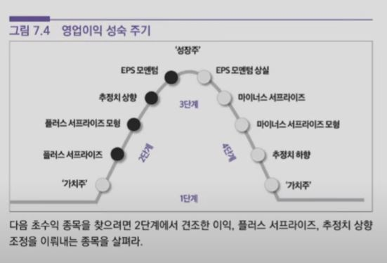
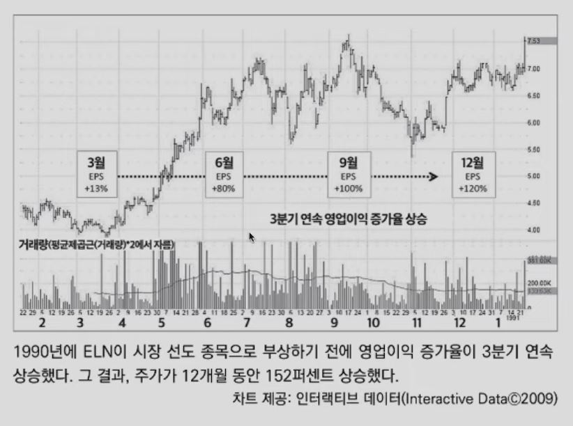
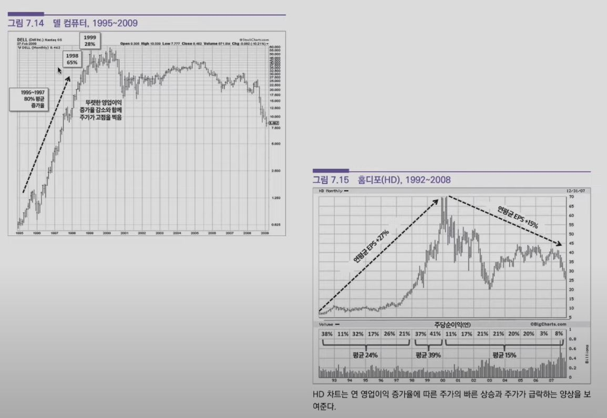
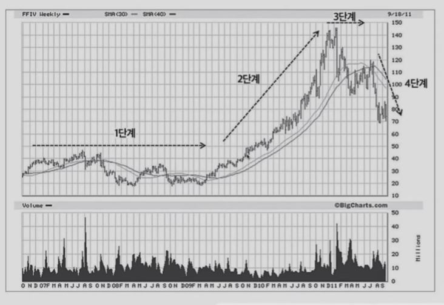
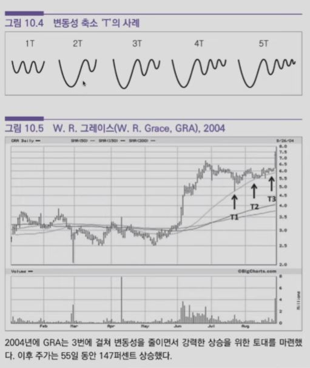

## 1. "진정한 성장주를 매수할 때는 시점도 정확해야 한다." - 필립 피셔

- 차티스트 vs 펀더멘탈리스트
    - 가격의 움직임이 유의미한 정보를 제공하는가?

        - 판단이 옳다고 확인해주는 주가 움직임 없이는 결코 펀더멘털을 근거로 한 판단에 베팅하지 않는다
        
        - 펀더멘털이 부진하더라도 상대적 주가 움직임이 시장의 상위 2퍼센트 이내라면 매수를 고려한다

## 2. 초수익 성장주 투자

- 펀더멘탈 확인

- 진입 시점 파악

- 리스크 관리

## 3. 펀더멘탈 확인

- "역사는 대박 종목이 특정 산업군을 선호한다는 것을 보여준다."

- 매출액 증가

- 영업이익 박스권 돌파

- 영업이익 증가율의 상승

- 영업이익 성장률이 꺾일 때 주가도 급락

- 생존편향 주의: 한두 해 성장한 이후 수년 후까지 추가 성장이 가능해야 함

## 4. 이익의 질

- 일회성 이익: 사업부 매각, 공장 폐쇄 등

- 캡이 씌워진 이익: 비용 삭감, 생산성 증가

- 업황 개선에 따른 이익 증가

- "이상적인 상황은 새로운 시장 및 기존 시장에서 신제품과 기존 제품의 판매량이 늘어나고, 가격은 오르고, 비용은 줄어드는 것이다."

- "최악의 상황은 가격 결정력이 제한되어 있고, 사업이 자본 집약적이며, 마진이 적거나 압박을 받고 있고, 엄격한 규제나 심한 경쟁 또는 둘 다에 직면하는 경우다."

## 5. 추세의 4단계

- 1단계 - 무시 국면: 보합

- 2단계 - 상승 국면: 매집

- 3단계 - 고점 국면: 분산

- 4단계 - 하락 국면: 투매

