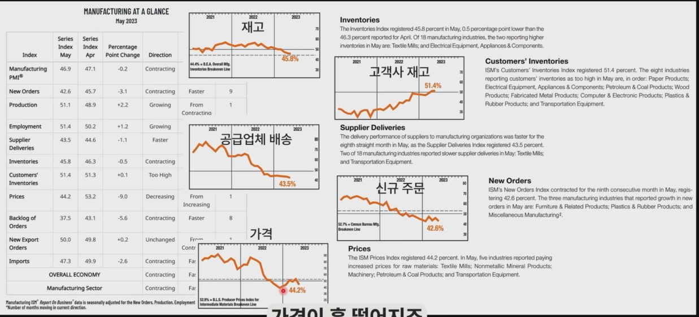
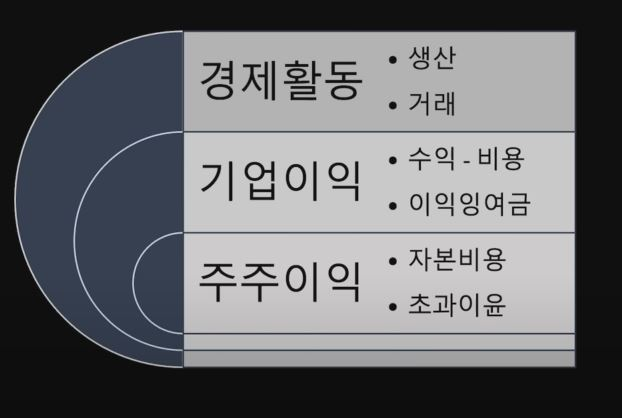
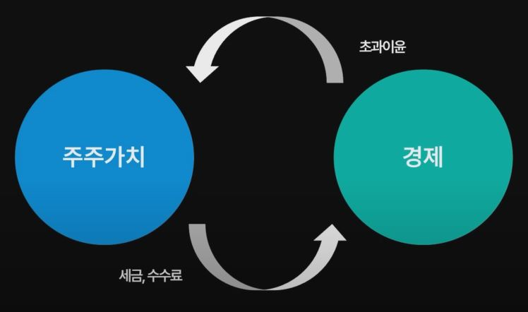

## 1. 버핏의 시장 전망?

- 1년 만기 초단기 채권 138.3억 달러, 1-5년 단기 채권 73.7억 달러
- 인플레이션에 대한 우려? 일드 커브?

- 올해 회사들의 실적이 작년보다 저조할 것이다.
    - perhaps the majority of our businesses will actually report lower earnings this year than last year.

- 올해 경기 침체와 주가 약세를 전망?

- "우리는 거시경제에 그다지 관심이 없습니다. 거시경제 전망을 잘한다고 해서 우리가 투자 실수를 피할 수 있다고는 생각하지 않습니다."

- "장세 변화를 예측하고자 하는 사람들은 두 번 중 열 번 정도 틀립니다."

- "우리는 시장이 무언가 흥미로운 제안을 할 때만 시장에 관심을 가진다."
    - we don't pay much attention to markets or forecasts unless the markets happen to offer something interesting to do.

## 2. 자산을 보는 기본 관점

- 2011년 주주서한

- 채권형 자산 denominated in a given currency / fixed income
    - 현금: 장기간에 걸쳐 확실히 구매력을 상실하는 자산
    - 채권: 명목수익률에서 세금과 인플레이션을 제하면 남는 게 없는 자산

- 산출물이 없는 자산
    - 금, 원자재, 미술품, ...

- 산출물이 있는 자산   
    - 사업, 농장, 부동산, ...
    
- 버크셔의 단기채권 = 현금등가물 = 좋은 제안을 발견했을 때 바로 거래에 나설 수 있는 준비 자금

## 3. 채찍 효과

## 4. '가치투자'와 거시경제

- 버핏도 거시경제를 본다
    - FDIC, SVB, 부채한도협상, 금리, 인플레이션, 재고 문제, 상업용 부동산 문제, 미중분쟁

- 거시경제와 투자의사결정의 일대일 매칭 X

- 기업의 퀄리티 파악 - 거시경제 없이 알 수 있나?

- 시장이 주는 흥미로운 제안 - 왜 이런 흥미로운 제안을 하는가?

## 5. 인덱스 펀드?

- 2013년 주주서한

- 유산의 90%는 S&P 500 인덱스 펀드에, 나머지 10%는 미국 국채에
    - Put 10% of the cash in short-term government bonds and 90% in a very low-cost S&P 500 index fund. (I suggest Vanguard's) I believe the trust's long-term results from this policy will be superior to those attained by most investors - whether pension funds, institutions or individuals - who employ high-fee managers.

- 고트락스 가문의 비유 (2005년 주주서한)
    - "투자자 전체로 보면, 기업이 번 돈 이상을 기업으로부터 빼내는 마법 같은 방법은 없습니다."

- 모든 주식을 소유하라 - 존 보글

- 인덱스 펀드를 파는 사람들은 존 보글이 했던 말을 무시하려 합니다.

- 그들은 존 보글이 제안한 아이디어와 정반대의 상품을 팔고 있습니다.

## 6. 경제와 이익과 주식

## 7. 모든 주식을 소유하라

