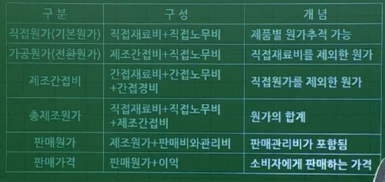

### 1. 원가관리회계 개요

- 원가 : 생산을 위해 사용 또는 소비되는 경제적 가치
- 원가회계 : 제품생산에 소비된 원가에 관한 정보를 경영자에게 제공하기 위한 회계

- 원가와 비용
    - 원가 
        - 생산을 위해 사용 또는 소비되는 경제적 가치
        - 주로 공장, 생산, 제조와 관련된 지출

    - 비용
        - 생산이 아닌 판매 및 관리 등에 사용되는 자원 (비제조원가)
        - 원가 이외의 업무와 관련된 지출 (판매, 영업 등)

- 소멸원가와 비소멸원가
    - 소멸원가
        - 경제적 효익을 얻는 과정에서 소멸되어서 비용 또는 손실로 재분류된 것
    - 비소멸원가
        - 경제적 효익을 얻는 과정에서 소멸되지 않아서 재고자산으로 분류됨
        - 추후 판매 등의 과정을 거쳐 수익을 창출하면 매출원가(비용)로, 수익을 창출하지 못하면 손실 등의 계정과목으로 재분류되어 소멸원가로 바뀜

### 2. 원가회계의 목적

1. 재무제표작성
    - 손익계산서의 제품매출원가 결정을 위해 제품원가계산 필요

2. 원가관리 및 통제
    - 원가관리 및 원가통제를 위해 원가자료를 집계하고 관리

3. 의사결정
    - 신제품 가격결정 등 경영의사결정에 필요한 원가정보 제공

4. 업적평가
    - 제품별 또는 판매원별 업적평가 등에 필요한 정보제공

### 3. 원가 분류

1. 원가 형태별 분류
    - 재료비
    - 노무비
    - 경비

2. 추적가능성에 따른 분류
    - 직접비
    - 간접비

3. 원가행태에 따른 분류
    - 변동원가
    - 고정원가
    - 혼합원가
    - 준고정원가

### 4. 원가의 구성

