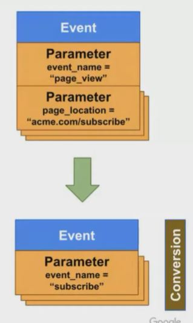

## 1. Granular Conversion Measurement

1. Define granular conversions without retagging

2. Start with existing event, and create a new one

3. Mark resulting event as conversion

- Live for web streams; coming soon for apps
- 30 conversions max. per property
- Apps : 500 unique events limit

    

