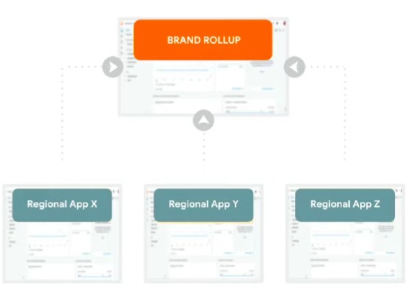

## 1. Account Structure Best Practices

1. Best practices can vary based on desired control, organization, legal and/or regulatory requirements, however there are some important considerations and common patterns.

2. However, if you have an App, that will primarily dictate your account structure.

## 2. Our Recommendation

1. 1 account per company

2. 1 property per brand or business unit
    - ex : regional units, brands, cross-brand project teams.
    - Truly separate units with different stakeholders.
    - ...where sharing across these units is specifically not desirable.

3. Roll-ups can further be used to unify brands/apps for parent-level access.

4. Use report collections and access controls to organize data within properties.

## 3. Example : Multi-App Brand

If you have multiple app for a brand, perhaps broken out by region or version, you will find you will need a property for each app and a Roll-up will enable the full cross-brand view.

## 4. Important Considerations

1. Apps!

2. Governance requirements (who can see what and for what purpose?)
    - Including regulatory requirements
    - Including integration / data sharing requirements

3. Organizational Structure

4. Additional costs

## 5. Common Patterns

1. Regional division

2. Cross Brand Roll-ups

3. Agency / external sharing of specific data

4. Team / Project based subs and/or roll-up