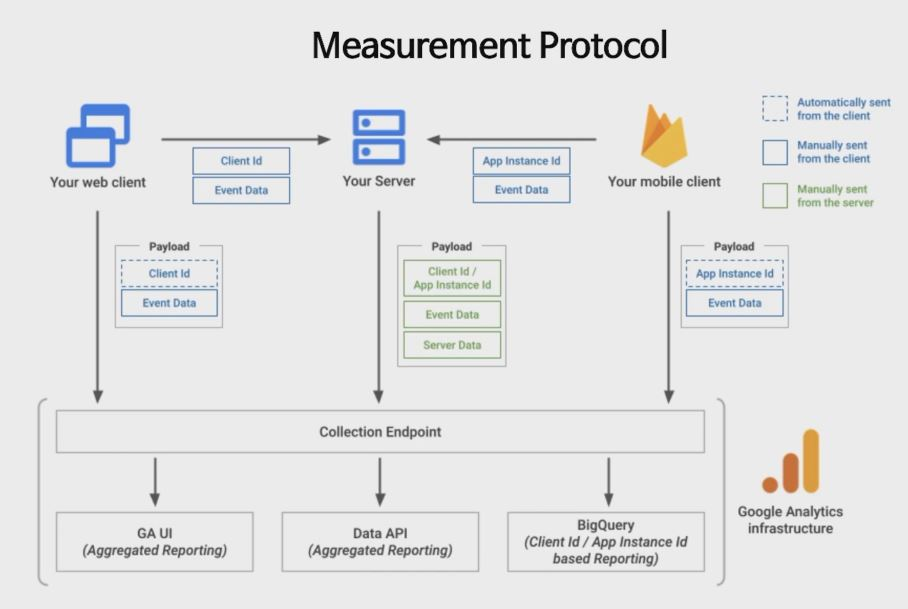

## [Link](https://youtu.be/lZad6JQwsjI?list=PLRrkVu2PYLQhRN7f4YvsAcyEDatyYpt25)

## 1. GA4 특징
1. 이벤트 기반의 데이터 모델
2. 웹사이트와 모바일 앱 모든 곳을 통합하여 사용할 수 있음
3. 머신러닝 활용
4. GCP 생태계와 연동이 잘 됨 (특히 BigQuery)

## 2. GA4 단점
1. 초기라서 업데이트가 너무 잦음
2. 데이터를 즉각 볼 수 있지 않음 (실시간 보고서 외에는 기본적으로 24~48h 후에 볼 수 있음)
3. 기준점 적용(데이터가 너무 적은 경우 안보여줌)

## 3. Measurement Protocol
- HTTP API를 이용해서 데이터를 서버에서 직접 전송하는 방법 

- EX : 구독서비스에서 카드 자동결제 (처음에는 서비스에서 결제되지만 그 이후에는 알아서 결제가 됨). 이런 것은 SDK로 수집하기 힘듬. 이런 경우 Measurement Protocol로 수집할 수 있음 