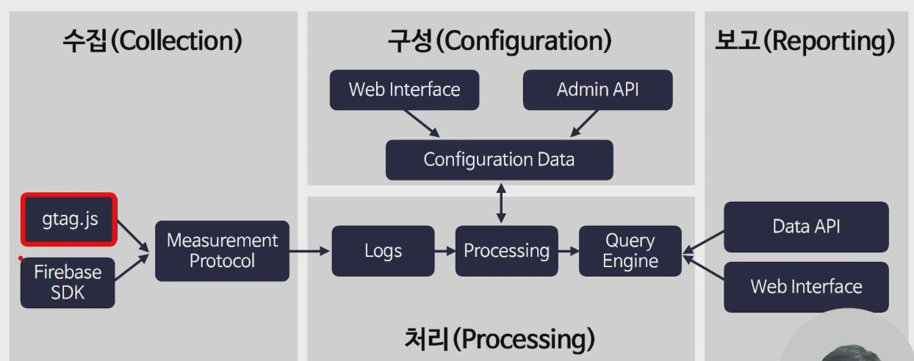
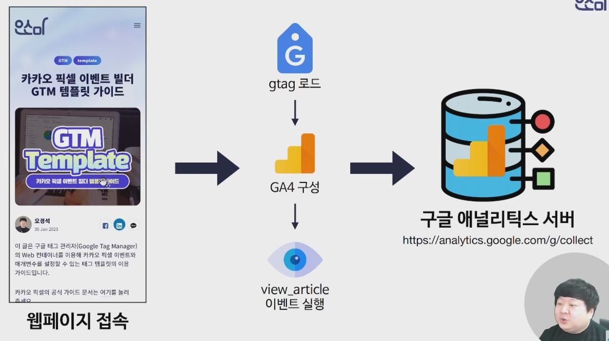
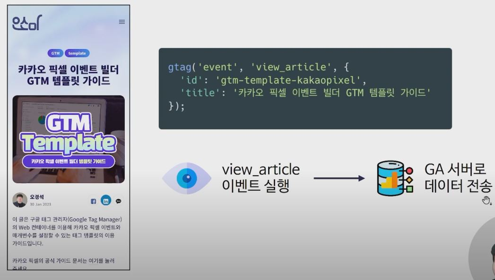
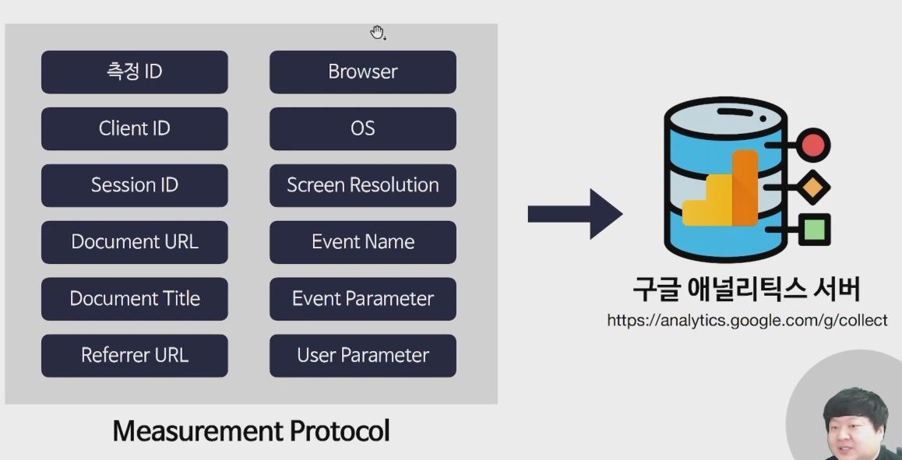
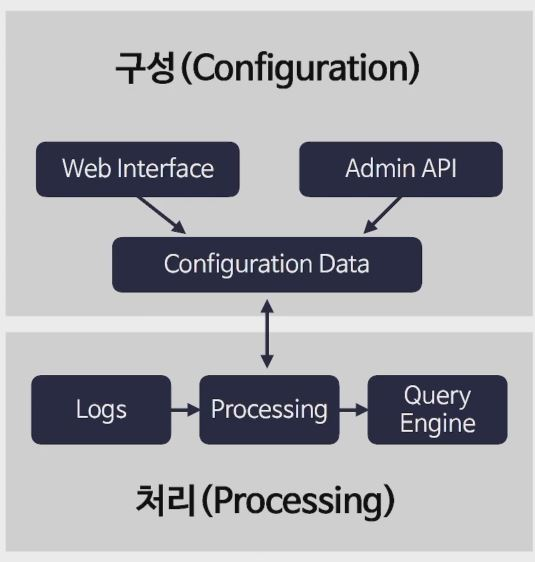
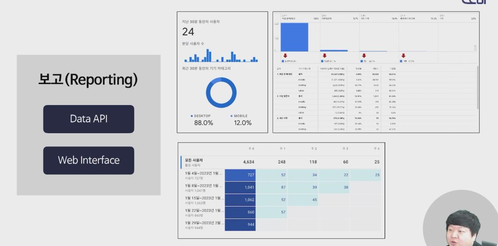

## [Link](https://youtu.be/6CIXzQkh2to?list=PLRrkVu2PYLQhRN7f4YvsAcyEDatyYpt25)

## 1. 구성도

## 2. 수집과정

## 2. 구성 및 처리

- GA 계정, 속성, 사용자 생성 및 관리
- 데이터 수집, 보관 관리
- 데이터 스트림 관리
- 전환 이벤트
- 맞춤 측정 기준, 맞춤 측정항목 관리
- Google Ads 등 연결 관리

## 3. 데이터 보고

