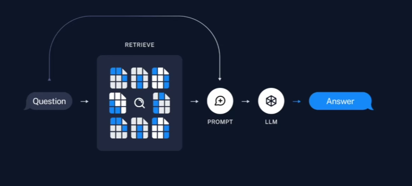
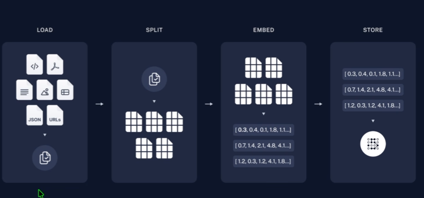
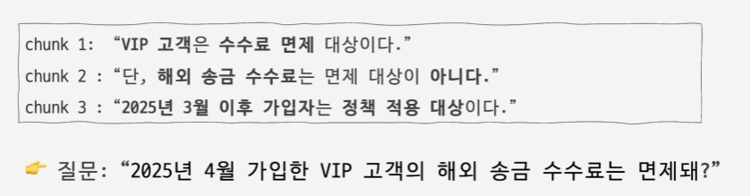
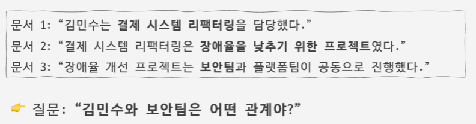
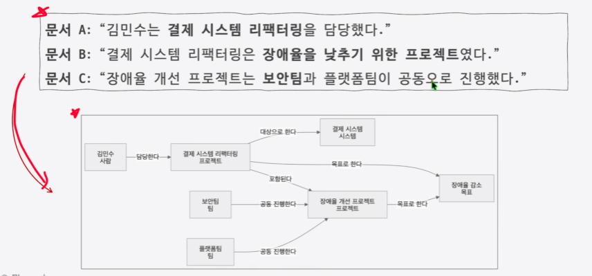
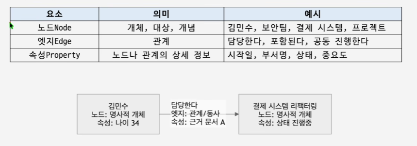
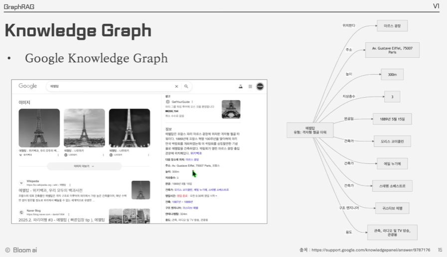

## 1. RAG의 작동 방식 

## 2. RAG 시스템 구축 순서 

## 3. RAG의 한계

1. Chunking의 한계

2. Top-K 검색의 한계

## 4. RAG Design Pattern

1. Native RAG (2-step RAG)

2. Retrieve-and-rerank (검색 후 재정렬)

    - LLM 전달 전 Reranker(재정렬) 모델을 거쳐 가장 정확도 높은 정보만 추리는 방식 

3. GraphRAG

    - 지식 그래프를 구축해 엔티티 간의 관계를 바탕으로 검색
     
4. Agentic RAG

    - LLM의 추론 방식을 통한 증강 

## 5. Ontology 

- 데이터를 의미있게 연결하고 해석하기 위한 개념 지도 

## 6. Knowledge Graph

1. 기본 구성 

    

2. Google Knowledge Graph

    

3. GraphDB : Knowledge Graph를 저장하고 탐색할 수 있는 데이터베이스 

    - neo4j : LLM + GraphRAG 빠르게 구축 가능

    - Amazon Neptune : AWS 기반 서비스 

    - Ontotext GraphDB : 온톨로지 제공

    - TigerGraph : 대규모 분산 그래프 분석 

     
## 7. Neo4j

- https://github.com/jaypakdevkr/graph_rag