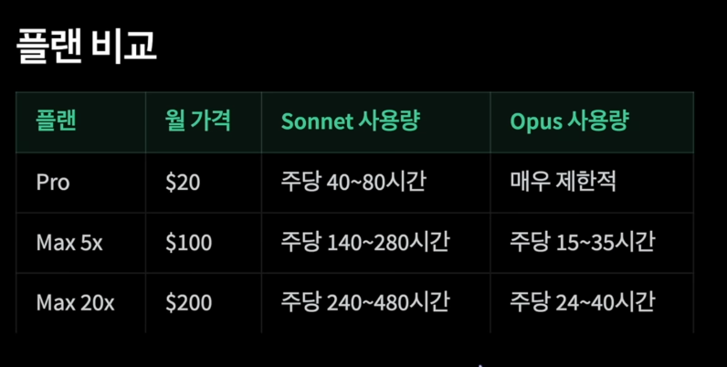

1. 컨텍스트 롯 (Context Rot)

- 컨텍스트를 관리하지 않으면 썩음 

- 작업 A가 끝났는데 치우지 않고 바로 작업 B 시작 -> 파일, 에러 로그, 테스트 결과 잔해 남음

2. 플랜 비교

    

3. opusplan

4. /clear -> 작업 간 초기화 & /rename 세션이름

- /rename 세션이름 해놓으면 나중에 /resume을 통해 쉽게 돌아갈 수 있음 

5. Extend Thinking

- 눈에 보이지 않으나 토큰을 꽤 잡아먹는 기능 (클로드가 답변 전에 깊이 생각하는 기능, 기본 활성화, 최대 31999 토큰)

- 간단한 수정에도 사용 가능

6. 구체적 프롬프트 체크리스트

- 파일, 함수, 구체적 요구사항 작성

7. MCP Tool Search true로 항상 켜놓기

8. CLAUDE.md 관리 & Skill로 분리 