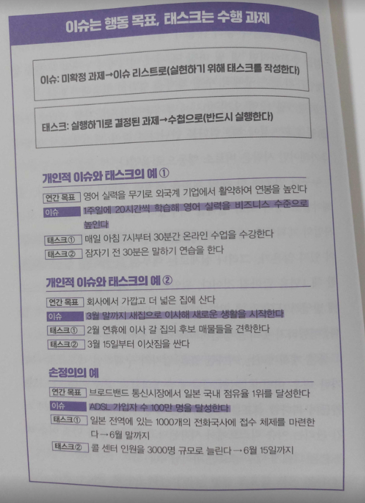
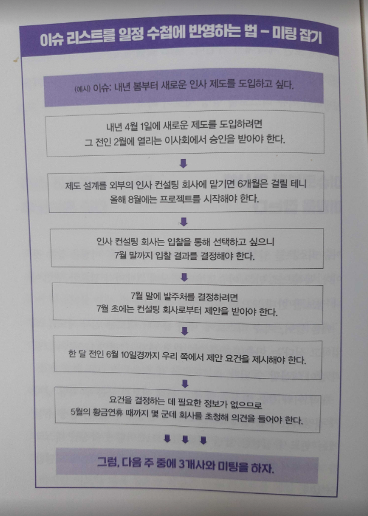

 p.6-7 
 개인의 노력에 의존하지 않고 조직에서 시간을 효율화하는 시스템을 만들어야 한다. 아무리 개인이 노력해 작업 속도를 높여봤자 부서 간 연계가 원활하지 않거나 시간만 질질 끌뿐 결론이 나지 않는 회의가 일상적으로 이루어진다면, 불필요한 재작업 또는 대기 시간이 발생하여 결국 개인이 장시간 노동을 하게 된다. 
 조직의 시간을 효율화하고 생산성을 높일 수 있는 시스템만 갖춰지면 그 다음은 개인이 묵묵히 일을 처리하기만 해도 최단 기간에 최대 성과가 난다. 

 p.22 
 손정의의 인생 50년 계획을 통해 우리는 무엇을 알 수 있을까. 바로 '성공하는 사람은 장기적으로 인생의 시간을 관리한다'는 점이다. 장기 목표가 없으면 단기 일정을 짤 수 없다. 일정이란 장기 목표로부터 역산해 짜는 것이기 때문이다. 자신의 최종 목표도 알지 못한 채 단지 눈앞에 주어진 일을 끊임없이 처리할 뿐이라면 이는 '일정 관리'라고 말하기 어렵다.

 p.26 
 소프트뱅크에서 근무하던 시절, 나는 손정의에게 다음과 같은 이야기를 여러 차례 들었다. 
 
 "어째서 많은 사람들이 큰일을 끝까지 해내지 못하는지 자네는 아는가?" 
 
 이렇게 말한 손정의는 종이에 산을 그리고 그 기슭에 빙빙 원을 그린 다음 또다시 말했다. 
 
 "대부분의 사람이 목표로 삼을 산을 정하지 않아. 그러니 나아가야 할 방향을 알지 못하고 같은 장소를 뱅글뱅글 돈 채 일생을 마치지. 하지만 '이 산을 오르겠다'라고 목표를 정하면 어느 길을 따라 오를지, 어떤 장비를 갖춰야 할지 등을 계획할 수 있기 때문에 마지막에는 제아무리 높은 산도 오를 수 있다네!" 
 
 계획을 세우지 않으면 사람은 아무것도 완수할 수 없다. 손정의는 내게 이 사실을 반복해서 가르쳐주었다.

 p.32-34 
 시간의 포트폴리오는 '1주일'이란 틀 안에서 관리해야 한다. 만일 영어학습에 1년간 1000시간을 투자하겠다고 정했다면 1년은 약 50주이므로 '1주일에 약 20시간씩' 공부하면 된다는 계산이 나온다. 그러면 하루에 3시간씩 공부하면 된다는 1일 배분량도 정해지므로 다음은 이를 일정에 넣고 실행만 하면 된다. 이런 식으로 학습, 취미, 가정 등 목적별로 1주일간의 배분을 확정하지 않으면 자기도 모르는 사이 다른 일에 시간을 사용하게 되므로 일에 치인 나머지 결국 1주일에 1시간도 공부하지 못하는 결과를 낳기 쉽다. 

 그 밖에 회식이나 술자리는 수요일 저녁으로 잡는다. 수요일이 아닌 날에는 집에서 가족과 함께 저녁 식사를 한다. 매주 토요일 오전에는 피트니스 센터에 간다는 식으로 1주일 단위의 시간 안에서 업무, 학습, 취미, 가정 등의 배분을 정해야 한다. 이렇게 목적별로 얼마만큼 배분할지를 정하지 않으면 술자리가 거의 매일 이어지는 바람에 결국 1주일에 단 한 번도 가족과 저녁 식사를 하지 못할 수도 있다. 

 p.36 
 손정의가 시간을 사용하는 방법은 일반 기업의 경영인들과는 크게 다르다. 가장 큰 차이는 다음 세 가지다.
 1. 우선순위에 따라 예정된 일을 거리낌 없이 변경한다.
 2. 지금 전력을 다하면 크게 성장할 수 있는 마일스톤에 집중한다.
 3. '발표 경영'으로 절대 바꿀 수 없는 목표를 정한다.

 p.37-38 
 손정의식으로 말하자면 전략이란 '전투를 생략하는 것'으로 그 본질은 '무엇을 하지 않을까?'이다. 인생 50년 계획에 관한 일화에서도 알 수 있듯이 손정의의 시간 경영에는 '목표'가 필수적이다. 우선 언제까지 무엇을 달성한다는 대략적인 마감 시한을 정하고, 그 다음은 커다란 목표를 향해 돌진한다. 단, 착각하지 말아야 할 것은 일직선으로만 나아가지는 않는다는 점이다. 목표로 삼을 산을 정했다면 진행 경로나 수단은 유연하게 바꾸면서 나아간다. 이것이 손정의의 최대 강점이다.

 p.42-43
 손정의는 인생 50년 계획으로부터 역산해 자신의 임무를 착착 실행하는 중이라고 이야기했다. 그렇다면 손정의는 구체적으로 어떻게 장기 목표를 단기 일정에 반영하는 걸까? 가장 가까이에서 그를 지켜보며 터득한 '시간 관리법'의 기본적인 핵심 요소들을 추려보면 다음과 같다. 
 1. 이슈 리스트를 만들어 큰 목표를 세분화하라.
 2. 이슈는 '행동 목표', 태스크는 '수행 과제'를 말한다.
 3. 미팅 일정 짜기는 시간 관리 그 자체다.
 4. 10초 이상 생각하지 말라
 5. 우선순위는 계속 바꿔도 된다.
 6. 정례회의의 중요성을 인식하라.  

 p.46  

 

 p.49-50 
 "10초 이상 생각하지 마라!"
 손정의는 늘 입버릇처럼 이렇게 말했다. 10초간 생각해도 모르겠다면 그 이상 혼자 생각한들 답은 나오지 않으니 다른 사람과 논의하거나 다른 사람의 의견을 들어야 한다는 의미였다. 혼자 고민하는 시간만큼 쓸데없는 것도 없다. 머리를 쥐어짠들 훌륭한 아이디어가 떠오르지도, 어려운 결단을 내리게 되지도 않는다. 그러니 모르는 내용이 있을 때는 재빨리 다른 사람의 지혜나 정보를 빌려라. 이것이 손정의의 신조다. 
  
 손정의에게 일이란 '10초 이내의 판단이 축적된 것'이다. 그리고 미팅은 '판단 재료를 한 데 모아 의사를 결정하는 자리'다. 이런 까닭에 소프트뱅크의 회의에서는 "검토 중입니다"라는 말을 절대로 해서는 안 된다. 이렇게 말하는 사람은 두 번 다시 회의에 참석할 수 없다. 손정의가 그 자리에서 10초 이내에 판단하기 위해 회의를 하는데, 그 안건은 회의가 끝난 후에 검토하겠다느 식으로 말하면 의사결정이 다음 회의 때로 미뤄지게 되기 때문이다. 시간을 무엇보다 중요하게 여기는 손정의에게는 가장 용납하기 힘든 상황이다.
  
 '혼자 10초 이상 생각하지 않는다. 그리고 다른 사람에게도 10초 이상 생각할 틈을 주지 않는다.' 이것이 손정의의 시간 관리 원칙이다.

 p.52-53 
 손정의의 우선순위에 따라 갑작스럽게 미팅이나 사전회의가 열리는 일도 많았지만 소프트뱅크에서는 매주 시행하는 '정례회의' 역시 중요하게 여겼다.
 - A프로젝트의 정례회의는 매주 월요일 오후 5시부터.
 - B프로젝트의 정례회의는 매주 화요일 오전 10시부터. 

 이렇듯 매주 정해진 날짜와 시간에 회의를 설정하고 매회 출석하는 멤버도 고정했다.
 
 정례회의를 중시하는 이유는 회의의 조정 비용을 낮추기 위해서다. 미팅을 통해 의사를 결정하려면 '정보'와 '권한'이 있어야 한다. 모처럼 회의를 열었는데 그 안건은 영업부의 고객 데이터가 없으면 판단하기 어렵다거나 컴플라이언스부의 허가 없이는 추진하기 힘들다는 말이 나온다면 회의 시간은 통쨰로 불필요한 시간이 돼버린다. 따라서 회의에 누구를 부를 것인지는 상당히 중요한 문제다.
 
 상황이 이렇다고는 하나 의사결정에 필요한 멤버를 미팅 때마다 확인하고 일정을 조정하는 작업은 수고로울뿐더러 시간도 많이 든다. 하지만 '안건 A에 관한 정보와 권한이 있는 사람은 매주 월요일 오후 5시의 정례회의에 참석하라'고 정해버리면 회의를 조정하는 비용이 단번에 절감된다. 뿐만 아니라 미리 매주 정해진 날짜와 시간에 회의가 열린다는 사실을 모두 알고 있으므로 그 시간에 고객과 약속을 잡아서 도저히 회의에 참석할 수 없다는 등의 이유로 결원이 발생하는 현상까지 막을 수 있다. 게다가 매주 회의를 열면 개인 업무 시간도 관리하기 편하다.

 p.57
 
 일정은  종이 수첩이나 컴퓨터로 관리하기를 권장한다. 종이 수첩이나 컴퓨터는 종이 또는 모니터 화면으로 1주일간의 시간배분을 한눈에 파악할 수 있는 까닭이다.
 
 종이 수첩이라면 '주간 계획표 양식'이 가장 좋다. 주간 계획표 양식의 수첩은 펼쳤을 때 두 페이지의 가로축에는 1주일 분의 날짜가, 세로축에는 하루의 시간축이 인쇄되어 있다. 세로축을 따라 시간별로 일정을 적어나가기만 해도 자신이 어떤 일에 얼마만큼의 시간을 사용할지 시각적으로 나타낼 수 있다. 게다가 딸 펼치기만 해도 그 주의 포트폴리오가 한 눈에 파악된다.
 
 '이 번 주에는 술자리가 세 번이나 있구나.'
 
 '이번 주 안에 급히 처리해야 할 업무가 생겼으니 목요일에는 야근을 하겠구나.'
 
 이처럼 1주일의 일정 전체를 예상해서 시간 배분을 의식하게 되므로 술자리 하나는 거절하자. A와의 미팅을 앞당기면 정시에 끝날 듯 하니 일정을 다시 조정해봐야겠다 등의 개선안을 사전에 마련할 수 있다.

 p.80
 
 애초에 상사란 밥상을 뒤엎는 존재다. 지위가 높은 사람일수록 많은 정보를 손에 넣을 수 있기 때문이다. 사장이 아는 정보와 갓 입사한 평사원이 아는 정보에는 당연히 격차가 있기 마련이다. 그리고 보유한 정보량이 다르면 의사를 결정하는 판단 기준 또한 달라진다.

 이러한 까닭에 사장이 자기 수중에 있는 정보를 토대로 적절한 판단을 내려도 그 정보를 알 길 없는 직원들이 볼 때는 불합리하고 권위적인 말처럼 들린다. 따라서 상사가 의사결정을 하면 부하직원들은 이를 받아들이고 실행할 수밖에 없다. 이는 소프트뱅크에 근무하는 직원들뿐 아니라 조직에서 일하는 사람이라면 누구나 같은 입장이리라. 그러므로 누구나 '상사의 무리한 요구를 해결할 수 있는 시스템'을 만들 필요가 있다.

 p.85
 
 '상대방이 기대하는 일은 하고, 기대하지 않는 일은 하지 않는다.' 이와 같은 선 긋기가 바로 효율화의 열쇠다. 이는 상사 뿐 아니라 고객이나 그 밖의 기업 이해관계자들을 대할 때도 마찬가지다. 더 확실히 해두고 싶을 때는 일을 추진하는 도중이라도 몇 번씩 기대치를 조율하면 된다. 중간 단계라도 좋으니 결과물을 보여주면서 이 방향성이 올바른지를 확인하며 추진해나가면 최종 단계에 이르러 '내가 생각했던 것과 다르니 다시 하라'는 말을 들을 일이 없다.

 p.90
 
 소프트뱅크에는 1분 1초의 시간조차 낭비하지 않기 위해 손정의가 주변 사람들에게 실천하도록 요구한 철칙이 있다. 그 철칙은 다음 다섯 가지다.
 
 1. '검토 중'이란 말은 절대 금물이다.
 2. 결론부터 말하라.
 3. A4 한 장의 메모를 준비하라.
 4. 결과물은 '명사형'과 '수치'로 정의하라.
 5. 문제를 '구조화'하라.

 p.94-95
 
 소프트뱅크에서는 '누가, 언제까지, 어떤 결과물을 낼 것인가'를 구체적인 태스크에 반영하는 것을 회의의 목표로 삼는다. 일본의 회사에서 흔히 있을 법한 "여러분, 그럼 나머지는 이런 식으로 부탁합니다!"라며 모호하게 끝나는 일은 절대 없다.
 
 회의에서 결정된 사항을 곧장 행동으로 옮기려면 담당자나 기한을 결정하는 것은 물론 결과물을 명확하게 정의하는 작업이 무엇보다 중요하다. 핵심은 '명사형'으로 정의하는 데 있다.
 
 "다음 주 회의 때까지 야마다 씨가 경쟁사의 고객 만족도를 조사해오세요"라는 식의 업무 지시는 태스크의 정의로서 충분하지 않다. "조사는 했습니다만 보고서는 아직입니다"라는 말을 듣게 될 가능성이 있기 때문이다. 보고서가 없으면 다음 행동으로 옮길 수 없으므로 조직 전체의 일이 그 지점에서 멈춰버려 의미 없이 시간만 흘러가게 된다. 따라서 결과물은 반드시 '명사형'으로 정의하는 것이 철칙이다.
 
 "다음 주 회의 때까지 야마다 씨가 '경쟁사의 고객 만족도 보고서'를 작성해오세요." 이것이 결과물을 정의하는 올바른 방법이다.

 손정의 밑에서 프로젝트 매니저로 일한 나는 이를 더욱더 철저히 하기 위해 '결과물을 기초로 한 회의록'을 작성했다. 담당자, 기한, 결과물을 적어넣는 형식을 만들어 회의에서 결정된 내용을 다음의 예시처럼 모두 명사로 적는 것이다.
 
 - 담당자 - 야마다
 - 기한 - 9월 10일
 - 결과물 - 경쟁사의 고객 만족도 보고서

 p.120
 
 