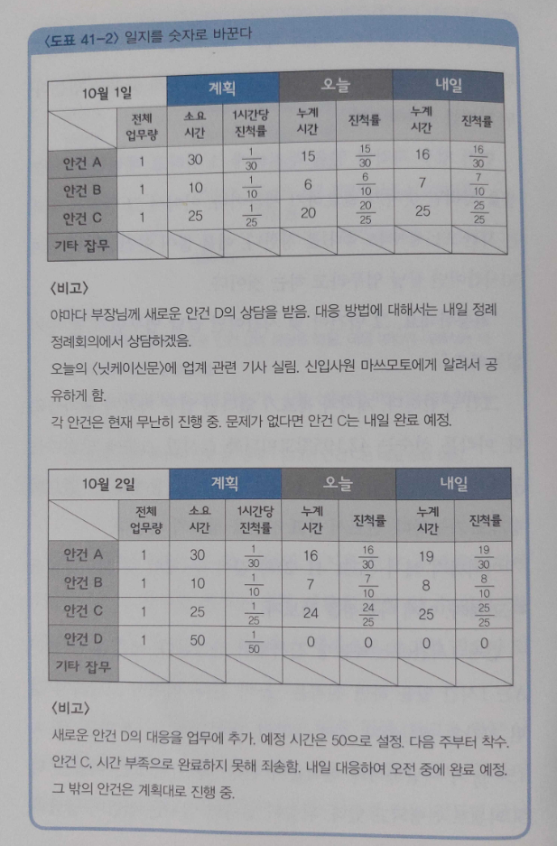

> p.42
> 
> '학거북산'은 '가정하는 법'을 가르쳐준다. 예를 들어 당신의 회사가 시장점유율 1위가 되기 위해서는 어떻게 해야 할까? 단순히 현재 몇 위인지 파악하는 선에서 끝나면 안 된다. 생각의 과정을 학거북산에 대응시키면 이렇게 된다.
> 
> 일단 전부 학이라고 가정한다 < - > 당사가 시장점유율 1위라고 가정한다.
> 
> 다리의 합계 수가 맞지 않는다 < - > 매출이 ~억 엔 부족하다
>
> 학 ~마리를 거북으로 바꾼다 < - > 그 오차를 메꿀 수 있는 ~~의 대응으로 커버한다.

> p.43
> 영업부 사원이라면 '학거북산'의 사고방식을 적용하여 아래와 같은 사고과정을 거치는 것이 중요하다.
> 
> 1. 먼저 손님이 우리 제품을 구입했다고 가정한다.
> 2. 그때 손님에게 좋지 않은 일이 일어났다면 그것은 무엇일까
> 3. 그 일을 상쇄할 제안을 한다.
> 4. 그러면 안 살 이유가 없어진다.

> p.63
> 
> 내가 하고 싶은 말은 '빨리'보다 훨씬 중요한 것을 우리가 잊고 있다는 사실이다. 그것은 바로 이것이다!
> 
> '이 계산 결과 뭔가 좀 이상한 것 같은데?'를 알아차리는 능력

> p.70
> 
> '많으면 많을수록 좋다'는 선입관을 버리자. '샘플 수'가 아니라 실제와의 '오차'가 얼마나 생기는지가 중요하다.

> p.92-93
> 
> 원주율이란 모든 원에 있어서 지름과 그 둘레 길이의 비율이다.
> => 그러므로 어떤 원 둘레 길이도 그 비율을 사용하면 구할 수 있다.
>
> 이것이 원주율에 대한 올바른 이해다. 학교에서 이렇게 배웠는가? 원주율의 의미를 제대로 이해하지 못하고서 그저 계산하는 데만 3.14를 사용했다면 그것은 비즈니스에 써먹을 수 있는 '근육 트레이닝'이 전혀 안 되어있다는 뜻이다.
> 
> 예전에 학교에서 .....
> 
> 원주율을 써서 정답을 이끌어냈다. 왜 원주율을 사용하냐고? 몰라. 그냥 그렇게 배웠으니까.
> 
> 그대로 직장인이 되면......
> 
> 이번 분기는 인원을 감축합니다. 사장님이 그렇게 지시했거든요. 이유요? 모릅니다. 안 가르쳐주셨으니까요.
> 
> 여러분 직장에 이런 동료나 선후배가 있다면 반드시 학교에서 배운 수학을 다시 공부해보라고 권하자. 이런 사람들이 꼭 비즈니스 현장에서 '결론 먼저' 따위의 그럴듯한 말들을 사용한다. 그러나 '결론 먼저'가 되려면 이유를 설명할 수 있다는 전제가 깔려 있어야 한다. 그런데 직장 내에는 '그냥 결론만 말해달라, 이유 따위 흥미 없다, 시키는 대로 할 테니까, 그렇게 하면 그 업무는 깔끔하게 해치울 수 있을테니까'라고 생각하는 사람이 의외로 많다. 그저 귀찮은 것이 싫다, 업무는 결과가 전부다...... 그런 생각 때문일 것이다. 하지만 정말로 그러면 만사 OK일까? 나는 그렇지 않다고 생각한다.
> 
> 수학으로 훈련할 수 있는 것은 계산 능력이 아니다. 결론의 이유(근거)를 생각하는 능력, 그것을 제3자에게 설명하고 설득시키는 능력이다.

> p.174
> 
> 배리법은 엄청난 위력을 발휘한다.
> 
> ## 문제
> 
> 당신이 어느 중소기업의 사장이라고 하자. 회사는 해마다 업적이 악화되고 있지만 절대로 존속시켜야 하는 상황이다. 그 때문에 올해 일률적으로 모든 사원의 연봉을 삭감할지 말지 망설이고 있다. 그러나 사내의 이사들로부터 반대 의견도 나온다. 당신은 어떻게 생각하는가?
>
> 이럴 때 우리는 '실시해야만 하는 이유'를 찾으려든다. 앞의 1 / 0의 문제로 치환하면 '존재하지 않는 이유의 설명'이다. 당연히 미주알고주알 늘어놓아봤자 결론은 나지 않고 회의시간만 한없이 길어진다. 그때 배리법을 사용해보자.
> 
> 예를 들어 실시하지 않는다고 한다 (결론을 부정한다)
> 
> -> 인건비는 낮아지지 않은 채로 매출도 더욱 떨어져간다. \
> -> 경영이 더욱 악화된다. \
> -> 회사를 존속시킬 수 없다 (엇, 원리원칙에 모순되고 만다) \
> -> 그것은 곤란하다! (모순의 이유는 결론을 부정했기 때문이다) \
> -> 그러므로 '실시하지 않는다'는 선택은 잘못이다(반대 의견을 부정할 수 있다)

> p.182-185
> 
> 회사가 새로운 고객을 끌어들이는 데 필요한 단가, 말하자면 신규 고객 획득 단가는 얼마로 설정하고 있습니까?
> 
> 강연회나 세미나에서 사람들에게 이렇게 물어보면 놀라운 대답이 나온다.
> 
> "논의는 하지만 사실은 정해지지 않았어요."
> 
> "어떻게 정하면 좋을지 잘 모르겠어요."
> 
> "어떻게 정하면 될까요?"
>
> 질문을 더 던져보았다.
> 
> "신규고객에게는 1년 동안 몇 회 구입하게 할 계획입니까?"
> 
> "그것도 명확히 정해져 있지 않습니다......"
> 
> 솔직히 말하면, 그것이 정해져 있지 않은데 신규 고객 획득 단가를 논의한다는 것 자체가 난센스다. 당연히 정하지 못한다. 무엇보다 먼저 그 부분을 명확하게 해야 한다. 그럼 그것이 되어 있다는 전제로 다음 문제를 함께 생각해보자.
> 
> ## 문제
> 평균 구입비가 3,500엔인 통신판매 사이트가 있다. 새 고객에게는 연간 3회 구입하게 할 계획이다. 상품원가율은 50%다. 이때 신규 고객 획득에는 얼마까지 들이면 될까?
> 
> 실제 비즈니스 현장에서는 판매 관리비나 기타 비용도 있으므로 이 정도 단순한 구조는 아니지만 여기서는 이해가 목적이므로 단순하게 생각해보자. 먼저 마케팅 비용은 신규 고객 획득과 기존 고객 유지라는 두 가지로 나눌 수 있다. 또 일반적인 규칙으로 아래와 같은 수치가 유명하다.
> 
> 신규 고객 획득 비용 : 기존 고객 유지 비용 = 5 : 1
> 
> 물론 어디까지나 일반론이다. 그러나 이런 '비'가 존재한다면 반드시 적극적으로 사용하고 싶다. 제4장에서 이야기했던 것을 기억해보자. 직장인에게 '비'는 구하는 것이 아니라 사용하는 것이다! 이 비로 다음과 같은 비용을 산출한다. 신규 고객 획득에 드는 비용을 '5'라고 하고 반복 구입을 '기존 고객 유지'라고 정의하면 거기 드는 비용은 '1'이다. 즉 3회 구입하면 비용이 합계 '7'이 된다.
> 
> 신규 획득  5 \
> 2회째 구입 1 \
> 3회째 구입 1 \
> |||||||||||||||||||| 7
> 
> 평균구입금액을 3,500엔이라고 하면 구입액의 합계는 3,500 * 3 = 10,500엔
> 
> 원가율 50%이므로 총이익은 5,250엔
> 따라서 최초 구입시 들여도 되는 비용은 5,250 * 5 / 7  = 3,750엔
>
> 즉 신규 고객 획득 단가가 3,750엔보다 높아지면 1년에 3회까지 이용한다 해도 '이익이 생기지 않는다'는 말이다. 일반적인 '비'이긴 하지만 이렇게 함으로써 기준을 찾아냈다.
> 
> "이런 건 실제 숫자도 아니니까 의미가 없잖아요!"
>
> 이렇게 딴죽을 거는 사람이 있을지도 모르겠다. 분명 정밀도는 결코 높지 않을지 모른다. 그러나 다시 한 번 말하지만 애초에 계획 자체가 없다면 이런 초등학교 수학 수준의 어림셈조차 할 수 없다. 아무 마케팅 계획도 없으면서 이런 말을 한다는 건 솔직히 난센스다.
> 
> 예를 들어 3년간 5회 이용하게 하는 계획이라면 똑같은 계산을 해보자. 여러분의 비즈니스에서 최적의 기간과 횟수를 설정하고, 어림잡아 기준을 산출해봄이 마땅하다. 금액과 실제 신규 고객 획득 단가(이것은 각자 갖고 있는 숫자로 산출할 수 있다)를 비교해보자. 알고 보니 지금까지 손해를 보고 있었다는 사실이 들통나지 않기를 바란다.

> p.202
> 
> 꺽은선 그래프는 동일한 항목의 변화를 나타내는 데 사용하는 것이 원칙이다. 다른 회사의 종업원 수와 비교하기에는 적합하지 않다.
> 
> 일반적으로 막대그래프는 실수를 비교하기 위해 사용하며 이처럼 비율을 표현하는 데는 잘 쓰지 않는다. 시각적으로 알 수 있도록 원그래프 또는 하나의 막대그래프로 표현해야 한다.

> p.222-223
> 
> 그날의 업무에 걸린 시간은 필요 없다. 보고를 받는 상사의 입장에서 몇 시간 동안 했는지는 중요하지 않다. 그들이 알고 싶은 것은 얼마나 진행되었으며, 앞으로 어느 정도면 끝날 것인가이다. 그렇다면 무엇을 해야 할까? 지금까지 거듭 말해온 평가를 하기 위한 수법인 '나눗셈'과 '무리하게 숫자를 만든다' 두 가지를 사용해보자. 
> 
> 먼저 업무 각각의 양을 무리하게 '1'이라고 해놓는다. 나눗셈을 하려면 숫자가 필요하기 때문이다. 이어서 그 업무에 걸리는 시간(또는 날짜라도 좋다)을 정한다. 예를 들어 안건 A라면 합계 30시간이면 끝날 업무라고 하는 것이다.
> 
> "죄송한데요, 그 안건이 몇 시간이면 끝날 업무인지 알 수가 없는데요."
> 
> 그건 곤란하다. 계획과 목표가 없다면 업무 자체가 불가능하다. 마라톤 선수는 42.195킬로미터를 ~시간 ~분에 달린다는 구체적인 계획이 있어야만 비로소 달리기를 통제할 수 있으며 평가도 가능하다. 반드시 목표 시간을 정하기 바란다. 
> 
> 이제 나눗셈을 해보자.
> 
> 먼저 1시간(또는 하루) 당 진척률이 산출된다. 예를 들면 안건 A는 1시간 일을 하면 진척은 1/30이 된다. 이어서 그날까지 걸린 시간을 계산하자. 안건 A라면 15시간이다. 그 말은 1 / 30 * 15 = 15 / 30가 이날까지의 진척률이 된다. 즉 안건 A는 이날로 딱 50퍼센트 진행되고 있다, 뒤집어 말하면 업무는 절반이 남았다는 것이다. 마지막으로 내일 어느 정도 진행될 예정인지도 기재하면 좋다. 내일 업무일지를 쓸 때 계획대로 진행되었는지 체크할 수 있기 때문이다.
> 
> 
> 
> 10월 2일의 업무일지를 보자. 안건 C가 게획대로 진행되지 않았다는 것, 그러나 내일은 완료할 예정이라는 것을 한 눈에 알 수 있다. 안건 A는 절반가량 진행, 안건 B는 70퍼센트 완료, 안건 D는 미착수라는 구체적인 진척 상황과 내일 어느 정도 진행될 것인지를 파악할 수 있다. 
> 
> '문제없이 진행되고 있다'는 참으로 편리한 말이다. 하지만 어떻게 보면 얼버무릴 수 있는 말이기도 하다. 숫자와 나눗셈을 사용하여 보고받는 쪽이 알기 쉽게 구체적으로 전달해주자.
> 
> 이것은 업무의 모든 면에서 필요한 사고방식이다. 지시를 받지 않아도, 직장에 그런 규칙이 없어도, 이런 숫자를 사용한 '보고'를 한다면 상사나 동료는 안심할 것이고 무엇보다 여러분 자신의 가치도 올라갈 것이다. 이렇게까지 명확하게 수치화해버리면 얼버무리기가 통하지 않기 때문이다.