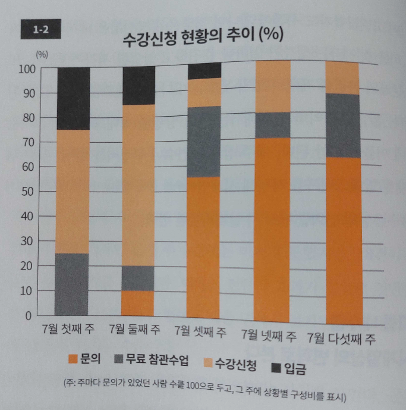
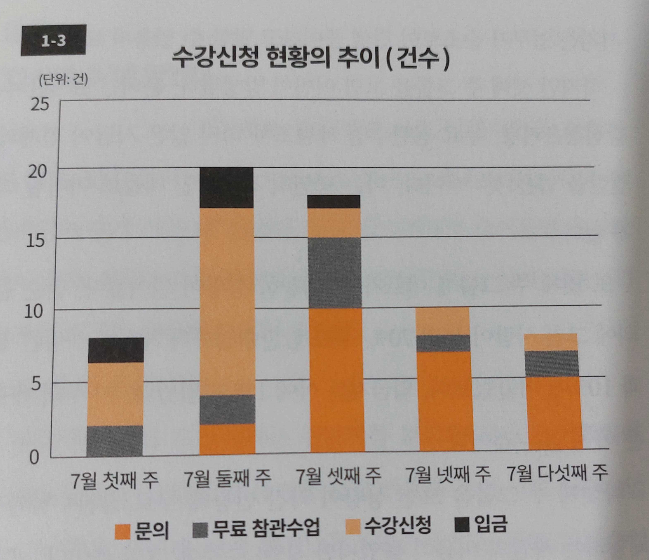
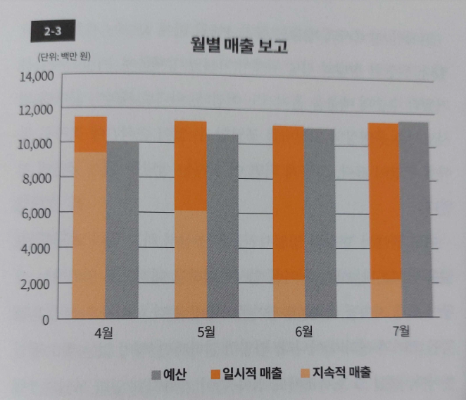

> p.5~6
>
> 이런 위기상황을 어떻게 극복했을까? 걱정 때문에 식은땀까지 흘리며 괴로워하던 나는 벼랑 끝에 몰린 심정으로 한 가지 결론을 내렸다.
> 
> '지금처럼 그냥 생각나는 대로 쓰다가는 이도 저도 안 된다.'
>
> 3일 안에 1만 개의 키워드를 추출해내기란 쉽지 않다. 1만 개를 찾으라는 건 곧 '경영사전을 만들라'는 지시나 다름없다. 이는 내 머릿속 지식을 모두 나열한다 해도 도저히 불가능한 일이었다.
>
> '어떡하지......'
>
> 시간은 무심히도 계속 흘렀다. 그렇게 고심에 고심을 거듭하던 끝에 나는 한 가지 사실을 깨달았다. 내게 필요한 게 바로 '구조화(Structualization)'라는 사실이었다.
>
> 이에 따라 나는 우선 경영에 관한 10가지 대항목부터 찾아 나눴다. '경영전략', '재무', '경리', '조직' 등의 거시적인 테마였다. 그리고 그 10개의 대항목마다 다시 10개의 중항목을 설정했다. 이로써 10 X 10 = 100. 이렇게 100개의 키워드를 도출할 수 있었다.
>
> 이후 각 중항목 아래에 100개씩 키워드를 적어 넣었다. 10 X 10 X 100 = 10000. 미션 완료! 이리하여 나는 3일 만에 비즈니스 키워드 1만 개를 추출하고 정리해 손정의 사장에게 제출할 수 있었다.

> p.12
>
> '문제점을 안다는 건 곧 해결책과 개선책을 세울 수 있다'는 '또 다른 사실'을 의미한다. 확실해진 문제점을 해결하기 위한 가설을 세우고, 이를 하나씩 검증해갈 수 있기 때문이다.

> p.25
>
> 본질을 파악하기 위해서는 단지 상황별 막대그래프를 그리는데 머물러선 안 된다. 매주 상황별 건수나 구성비를 알 수 있는 적재형 막대그래프를 작성해 시계열상의 변화를 반드시 살펴봐야만 한다.

> p.26
>
> 

> p.27
>
> 

> p.31
>
> 문제점은 누적으로 보고서를 작성할 경우 제대로 운영될 때의 수치까지 포함되어 있기 때문에 한눈에 알기 어렵다. 이는 누적이 가진 일종의 함정이다. 
>
> 따라서 어떤 상황의 진실을 보기 위해선 누적의 함정에 빠지지 않는 것, 바로 여기에 성패가 달려 있다 해도 과언이 아니다. 시간적인 흐름 속에서 업무를 처리할 경우 '어떤 기간 동안 벌어진 일만을 콕 집어내는' 그룹 관리가 필수적이다. 이는 몇 가지 공정을 거쳐 운영하는 업무에서 가장 중요한 업무에서 가장 중요한 요소 중 하나다.

> p.34
>
> 1. 상황(단계)을 정의한다.
> 2. 상황(단계)은 실제 산출 베이스로 명확히 한다.
> 3. 누적이 아니라 그룹 내수로 본다.
> 4. 시계열상의 변화로 추이를 본다.
> 5. 백분율 수치와 실제 수치를 모두 기입해 '원 슬라이드, 원 메시지(One Slide, One Message)'로 만든다.

> p.43
> 
> 구체적으로는 업무를 1) 접수 - 인쇄 - 분류, 2) 기록 조사, 3) 기록 심사, 4) 답변 처리 등의 4가지 과정으로 나눠 정의하고, 각각의 업무 과정마다 진척상황이 실시간으로 파악되도록 이를 바코드로 관리했다. 이로써 처리 능력이 비약적으로 개선되어 특별편의 처리 지연 문제는 해결될 기미가 보이기 시작했다. 현재는 특별편의 처리 지연 문제가 거의 해결된 상태다. 이때 포인트는 '상황을 정의해 주별 그룹 관리를 하는 것'이다. 상황을 분명하게 정하면 자료도 손쉽게 만들 수 있고 POS 시스템 구축 역시 가능해진다.
>
> 그만큼 그룹 관리는 효과적인 경영 기법이다. 시간적인 흐름을 고려하면서 업무의 진척상황을 수치화하다 보면 반드시 애로사항을 발견할 수 있다. 그러면 이후에는 애로사항 해소(문제 해결)에만 전념할 수 있다.

> p.52-53
>
> 만일 여러분이 어떤 회사의 안정성과 견실성, 기초체력 등을 알고 싶다면 '전체 매출 중 지속적인 매출의 비율이 어느 정도인지' 파악하는 게 가장 중요하다. 이를 위해서는 우선 매출을 지속적인 것과 일시적인 것으로 나눠서 봐야만 한다.
> 
> 일시적으로 매출을 확보해 아무리 표면적인 수치를 끌어올려도 그건 결국 숫자 장난에 불과하다. 이는 안정과 성장으로 이어지는 숫자가 아니라 '일종의 눈속임'에 가깝다. 무엇보다 지속적인 매출과 일시적인 매출이 어떻게 움직이고 있는지, 그 트렌드를 평가해야 한다. 매출 보고서를 만들 때 가장 먼저 주의해야 할 점이 바로 여기에 있다. 
> 
> 만일 부하직원이 <2-2> 같은 보고서를 가져온다면 어떻게 해야 할까. '뭔가 이상하다'고 여기며 부하 직원에게 질문을 던져야 한다. 왜냐하면 뭔가 감추고 있을 가능성이 크기 때문이다. 이런 '도망치는(회피하는) 자세'가 엿보이는 매출 보고서를 본 뒤 "~~ 건은 어떻게 되었느냐?"고 물으면 대개 "괜찮을 것 같습니다"라는 답이 돌아오곤 한다.
>
> 사실 '괜찮다'는 답만큼 믿기 어렵고 불확실한 것도 없다. 그건 어떤 구체적인 것을 의미하지 않는다. 무엇이 괜찮은지, 지금 어디까지 진행되었는지 전혀 알 수 없다. 부하직원에게 '괜찮다'는 답이 돌아온다면 반드시 주의할 필요가 있다. 좋지 않은 상황에서 눈길을 피한 채 뭔가를 감추려 한다고 의심해보아도 좋다.

> p.56-57
> 
> '도망치는 자세'를 발견한 <2-2>의 막대그래프를 재검토해 새로 작성한 것이 바로 도표 <2-3>이다. 각 거래처의 매출을 지속적인 매출과 일시적인 매출로 나눈 뒤, 이를 예산과 대비시켜 놓았다. 이는 회사별 매춢이 아니라, 매출의 종류를 기준으로 숫자를 재정리한 것이다. 
> 
> 자, 어떤가. 이것으로 이 회사의 위기상황을 한눈에 실감할 수 있지 않은가. 이 막대그래프를 보면 일시적인 매출이 점차 증가하고 있음을 한눈에 알 수 있다. 거꾸로 아무것도 안 해도 돈이 굴러들어 오는 지속적인 매출은 매달 감소하고 있다는 점도 호가인할 수 있다. 4월에는 전체 매출의 85% 이상을 점하던 지속적인 매출이 5월에 들어서자 절반 정도까지 하락, 이후 6월, 7월에는 연이어 20% 정도까지 감소했다. 그 대신 늘어난 것이 '일시적인 매출'이다.
> 
> 
> 
> 이는 무엇을 의미할까. 영업 현장에서 일시적인 매출을 만들어 가까스로 예산에 맞춘 것이다. 5월에 지속적인 매출이 상당히 줄었기 때문에 영업사원들이 어떻게든 실적 수치만이라도 올리려는 심산에, 다른 거래처에 사정사정해 일시적인 매출을 올려 눈속임했던 것이다.
>
> 여기서 그 내막을 밝히면, 이 보고서를 작성한 영업사원은 'D사와의 계약이 5월에 끝나면 실적이 대폭 줄어든다'는 사실을 알았기 때문에 급히 C사에 사정사정해 시스템의 위탁 계약을 맺었다. 이로써 5월, 6월, 7월 모두 실적 수치를 끌어올린 것이다.

> p.59
> 
> 영업사원이 실적을 올리기 위해 노력하는 것 자체가 결코 나쁘지 않다. 문제는 '어떤 방향인가'하는 점이다. 목표가 아닌 지점을 향해 달리는 건 무의미하다. 목표는 '매출을 안정적으로 확보하는 것'이다. 고정적인 매출과 일시적인 매출로 나눠 매출 보고서를 만들어야 하는 의미가 바로 여기에 있다.

> p.61
> 
> 매출 보고서 작성 포인트
> 
> 1. 매출을 지속성의 관점으로 나눠 인식한다.
> 2. 장래를 예상할 수 있도록 막대그래프로 시계열상의 변화를 살펴본다.
> 3. 백분율 수치와 실제 수치를 모두 기입한다.
> 4. 기본은 '원 슬라이드, 원 메시지'로 표현한다. 
> 5. 개별적인 숫자보다 합계 숫자를 반드시 낸다.
