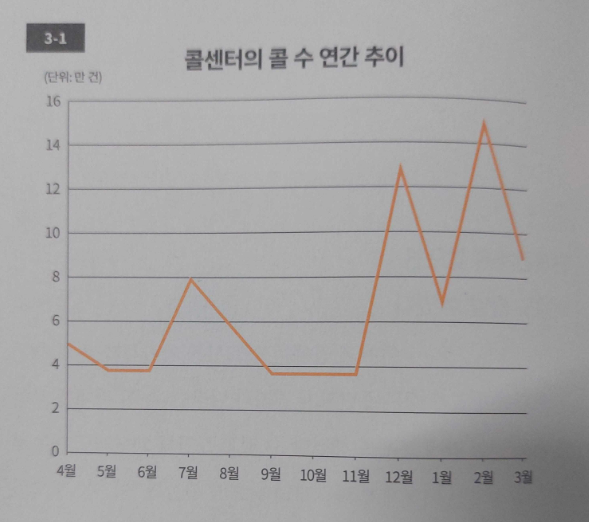

 p.5~6

 이런 위기상황을 어떻게 극복했을까? 걱정 때문에 식은땀까지 흘리며 괴로워하던 나는 벼랑 끝에 몰린 심정으로 한 가지 결론을 내렸다.
 
 '지금처럼 그냥 생각나는 대로 쓰다가는 이도 저도 안 된다.'

 3일 안에 1만 개의 키워드를 추출해내기란 쉽지 않다. 1만 개를 찾으라는 건 곧 '경영사전을 만들라'는 지시나 다름없다. 이는 내 머릿속 지식을 모두 나열한다 해도 도저히 불가능한 일이었다.

 '어떡하지......'

 시간은 무심히도 계속 흘렀다. 그렇게 고심에 고심을 거듭하던 끝에 나는 한 가지 사실을 깨달았다. 내게 필요한 게 바로 '구조화(Structualization)'라는 사실이었다.

 이에 따라 나는 우선 경영에 관한 10가지 대항목부터 찾아 나눴다. '경영전략', '재무', '경리', '조직' 등의 거시적인 테마였다. 그리고 그 10개의 대항목마다 다시 10개의 중항목을 설정했다. 이로써 10 X 10 = 100. 이렇게 100개의 키워드를 도출할 수 있었다.

 이후 각 중항목 아래에 100개씩 키워드를 적어 넣었다. 10 X 10 X 100 = 10000. 미션 완료! 이리하여 나는 3일 만에 비즈니스 키워드 1만 개를 추출하고 정리해 손정의 사장에게 제출할 수 있었다.

 p.12

 '문제점을 안다는 건 곧 해결책과 개선책을 세울 수 있다'는 '또 다른 사실'을 의미한다. 확실해진 문제점을 해결하기 위한 가설을 세우고, 이를 하나씩 검증해갈 수 있기 때문이다.

 p.25

 본질을 파악하기 위해서는 단지 상황별 막대그래프를 그리는데 머물러선 안 된다. 매주 상황별 건수나 구성비를 알 수 있는 적재형 막대그래프를 작성해 시계열상의 변화를 반드시 살펴봐야만 한다.

 p.26

 

 p.27

 

 p.31

 문제점은 누적으로 보고서를 작성할 경우 제대로 운영될 때의 수치까지 포함되어 있기 때문에 한눈에 알기 어렵다. 이는 누적이 가진 일종의 함정이다. 

 따라서 어떤 상황의 진실을 보기 위해선 누적의 함정에 빠지지 않는 것, 바로 여기에 성패가 달려 있다 해도 과언이 아니다. 시간적인 흐름 속에서 업무를 처리할 경우 '어떤 기간 동안 벌어진 일만을 콕 집어내는' 그룹 관리가 필수적이다. 이는 몇 가지 공정을 거쳐 운영하는 업무에서 가장 중요한 업무에서 가장 중요한 요소 중 하나다.

 p.34

 1. 상황(단계)을 정의한다.
 2. 상황(단계)은 실제 산출 베이스로 명확히 한다.
 3. 누적이 아니라 그룹 내수로 본다.
 4. 시계열상의 변화로 추이를 본다.
 5. 백분율 수치와 실제 수치를 모두 기입해 '원 슬라이드, 원 메시지(One Slide, One Message)'로 만든다.

 p.43
 
 구체적으로는 업무를 1) 접수 - 인쇄 - 분류, 2) 기록 조사, 3) 기록 심사, 4) 답변 처리 등의 4가지 과정으로 나눠 정의하고, 각각의 업무 과정마다 진척상황이 실시간으로 파악되도록 이를 바코드로 관리했다. 이로써 처리 능력이 비약적으로 개선되어 특별편의 처리 지연 문제는 해결될 기미가 보이기 시작했다. 현재는 특별편의 처리 지연 문제가 거의 해결된 상태다. 이때 포인트는 '상황을 정의해 주별 그룹 관리를 하는 것'이다. 상황을 분명하게 정하면 자료도 손쉽게 만들 수 있고 POS 시스템 구축 역시 가능해진다.

 그만큼 그룹 관리는 효과적인 경영 기법이다. 시간적인 흐름을 고려하면서 업무의 진척상황을 수치화하다 보면 반드시 애로사항을 발견할 수 있다. 그러면 이후에는 애로사항 해소(문제 해결)에만 전념할 수 있다.

 p.52-53

 만일 여러분이 어떤 회사의 안정성과 견실성, 기초체력 등을 알고 싶다면 '전체 매출 중 지속적인 매출의 비율이 어느 정도인지' 파악하는 게 가장 중요하다. 이를 위해서는 우선 매출을 지속적인 것과 일시적인 것으로 나눠서 봐야만 한다.
 
 일시적으로 매출을 확보해 아무리 표면적인 수치를 끌어올려도 그건 결국 숫자 장난에 불과하다. 이는 안정과 성장으로 이어지는 숫자가 아니라 '일종의 눈속임'에 가깝다. 무엇보다 지속적인 매출과 일시적인 매출이 어떻게 움직이고 있는지, 그 트렌드를 평가해야 한다. 매출 보고서를 만들 때 가장 먼저 주의해야 할 점이 바로 여기에 있다. 
 
 만일 부하직원이 <2-2 같은 보고서를 가져온다면 어떻게 해야 할까. '뭔가 이상하다'고 여기며 부하 직원에게 질문을 던져야 한다. 왜냐하면 뭔가 감추고 있을 가능성이 크기 때문이다. 이런 '도망치는(회피하는) 자세'가 엿보이는 매출 보고서를 본 뒤 "~~ 건은 어떻게 되었느냐?"고 물으면 대개 "괜찮을 것 같습니다"라는 답이 돌아오곤 한다.

 사실 '괜찮다'는 답만큼 믿기 어렵고 불확실한 것도 없다. 그건 어떤 구체적인 것을 의미하지 않는다. 무엇이 괜찮은지, 지금 어디까지 진행되었는지 전혀 알 수 없다. 부하직원에게 '괜찮다'는 답이 돌아온다면 반드시 주의할 필요가 있다. 좋지 않은 상황에서 눈길을 피한 채 뭔가를 감추려 한다고 의심해보아도 좋다.

 p.56-57
 
 '도망치는 자세'를 발견한 <2-2의 막대그래프를 재검토해 새로 작성한 것이 바로 도표 <2-3이다. 각 거래처의 매출을 지속적인 매출과 일시적인 매출로 나눈 뒤, 이를 예산과 대비시켜 놓았다. 이는 회사별 매춢이 아니라, 매출의 종류를 기준으로 숫자를 재정리한 것이다. 
 
 자, 어떤가. 이것으로 이 회사의 위기상황을 한눈에 실감할 수 있지 않은가. 이 막대그래프를 보면 일시적인 매출이 점차 증가하고 있음을 한눈에 알 수 있다. 거꾸로 아무것도 안 해도 돈이 굴러들어 오는 지속적인 매출은 매달 감소하고 있다는 점도 호가인할 수 있다. 4월에는 전체 매출의 85% 이상을 점하던 지속적인 매출이 5월에 들어서자 절반 정도까지 하락, 이후 6월, 7월에는 연이어 20% 정도까지 감소했다. 그 대신 늘어난 것이 '일시적인 매출'이다.
 
 
 
 이는 무엇을 의미할까. 영업 현장에서 일시적인 매출을 만들어 가까스로 예산에 맞춘 것이다. 5월에 지속적인 매출이 상당히 줄었기 때문에 영업사원들이 어떻게든 실적 수치만이라도 올리려는 심산에, 다른 거래처에 사정사정해 일시적인 매출을 올려 눈속임했던 것이다.

 여기서 그 내막을 밝히면, 이 보고서를 작성한 영업사원은 'D사와의 계약이 5월에 끝나면 실적이 대폭 줄어든다'는 사실을 알았기 때문에 급히 C사에 사정사정해 시스템의 위탁 계약을 맺었다. 이로써 5월, 6월, 7월 모두 실적 수치를 끌어올린 것이다.

 p.59
 
 영업사원이 실적을 올리기 위해 노력하는 것 자체가 결코 나쁘지 않다. 문제는 '어떤 방향인가'하는 점이다. 목표가 아닌 지점을 향해 달리는 건 무의미하다. 목표는 '매출을 안정적으로 확보하는 것'이다. 고정적인 매출과 일시적인 매출로 나눠 매출 보고서를 만들어야 하는 의미가 바로 여기에 있다.

p.61
 
매출 보고서 작성 포인트
 
1. 매출을 지속성의 관점으로 나눠 인식한다.
2. 장래를 예상할 수 있도록 막대그래프로 시계열상의 변화를 살펴본다.
3. 백분율 수치와 실제 수치를 모두 기입한다.
4. 기본은 '원 슬라이드, 원 메시지'로 표현한다. 
5. 개별적인 숫자보다 합계 숫자를 반드시 낸다.

p.65~66

자신이 속한 조직의 장기적인 성장에 공헌하려는 마음가짐만 있으면 결코 애매한 보고서를 만들지 않을 것이다. 이때 중요한 건 보고서 작성의 관점이나 포지션을 '부하 직원에서 상사로' 옮기는 것이다. 그렇게 하면 시선의 위치가 높아지고, 본질적인 문제가 한 층 명확하게 드러난다. 즉 실태를 드러내 문제점을 추출하고 그 다음 단계로 이어나갈 수 있는, 유효한 보고서를 만들 수 있다.

p.72

p.73

콜의 발생 원인과 결과를 연결하기 위해서라면 꺾은선그래프만으로는 역부족이다. 그래프라고 해서 무조건 다 좋을 리가 어벗다. 그보다는 목적에 합치된 그래프를 선택하는 것이 중요하다. 

꺾은선그래프에 말풍선을 활용해 콜의 발생 원인 수와 발생률을 기입해보자.

p.74

p.76

요인분석 보고서

- 포인트1. 콜의 발생 원인과 연결한다.
- 포인트2. 꺾은선그래프가 아니라, 누적그래프를 통해 콜의 발생 원인별로 표시한다.
- 포인트3. 말풍선으로 콜의 발생 원인 수와 발생률을 기입한다. 

p.79~80

아랫선에서 윗선을 움직이기란 결코 쉽지 않다. 하지만 문제를 일으킨 요인을 정확히 인식하면 윗선의 생각도 달라진다. 다만 문제 요인을 10가지씩 늘어놓고 '전부 다 해결해달라'고 해봐야 위에서는 쉽게 움직이지 않는다. 누적그래프에 따라 무엇이 원인인지를 파악한 요인 분석 보고서를 작성한 뒤 '최소 제일 중요한 이것만큼은 반드시 해결해주십시오'라고 요구새향 한다. 바로 이것이 포인트다.

p.85

경영상 가장 안 좋은 건 구체성이 결여된 채 '어쨌거나' 혹은 '그냥 상황에 따라, 아무 계획성 없이' 이뤄지는 개선이다. 사실 그건 개선이라고 말하기조차 힘들다.

인과관계를 아는 것이야말로 개선을 위해 중요한 첫걸음이다. 조금 오래 걸리는 것처럼 보여도 결과적으로는 그게 문제 해결의 지름길이 된다는 사실을 반드시 명심하자.

p.90

회의의사록을 작성할 때 필수적인 건 '프로젝트 관리형 사고'다. 프로젝트 관리란 '주어진 목표를 달성하기 위해 인재와 비용, 설비, 물자, 일정 등을 조정하고 전체의 진척상황 등을 관리하는 것'을 말한다.

p.93

p.95

보고와 결의사항을 명확히 하는 것도 회의의사록을 정리할 때 필수적이다. 예를 들어 판촉 캠페인을 실시할 때 그 캠페인에 대해 '지금 검토 중'이라는 이야기인지, '결정된 것'으로 보고하는 것인지, 혹은 '결의를 하고 있는 것인지' 등을 명확히 해두지 않으면 회의의사록으로서 가치가 없다.

p.99

짜임새 있게 회의를 하다보면 '누가 책임자고, 언제까지를 마감기한으로 정해, 무엇을 해야 하는지'가 착착 결정된다. 그러다보면 생산성은 확실히 올라간다. 만약 그렇지 않다면 이 3가지 요소를 명확하게 정하지 않았기 때문이다.

p.100

회의의사록의 배포처에 대해서도 반드시 명시해둬야 한다. 이는 의외로 간과되기 쉽지만, 한편으로 매우 중요한 결정사항이기도 하다. 예를 들어 자신이 지금 참석하고 있는 회의의 의사록이 이사회 멤버들에게까지 배포된다는 점을 아는 것과 모르는 것은 천양지차다. 참가자의 의식 자체가 달라질 테고 회의의 의미도 크게 달라질 것이다.

p.102~103

프로젝트 관리형 회의의사록

- 포인트1. 양식화한다.
- 포인트2. A4지 사이즈 1장으로 정리한다. 
- 포인트3. 회사에서 정해진 양식이 있어도 조합시킬 부분은 조합한다.
- 포인트4. 테마를 명확하게 정한다.
- 포인트5. 항목을 세로줄로 나열한다.
- 포인트6. 보고사항과 결의사항을 나눈다.
- 포인트7. 결의사항은 결정사항과 미결사항으로 나눈다.
- 포인트8. 사실과 평가를 나눈다.
- 포인트9. 명사화시켜 마무리하고 숫자를 넣는다.
- 포인트10. 책임자와 마감기한, 결과물의 내용을 정한다.
- 포인트11. 의사록 내용을 회의 장소에서 확인한다. 
- 포인트12. 배포처를 정해둔다.
- 포인트13. 회의 출석자를 명기해둔다.
- 포인트14. 작성자와 작성일시, 버전도 잊지 않고 기입한다.

p.116

p.123

프로젝트 관리 시트

- 포인트1. '버전관리'라는 면에서 작성자와 작성일을 명확히 기재한다.
- 포인트2. 결과물을 구체적인 사안이나 행동으로 정의한다.
- 포인트3. 마감기한과 담당자를 결정한다.
- 포인트4. 각 담당자 단위로 공정을 나눈다.
- 포인트5. 업데이트 작업을 게을리하지 않고, 각자가 가진 자료는 최신판으로 유지한다.

p.124

만일 PM이 권한이 없는 상태로 책임자나 결과물, 마감기한을 명확하게 하지 않는다면 프로젝트 진행은 그만두는 게 낫다. 제대로 성과를 낼 수 없는 상태에서 이리 치이고 저리 치여도 어쩔 수 없는 일이다.

p.129

관리, 개선 활동의 중점 목표를 정할 때 도움이 되는 파레토 차트는 QC의 7가지 기법 중 하나로 간주된다. 이렇게나 편리한 도구를 비즈니스에서 사용하지 않을 수 없다. '문제가 어디 있는지를 찾기 어려운 사람'이라면 반드시 사용해보기를 추천하는 도구다.

p.130

QC의 나머지 6가지 기법

- 히스토그램(Histogram)
    - 길이, 무게, 시간, 경도, 두께 등을 측정하는 데이터(계량 값)가 어떤 분포를 보이는지 알아보기 쉽게 나타낸 그림

- 특성 요인도(Cause and Effect Diagram)
    - 현장에서 발생하는 문제점들의 원인을 정리해 상호관계를 조사함으로서 그 인과관계를 그림으로 나타낸 것

- 층별(Stratiffication)
    - 필요 요인마다 데이터를 구분해서 잡는 것

- 산점도(Scatter Diagram)
    - 두 개가 짝을 이룬 데이터를 그래프 용지 위에 점으로 나타낸 그림.

- 체크 시트(Check Sheet)
    - 불량 수, 결점 수 등 셀 수 있는 데이터가 분류 항모고별로 어디에 집중되어 있는지를 알기 쉽게 나타낸 그림

- 관리도(Graph & Process Control Charts)
    - 그래프 안에서 점의 이상 여부를 판단하기 위해 중심선이나 한계선을 기입한 것 

p.143

현장에서는 누구나 '여러 가지 문제가 있다'고 인식한다. 따라서 '어떻게든 문제를 해결해야 한다'는 인식을 갖고 있다. 경영진이나 매니저, 평사원 할 것 없이 모두 공통된 인식을 갖고 있다. 하지만 이때 '어느 것부터 손을 대야 할지'에 대해선 잘 모른다.

p.143

일은 하고 있는데 출구가 보이지 않는다면, 바로 이때 문제 해결에 큰 도움이 되는 것이 '파레토 차트'다.

p.152

손정의 사장은 왜 그렇게까지 회귀분석에 집착했던걸까, 그건 '회귀 분석을 잘 사용하면 자신이 지금 생각하고 있는 가설이 바른지에 대한 여부를 확인할 수 있기 때문'이다. 현재 자신이 전개 중인 비즈니스가 어떤 구조로 이뤄지는지 간단한 숫자로 알 수 있는 것이다.

'모든 것을 숫자로 파악하라!'

바로 이것이 손정의 사장의 기본 방침이었다. 그는 회사 매출이나 주기를 모두 수치화해 항상 머릿속에서 구조화하고 있는 사업과의 상관관계를 도출했다.

p.159

결정계수를 그래프상에서 보여주면 추세선의 확실성을 누구한테든 설명하기 쉽다. 거꾸로 이를 넣지 않으면 '안 맞는 거 아니냐'는 논쟁이 벌어질지도 모른다. 따라서 결정계수는 반드시 그래프 속에 넣어두도록 하자.

p.160-161

회귀 분석이 가진 또 하나의 장점은 '누락 체크가 가능하다'는 점이다. 만일 결정계수가 0.5 이하일 경우 자신이 생각하지 못했던 것 외의 요소가 관계되어 있을지 모른다. 휴대전화의 계약 사례로 보자면 방문객 수 이외에 날씨나 온도, 혹은 다른 요소가 얽혀 있을 가능성을 생각해볼 수 있다. 요컨대 '자신이 생각하는 가설이 바른지, 빠진 요소가 없는지 거머증할 수 있는 것'이다. 이것이 바로 '누락 체크'다.

p.174

모두가 '이건 나비, 저건 나방'이라고 생각하면 우리는 그 정의에 따라 움직이게 된다. 정의가 반드시 엄밀할 필요는 없다. 오차로 인정되는 범위라면 그것만으로도 정의는 충분하다. 그러므로 일에서도 업무의 정의, 각 업무별 구분을 명확하게 했으면 한다. 정의가 없으면 모두가 정의를 결정할 것! 바로 이 작업을 잊지 않고 실시하도록 하자.

p.180~181

지금까지 TV 업계는 TV를 인터넷에 접속해 쌍방향으로 이용하고자 다양한 노력을 강구해왔다. 시장에서는 그 기능이 가능한 제품이 잇달아 발매되었지만 널리 보급되지는 못했다. 그건 어디까지나 '시청 거리가 영향을 미쳤기 때문'이었다.

사용 목적에 따라 신체 자세나 시청 거리는 달라진다. 기본적으로 TV는 가까이서 보는 게 아니다. 화면의 지근거리까지 다가가 보는 이는 아마 어린 아이 정도일 것이다. 하지만 인터넷은 가까이서 보는 게 당연하다. 떨어진 장소에서 리모컨으로 조작해 TV를 보듯, 우리는 떨어진 장소에서 스크린에 비춰진 파워포인트 슬라이드를 본다.

그러므로 TV의 인터넷 이용은 아무리 시간이 지나도 널리 확산되기 어렵다. 마찬가지로 파워포인트로 작성된 PT용 슬라이드는 기획서에 어울리지 않고, 기획서 또한 PT용으로는 어울리지 않는다.

주연도, 시청 거리도 근본적으로 다르기 때문에 아무리 테마가 같아도 기획서를 PT용 자료로서 그대로 사용해선 안 된다. 이를 안이하게 전용하는 사람들을 간혹 볼 수 있는데 그건 큰 잘못이다. 기획서와 PT용 자료는 반드시 구분해 작성하고 사용해야만 한다.

p.186

당신이 PT용 자료를 작성할 때 고려하는 건 상사인가 혹은 주위에 '노력한 것처럼'보이는 것인가.

결국 PT의 주목적은 누군가에게 당신의 메시지를 전하는 데 있다. 그것이야말로 가장 우선시해야 할 목적이다.

p.187

우선 슬라이드는 '원 슬라이드, 원 메시지'로 작성한다. 이것이 대원칙이다.

p.194~195

소프트뱅크의 결산 설명회에서 배포되는 자료를 보면 '숫자를 어떻게 넣는 게 효과적인지' 알 수 있다. 회사의 가치를 전달하는 숫자가 거의 모든 페이지에 담겨 있기 때문이다.

매출 페이지에는 소프트뱅크와 NTT 도코모, KDDI 등 업계 주요 3개사의 매출을 기록한 뒤 크게 'No.1'이라고 쓰여 있다. EBITDA의 페이지에도 'No.1'이라고 크게 표기되어 있다. 여기에서 중요한 건 20조 원이라는 매출과 5조 9210억 원이라는 영업이익이 아니라 '업계 No.1'이라는 사실이기 때문이다.

모바일의 영업이익 페이지에는 '보다폰 인수 전 3년'과 '인수 후 9년'  동안의 영어버이익을 막대그래프화해 '인수 후 8배'라고 써놓았다. 이 페이지에서 전하고 싶은 메시지는 2014년도 영업이익이 2조 790억 원이라는 숫자가 아니라, 보다폰을 인수하고서 영업이익이 8배나 늘었다는 경향이기 때문이다.

숫자를 넣을 때 중요한 건 '연속적인 숫자에서 어떤 경향을 읽어내는' 것이다. 그리고 경쟁사나 자사의 과거 실적을 비교해 숫자에 어떤 의미를 부여한다. 또 숫자의 경향에서 미래를 예측하고 비전을 도출한다. 숫자에 따라 뒷받침된 각 슬라이드는 PT의 설득력을 크게 높인다. 여러분도 숫자를 단순한 숫자로 다루지 않고, 누구나 알 수 있는 쉬운 그래프로 가공해 숫자의 의미를 청중들에게 쉽게 전달했으면 한다.

p.196 ~ 197

소프트뱅크식 프레젠테이션

- 포인트1. 원 슬라이드, 원 메시지, 원 이미지
- 포인트2. 원 이미지는 가로 X 세로 비율에 주의한다.
- 포인트3. 메시지에 따라 말풍선이나 화살표를 넣는다.
- 포인트4. 메시지는 설명이 아니라 해석으로 한다.
- 포인트5. 메시지의 글자 수는 20자 내외로 한다.
- 포인트6. 메시지를 뒷받침하는 숫자를 넣는다.
- 포인트7. 마지막에 반드시 페이지 번호를 붙인다.
- 포인트8. 적당한 길이의 동영상을 활용하면 효과적이다.

p.202

처음에는 낮은 톤으로 이야기를 시작하는 것도 효과적이다. 이는 손정의 사장의 PT에서 자주 볼 수 있는 패턴이다. 그의 PT는 처음부터 높은 톤이 아니다. 굳이 선택하자면 처음에는 차분한 어투로 시작하는 게 좋다.

그리고 전하고 싶은 메시지를 높은 톤으로 말하고, 점점 긴장감을 더해 고성을 낼 때는 목소리를 뒤집으면서 마지막에는 거의 울부짖듯이 끝낸다. 이런 감동적인 PT도 발표자 자신이 먼저 곱씹어 보고, 메시지를 잘 손질해 진실로 청중에게 전하고 싶다는 마음으로 전개했기 때문에 실현할 수 있는 것이다.

p.218

원그래프와 막대그래프에는 각각의 세부적인 숫자를 일절 집어넣지 않는다. 그것을 넣으면 그래프가 복잡해지고, 도대체 무엇을 말하는지 알기조차 어려워지기 때문이다. 막대그래프에는 최소한의 눈금을 넣지 않으면 아예 의미 자체가 불명확해지기 때문에 최소한만 넣는다. 하지만 그 외의 요소는 삭제하고, 전하고 싶은 내용만을 숫자로 강조한다.

p.220

소프트뱅크에선 증가하는 현 상황을 전하고 싶을 때는 가로축을 짧게 만든다. 가로축이 길면 증가하는 것처럼 보이지 않기 때문이다.

p.226

그래프가 있다면 거기에 '나는 이렇게 생각한다'가 반드시 따라붙어야 한다. 거기에 그래프의 존재 이유가 있으므로 반드시 '평가'가 필수다. 평가가 없는 자료는 더 이상 자료라고 할 수조차 없다.